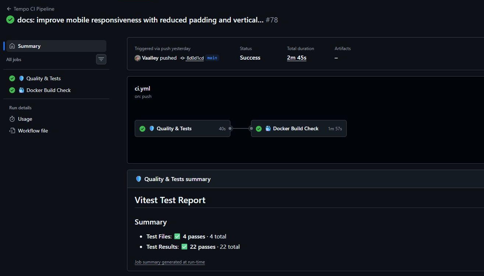
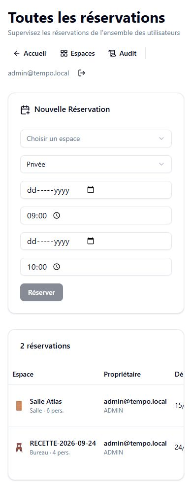
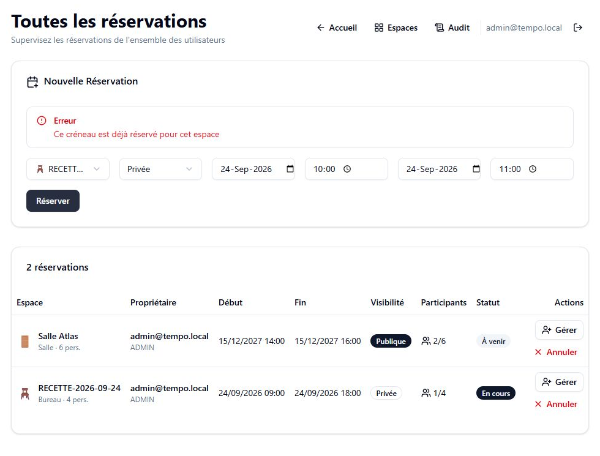
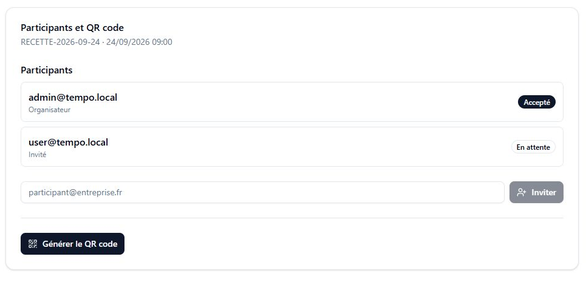
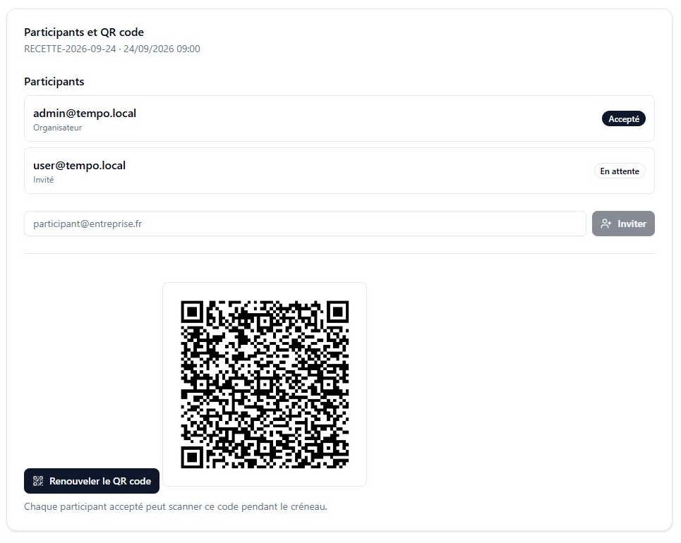
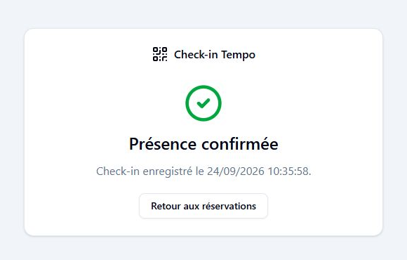
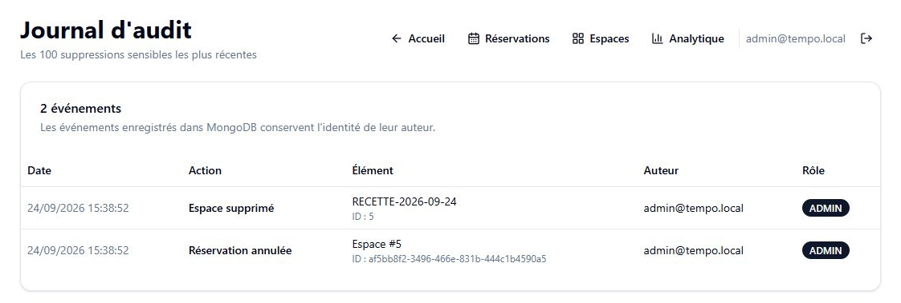

Certification professionnelle

Titre professionnel: **Concepteur développeur d'applications**

RNCP**:** **37873**

DOSSIER PROJET

PROJET :

**Tempo**

Rédacteur :

Valentin Musset

Date : _7 Octobre 2026_

**SOMMAIRE**

1. Liste des compétences du référentiel couvertes par le projet
    1. Développer une application sécurisée
    2. Concevoir et développer une application sécurisée organisée en couches
    3. Préparer le déploiement d'une application sécurisée
2. Cahier des charges
3. Présentation de l'entreprise et du service
4. Gestion de projet
5. Spécifications fonctionnelles
6. Spécifications techniques
7. Réalisations
8. Éléments de sécurité de l'application
9. Plan de tests
10. Jeu d'essai de la fonctionnalité la plus représentative
11. Veille sur les vulnérabilités de sécurité

# 1\. LISTE DES COMPÉTENCES DU RÉFÉRENTIEL COUVERTES PAR LE PROJET

Ce dossier présente mon travail de conception, de développement et de préparation du déploiement de Tempo. Il intègre la mise en ligne de la démonstration du 22 septembre 2026 sur https://tempo-val.duckdns.org. Les exemples s’appuient sur les fichiers du dépôt, les tests et les écrans de l’application.

## 1.1 Développer une application sécurisée

### 1.1.1. Installer et configurer son environnement de travail en fonction du projet

J'ai organisé Tempo sous la forme d'un monorepo Bun composé d'un backend Hono et d'un frontend SvelteKit. Les commandes communes sont centralisées à la racine pour lancer le développement, les tests, le lint, le formatage et le build. Les deux applications gardent leurs commandes propres, avec un point d’entrée commun à la racine.

PostgreSQL et MongoDB peuvent être lancés localement ou avec Docker Compose. Les versions de Bun et des images de base sont épinglées pour limiter les écarts entre un poste de développement et le runner GitHub Actions. Les identifiants de base de données et le secret JWT proviennent de fichiers d'environnement ignorés par Git. Les fichiers `.env.example` décrivent uniquement la structure attendue avec des valeurs factices.

Git assure le versionnement. Oxlint et Oxfmt contrôlent la qualité du code, Bun Test et Vitest exécutent les tests unitaires, et Playwright pilote Chromium pour les parcours complets. Le `README.md` regroupe les commandes de démarrage, de migration, de seed, de sauvegarde et de restauration.

### 1.1.2. Développer des interfaces utilisateur

J'ai développé les écrans avec Svelte 5, SvelteKit, Tailwind CSS et les composants shadcn-svelte. Les pages utilisent les runes Svelte pour leurs états locaux. Les formulaires indiquent les chargements et affichent les erreurs retournées par l'API, par exemple lorsqu'un espace est déjà réservé ou qu'une invitation ne peut pas être créée.

L'interface s'adapte au rôle connecté. Un collaborateur ne voit ni les liens ni les actions d'administration. Un administrateur accède à la gestion des utilisateurs et des espaces, aux statistiques, aux audits et à la vue globale des réservations. La page des réservations permet aussi de choisir la visibilité, d'inviter un participant, de répondre à une invitation, de rejoindre une réservation publique et de générer un QR code.

Les appels réseau passent par un client Hono RPC typé avec `AppType`. Les réponses 401 et 403 sont traitées de manière centralisée. Le retour vers la page de check-in après une connexion conserve le jeton QR dans le stockage de session, sans l'ajouter à la requête HTTP vers `/login`. Les tests Vitest et les contrôles Svelte couvrent ces comportements.

### 1.1.3. Développer des composants métier

Le backend est découpé en modules `auth`, `users`, `workspaces`, `bookings`, `analytics` et `audit`. Chaque module sépare les routes HTTP de la logique métier et de l'accès aux données. Les entrées sont validées avec Zod avant d'atteindre les services.

Le module de réservation contrôle les créneaux et les participants. Il vérifie les créneaux, traduit les conflits PostgreSQL en réponses HTTP 409, gère la visibilité publique ou privée, les invitations, les participants et la capacité de l'espace. Pour une admission, la transaction verrouille d’abord l’espace, puis la réservation. Cet ordre coordonne l’ajout des participants avec les modifications de capacité.

Pour le check-in, le serveur génère un jeton aléatoire de 256 bits et n'enregistre que son hash SHA-256. Seul un participant accepté peut confirmer sa présence, pendant le créneau de la réservation. La génération d'un nouveau QR code invalide le précédent. Ces règles sont couvertes par des tests de routes et par un scénario d'intégration sur PostgreSQL réel.

### 1.1.4. Contribuer à la gestion d'un projet informatique

J'ai mené ce projet seul et assuré le cadrage, la conception, le développement, la recette et la préparation du déploiement. Le travail a été découpé dans Trello avec un tableau Kanban.

La priorité a d'abord porté sur l'authentification, la création d'espaces et la réservation. Les contrôles d'accès, l'intégrité des données, la CI et les tests d'intégration ont ensuite consolidé ce premier socle. Les réservations publiques ou privées, les invitations, les participants et le check-in par QR code ont été intégrés plus tard.

Les commandes de contrôle local portent sur le formatage, le lint, les types, les tests et le build. Le workflow GitHub Actions prévoit aussi une recette Docker. Un résultat local ne vaut pas validation de la CI : la version finale doit disposer de son propre résultat.

## 1.2. Concevoir et développer une application sécurisée organisée en couches

### 1.2.1. Analyser les besoins et maquetter une application

J'ai commencé par formaliser le besoin dans `SPECS.md`. Le cahier des charges distingue le collaborateur de l'administrateur et délimite les fonctions de réservation, de supervision et d'audit. Les cas d'utilisation et les règles de gestion ont ensuite servi à préparer les modèles de données et les routes de l'API.

Une première maquette Figma a fixé la navigation générale. L'interface a évolué pendant l'implémentation pour tenir compte des composants disponibles et des retours obtenus pendant les tests. La cartographie des pages, la maquette initiale et les diagrammes de comportement figurent en section 5.

### 1.2.2. Définir l'architecture logicielle d'une application

J'ai retenu une architecture en trois couches. SvelteKit gère la présentation, Hono porte les routes et les services métier, tandis que PostgreSQL et MongoDB assurent la persistance. Le frontend et le backend sont deux workspaces du même dépôt. Le type de l'application Hono est partagé avec le client RPC, ce qui permet à TypeScript de détecter une incompatibilité de route ou de données pendant la compilation.

Les contrôles interviennent à plusieurs niveaux. Le frontend adapte la navigation, mais l'API reste responsable des autorisations. Les middlewares vérifient le JWT, le rôle, le CORS, les en-têtes de sécurité et la limite de requêtes. Zod contrôle les entrées. PostgreSQL applique les clés étrangères, les contraintes temporelles et l'exclusion des réservations concurrentes.

Le backend est un monolithe modulaire. Sa capacité sous charge reste à mesurer. Les images Docker multi-stage et le runtime commun limitent le nombre de composants à construire et à maintenir. L'éco-conception est abordée ici par la sobriété de l'architecture et la réduction des services inutiles.

### 1.2.3. Concevoir et mettre en place une base de données relationnelle

J'ai traduit le modèle de données dans le schéma Drizzle puis généré des migrations SQL versionnées. PostgreSQL contient les utilisateurs, les espaces, les réservations, les participants et les hashes des jetons QR. Les clés étrangères et les suppressions en cascade évitent les enregistrements orphelins. Des contraintes supplémentaires garantissent un créneau valide, une capacité positive et l'absence de chevauchement pour un même espace.

Le seed crée deux comptes, plusieurs espaces et une réservation publique avec une invitation en attente. Il est idempotent afin de pouvoir être rejoué dans un environnement de démonstration. Les tests unitaires utilisent des mocks, tandis que les tests d'intégration appliquent les migrations et travaillent sur une base PostgreSQL réelle.

Les volumes Docker conservent les données entre deux démarrages. Le `README.md` documente aussi les commandes `pg_dump` et `pg_restore` nécessaires à une sauvegarde ou à une restauration manuelle.

### 1.2.4. Développer des composants d'accès aux données SQL et NoSQL

Drizzle ORM exécute les opérations SQL et conserve les types du schéma jusqu'aux services. Les créations de réservations et de participants utilisent des transactions. Les recherches relationnelles chargent les espaces, les propriétaires et les participants sans reconstruire ces relations dans le frontend.

MongoDB stocke les audits de suppression. Le service enregistre l'entité supprimée, l'auteur et la date, puis restitue les événements du plus récent au plus ancien. Cet audit fonctionne en mode best effort : un échec MongoDB est journalisé, mais ne revient pas sur une suppression déjà validée dans PostgreSQL.

Les routes convertissent les erreurs métier en statuts HTTP cohérents. Les tests unitaires isolent les services avec des mocks. Les tests d'intégration vérifient la persistance réelle, le conflit de concurrence, le parcours d'invitation et de check-in, ainsi que l'ordre et le filtrage des audits.

## 1.3. Préparer le déploiement d'une application sécurisée

### 1.3.1. Préparer et exécuter les plans de tests d'une application

Les tests couvrent plusieurs niveaux. 106 tests backend unitaires et HTTP et 22 tests frontend passent. Ils vérifient les services, les routes, les autorisations, les sessions par cookie, le client RPC et les gardes de navigation.

Les 15 tests PostgreSQL comprennent trois scénarios de réservation et de collaboration, ainsi que douze scénarios de capacité et de concurrence. Deux tests MongoDB sont présents pour l’écriture, l’auteur, l’horodatage, l’ordre et le filtrage des audits. Deux parcours Playwright couvrent la réservation suivie de son annulation et le parcours d’invitation jusqu’au check-in.

La section 9 relie les tests aux règles métier.

### 1.3.2. Préparer et documenter le déploiement d'une application

J'ai écrit deux Dockerfiles multi-stage et un fichier `docker-compose.yml` pour PostgreSQL, MongoDB, le backend et le frontend. Compose attend les contrôles de santé des bases. Le backend applique ensuite les migrations avant de démarrer, puis le frontend attend que l'API soit disponible. Un profil optionnel charge le jeu de démonstration.

Le `README.md` décrit la configuration, le lancement, les contrôles de santé, les tests d'intégration, les sauvegardes, la restauration et le retour à une version précédente. Les principales versions applicatives sont épinglées et les secrets restent hors du dépôt. Le déploiement public utilise aussi une image Caddy `2-alpine`.

Le 22 septembre 2026, j’ai choisi une machine Ubuntu mise à disposition par un ami, dans `/opt/tempo/`.

### 1.3.3. Contribuer à la mise en production dans une démarche DevOps

J'ai configuré le workflow `.github/workflows/ci.yml`. Le premier job vérifie le format, le lint, les types, les tests et le build. Le second construit la stack Docker Compose, attend les services, charge le seed et exécute les intégrations PostgreSQL et MongoDB ainsi que les deux parcours Playwright. Les traces, captures et vidéos d'un échec E2E sont conservées comme artefacts pendant sept jours.

L’exécution GitHub Actions n° 78 du 23 septembre 2026 a réussi pour le commit 8d0d1cd, qui contient les corrections mobiles. Les jobs Quality & Tests et Docker Build Check sont tous les deux passés. Cette preuve porte sur ce commit. [Consulter cette exécution](https://github.com/Vaalley/tempo/actions/runs/35839428413).



# 2\. CAHIER DES CHARGES

Le cahier des charges décrit le besoin du point de vue métier. Les choix d'implémentation sont détaillés dans les sections 5 et 6.

## 2.1. Description de l'existant

Tempo est un projet personnel de certification, réalisé en dehors du temps en entreprise.

Le point de départ est l'usage du flex-office sans outil dédié. Un tableur partagé ou un planning général permet de noter une occupation, mais gère mal les accès simultanés, les invitations et la présence réelle. Tempo propose un espace unique pour réserver un bureau ou une salle, inviter des participants et suivre l'occupation.

## 2.2. Reprise de l'existant

Le projet est créé sans code, hébergement, nom de domaine ou documentation hérités. Le cahier des charges `SPECS.md`, les diagrammes, le code et la documentation ont été produits pour Tempo. au cours de l'année 2026.

## 2.3. Principes de référencement

Tempo est une application métier interne accessible après authentification. Les pages applicatives n'ont pas vocation à apparaître dans les moteurs de recherche. Le document demande donc leur non-indexation.

## 2.4. Exigences de performances et de volumétrie

Les cibles de départ sont des entreprises de 50+ collaborateurs ou des ecoles/centre de formation, sur un ou plusieurs sites.

Les hypothèses de dimensionnement sont les suivantes :

- quelques dizaines d'utilisateurs connectés en même temps ;
- quelques centaines de réservations créées chaque jour ;
- un service disponible pendant les heures ouvrées ;
- un temps de réponse visé inférieur à 300 ms pour la consultation et la réservation.

Ces chiffres sont des objectifs. La V1 repose sur un backend unique et PostgreSQL ; le besoin d’une architecture distribuée ne semble pas nécessaire.

## 2.5. Multilinguisme et adaptations pour un public spécifique

La V1 est disponible uniquement en français. Aucune traduction n'est prévue dans le périmètre actuel.

## 2.6. Description graphique et ergonomique

### 2.6.1. Composants de la charte graphique

Tempo utilise une identité visuelle sobre adaptée à un outil interne. Le nom du produit tient lieu de logotype. La typographie est celle du système et les composants partagent les mêmes tailles, espacements et états.

La palette repose sur les variables CSS de shadcn-svelte et Tailwind CSS. Elle comporte des couleurs neutres, une couleur principale et des variantes pour les alertes ou les actions destructives. Les boutons, cartes, tableaux, badges, champs et messages d'erreur restent cohérents d'un écran à l'autre.

### 2.6.2. Responsive design et ergonomie

Les écrans utilisent les classes adaptatives de Tailwind CSS. L'administration et les tableaux sont principalement destinés à un poste de travail. La création d'une réservation, la réponse à une invitation et le check-in doivent aussi rester utilisables sur mobile.

Sur petit écran, le titre et la navigation se placent l’un sous l’autre. Les liens passent à la ligne et les longues adresses de compte peuvent être coupées pour rester dans la largeur disponible. Les marges sont réduites et le formulaire de réservation s’affiche en colonne. Le nom de l’espace sélectionné est tronqué s’il est trop long. Les tableaux conservent un défilement horizontal dans leur propre zone. Le 24 septembre 2026, l’accueil, les réservations, les espaces, le check-in et l’audit ont été vérifiés avec une fenêtre de 390 × 844 pixels. Aucun débordement horizontal de la page n’a été observé sur ces écrans.



Réservations à 390 pixels de largeur. Le tableau défile dans sa propre zone.

## 2.7. Besoins fonctionnels métier

### 2.7.1. Utilisateurs du projet

Deux profils utilisent Tempo :

- le collaborateur `USER` crée un compte, se connecte, consulte les espaces et gère ses réservations. Il peut inviter des personnes, répondre à une invitation, rejoindre une réservation publique et confirmer sa présence ;
- l'administrateur `ADMIN` possède les mêmes fonctions et gère aussi les utilisateurs et les espaces. Il voit toutes les réservations, peut les annuler et consulte les statistiques ainsi que les audits.

Le processus concerné est la gestion des espaces de travail, généralement suivie par les fonctions RH ou Office Management.

### 2.7.2. Informations relatives aux contenus

Tempo ne publie aucun contenu éditorial. L'application traite :

- les comptes, avec l'adresse électronique, le hash du mot de passe et le rôle ;
- les espaces, avec leur nom, leur type et leur capacité ;
- les réservations, avec le créneau, la visibilité et le propriétaire ;
- les participants, avec leur rôle, leur réponse à l'invitation et leur heure éventuelle de check-in ;
- les hashes des jetons QR et leur date d'expiration ;
- les audits de suppression, avec l'entité concernée et l'auteur de l'action.

Ces informations comprennent des données personnelles. Les mots de passe sont hachés, les entrées sont validées et les opérations sensibles sont soumises à une autorisation. Les suppressions font l'objet d'une tentative d'audit.

### 2.7.3. Besoins fonctionnels

Un collaborateur doit pouvoir créer un compte, se connecter et se déconnecter. À l'inscription, il reçoit le rôle `USER`. Une fois connecté, il peut consulter les bureaux et les salles, puis réserver un espace sur un créneau libre. La réservation peut être publique ou privée ; elle doit concerner un espace existant et respecter des dates valides. Son propriétaire peut l'annuler, mais il ne peut pas supprimer la réservation d'un autre utilisateur.

Le propriétaire d'une réservation peut inviter des utilisateurs déjà inscrits. Chaque invité choisit d'accepter ou de refuser : personne ne peut répondre à sa place. Tant qu'il n'a pas répondu, son invitation compte dans les places occupées. Un utilisateur connecté peut aussi rejoindre une réservation publique, à condition qu'il reste de la place. Une fois sa participation acceptée, il peut confirmer sa présence avec le QR code pendant le créneau réservé.

L'administrateur gère les espaces : lui seul peut en créer, les modifier ou les supprimer. Chaque espace doit avoir une capacité entière d'au moins une place. Il peut également annuler une réservation et y inviter un utilisateur. Il dispose d'une vue sur les réservations, les statistiques et les suppressions enregistrées, présentées de la plus récente à la plus ancienne. L'accès à ces fonctions est réservé au rôle `ADMIN`.

La V1 ne prévoit pas de filtrage avancé des espaces, de gestion de plusieurs sites, de notifications ou de quotas plus détaillés.

## 2.8. Budget

Aucun budget financier n'a été attribué, puisque Tempo est un projet personnel réalisé en parallèle de l'alternance. Le temps a été réparti entre le cadrage, la conception, le développement du backend et du frontend, les tests, la conteneurisation et la rédaction.

Aucun relevé horaire exhaustif n'a été tenu.

# 3\. PRÉSENTATION DE L'ENTREPRISE ET DU SERVICE

## 3.1. Présentation de l'entreprise et du service

Tempo n'est pas développé pour une entreprise existante. C'est un projet personnel mené en autonomie pour couvrir les compétences du titre CDA sur un cas de gestion d'espaces en flex-office.

Le projet est envisagé comme un produit SaaS destiné à des PME. J’ai défini le besoin et développé la solution. Cette situation est propre au cadre de certification et ne correspond pas à une commande commerciale réelle.

## 3.2. Objectifs du projet

Tempo permet à un collaborateur de réserver un bureau ou une salle, seul ou avec d'autres participants. L'administrateur gère les espaces et les comptes, consulte les réservations et suit l'occupation. Il peut aussi retrouver les suppressions enregistrées dans le journal d'audit.

Les participants acceptés peuvent confirmer leur présence avec un QR code pendant le créneau réservé. Ce code peut être partagé : le check-in ne garantit donc pas que la personne se trouve sur place.

## 3.3. Cible adressée par le projet

Le projet s'adresse aux entreprises de plus de 50 collaborateurs, ainsi qu'aux écoles et centres de formation qui partagent des bureaux ou des salles. Les utilisateurs doivent pouvoir réserver rapidement. Les administrateurs ont besoin de connaître les réservations en cours et de gérer les espaces.

## 3.4. Processus utilisateur impacté

Tempo remplace le suivi quotidien des réservations dans un tableur ou un planning partagé. Les équipes RH et les responsables des espaces peuvent consulter l'occupation et repérer les espaces les plus utilisés.

# 4\. GESTION DE PROJET

Le suivi repose sur Trello, Git et les documents de travail du dépôt.

## 4.1. Intervenants sur le projet

J'ai réalisé Tempo seul. J'ai donc pris en charge :

- l'expression du besoin et le cahier des charges ;
- la conception des données, de l'architecture, des diagrammes et des écrans ;
- le développement du backend, du frontend et des migrations ;
- la rédaction et l'exécution des tests ;
- Docker Compose, GitHub Actions et la documentation de déploiement.

Je n'ai pas travaillé avec un client, un chef de projet ou un designer extérieur. J'ai consigné les choix du projet dans les documents du dépôt et le suivi des tâches.

## 4.2. Méthodologie

J’ai organisé le travail avec un tableau Kanban dans Trello : « À faire », « En cours » et « Terminé ». Chaque carte correspondait à une fonctionnalité ou à une tâche technique que je pouvais vérifier séparément.

J'ai développé les fonctionnalités progressivement, en les testant avant de passer à la suivante. Les premiers parcours ont ensuite été complétés par les réservations publiques ou privées, les invitations et le check-in. Un plan de corrections m'a permis de reprendre les points de sécurité, de documentation et de déploiement.

## 4.3. Outils, planning et suivi

J'ai commencé par le besoin et la conception, puis développé le backend et le frontend. Les tests ont accompagné le développement. J'ai ensuite préparé les conteneurs Docker, la CI et la documentation.

Trello m'a servi à suivre les tâches et GitHub à conserver l'historique du code. Les documents de travail du dépôt regroupent les corrections à effectuer. GitHub Actions lance les contrôles à chaque envoi.


## 4.4. Objectifs de qualité

Pour vérifier le projet, je m’appuie sur les tests et les contrôles automatiques suivants :

- l’inventaire comprend 106 tests backend unitaires et HTTP, 15 tests PostgreSQL, 2 tests MongoDB, 22 tests frontend et 2 parcours E2E ; les exécutions réellement constatées sont précisées en section 9 ;
- Oxlint, Oxfmt, TypeScript et Svelte Check contrôlent le code avant le build ;
- Zod valide les entrées, les mots de passe sont hachés, les routes sont protégées par JWT et les droits sont vérifiés côté API ;
- les modules séparent les routes, les services et la persistance ;
- GitHub Actions reconstruit l'application et exécute la recette Docker sur un environnement neuf.

Ces contrôles sont exécutés par le workflow GitHub Actions. La protection de branche se configure séparément sur GitHub.

# 5\. SPÉCIFICATIONS FONCTIONNELLES

Cette partie décrit les fonctionnalités de la V1. Certains diagrammes présentent encore la conception initiale ; les différences avec le code sont précisées dans les sections concernées.

## 5.1. Contraintes du projet et livrables attendus

### 5.1.1. Criticité de l'application

Une interruption de Tempo pendant la journée empêche de consulter les réservations, d'en créer, de répondre aux invitations et de confirmer sa présence. La criticité reste modérée pour cet outil interne.

L'application vise une utilisation de 8 h à 19 h, du lundi au vendredi, par quelques dizaines à quelques centaines d'utilisateurs.

### 5.1.2. Applications connexes

Tempo fonctionne sans annuaire, calendrier ou logiciel RH externe. Une connexion SSO ou une synchronisation avec un calendrier pourrait être ajoutée plus tard.

### 5.1.3. Services tiers

L'application n'utilise ni service d'emailing, ni CRM, ni outil d'analytics externe. GitHub Actions est utilisé uniquement pour la CI. La stack de démonstration reste exécutable en local avec Docker Compose.

### 5.1.4. Livrables attendus

Les livrables sont :

- le cahier des charges `SPECS.md` ;
- les modèles MERISE, les diagrammes UML et la maquette Figma ;
- le backend, le frontend et les migrations versionnés sur GitHub ;
- les tests unitaires, HTTP, frontend, d'intégration et E2E ;
- les Dockerfiles et le fichier `docker-compose.yml` ;
- le workflow GitHub Actions ;
- le seed de démonstration, le `README.md` et le présent dossier.

## 5.2. Architecture logicielle du projet

Tempo suit une architecture en trois couches dans un monorepo Bun.

La présentation repose sur SvelteKit et Svelte 5. Les pages utilisent un client Hono RPC dont les types proviennent du backend. Hono reçoit les requêtes, applique les middlewares, puis appelle les services des modules `auth`, `users`, `workspaces`, `bookings`, `analytics` et `audit`.

PostgreSQL contient les comptes, les espaces, les réservations, les participants et les hashes de jetons QR. MongoDB contient les audits de suppression. Le chemin principal d'un traitement est `Route -> Service -> Drizzle/Mongo`. Il n'existe pas de couche Repository séparée.

Le frontend et le backend disposent chacun d'un Dockerfile multi-stage. Docker Compose les lance avec PostgreSQL et MongoDB.


Le diagramme montre encore le JWT dans `localStorage` et son envoi par un en-tête Bearer. Depuis, la session utilise un cookie `HttpOnly`, `credentials: include` et une protection CSRF. Les trois couches restent les mêmes.

## 5.3. Maquettes et enchaînement des écrans

### 5.3.1. Cartographie

```text
/                      Accueil après authentification
/login                 Connexion et inscription
/bookings              Réservations, invitations, participants et QR code
/check-in              Validation de présence depuis un QR code
/admin/workspaces      Gestion des espaces, rôle ADMIN
/admin/analytics       Statistiques d'occupation, rôle ADMIN
/admin/audit           Consultation des audits, rôle ADMIN
```

Un visiteur qui tente d'ouvrir une page protégée est redirigé vers `/login`. Après la connexion, l'accueil affiche les fonctions disponibles pour son rôle. Le collaborateur accède à ses réservations, à ses invitations et aux réservations publiques. L'administrateur voit aussi les outils de gestion, les statistiques, les audits et l'ensemble des réservations.

Lorsqu'un utilisateur non connecté scanne un QR code, la destination est conservée dans `sessionStorage` pendant le passage par la page de connexion. Le jeton reste dans le fragment de l'URL et n'est pas envoyé dans la requête initiale au serveur frontend.

### 5.3.2. Maquettes

La [maquette Figma](https://www.figma.com/design/cvMJhj3qr2kSouD2GR3fE8/Tempo?node-id=0-1&t=08qaUd48S0dcjfgZ-1) m'a servi à préparer la navigation et les premiers écrans. L'interface a ensuite évolué avec shadcn-svelte et l'ajout de fonctionnalités. Les captures montrent la version développée.


## 5.4. Modélisation des données

### 5.4.1. MCD (MERISE)


### 5.4.2. MLD (MERISE)


### 5.4.3. MPD (MERISE)


### 5.4.4. Diagramme de classes (UML)


Les modèles prévoyaient des entreprises, des localisations, des quotas avancés, des notifications et une annulation logique. Ces fonctions ne sont pas présentes dans la V1, qui gère les comptes, les espaces, les réservations, les participants et les jetons QR. Les différences sont détaillées dans `docs/ECARTS_DIAGRAMMES_2026-09-21.md`.

Le schéma Drizzle se trouve dans `apps/backend/src/db/schema.ts`. Les migrations `0000` à `0004` créent les cinq tables PostgreSQL : `users`, `workspaces`, `bookings`, `booking_participants` et `booking_qr_tokens`. Les audits sont stockés séparément dans MongoDB.

Dans le code, les rôles et les types d’espace sont des enums PostgreSQL. Les comptes et les réservations utilisent des UUID, alors que le MPD indique des entiers. La réponse à une invitation et le check-in sont enregistrés dans `booking_participants`. Chaque réservation conserve au plus un hash de jeton QR actif avec sa date d’expiration, contrairement aux modèles qui prévoient plusieurs QR.

## 5.5. Création et modification de la base de données

### 5.5.1. Script de création

Drizzle Kit génère les migrations à partir du schéma TypeScript. La migration `0000_gorgeous_vapor.sql` crée les premiers enums, les comptes et les espaces :

```sql
CREATE TYPE "public"."role" AS ENUM('ADMIN', 'USER');
CREATE TYPE "public"."workspace_type" AS ENUM('DESK', 'MEETING_ROOM');

CREATE TABLE "users" (
    "id" uuid PRIMARY KEY DEFAULT gen_random_uuid() NOT NULL,
    "email" text NOT NULL UNIQUE,
    "password" text NOT NULL,
    "role" "role" DEFAULT 'USER',
    "created_at" timestamp DEFAULT now()
);

CREATE TABLE "workspaces" (
    "id" serial PRIMARY KEY NOT NULL,
    "name" text NOT NULL,
    "type" "workspace_type" NOT NULL,
    "capacity" integer DEFAULT 1 NOT NULL,
    "created_at" timestamp DEFAULT now()
);
```

La migration `0001_optimal_black_tarantula.sql` ajoute la table des réservations :

```sql
CREATE TABLE "bookings" (
    "id" uuid PRIMARY KEY DEFAULT gen_random_uuid() NOT NULL,
    "user_id" uuid NOT NULL,
    "workspace_id" integer NOT NULL,
    "start_at" timestamp NOT NULL,
    "end_at" timestamp NOT NULL,
    "created_at" timestamp DEFAULT now(),
    FOREIGN KEY ("user_id") REFERENCES "users"("id") ON DELETE CASCADE,
    FOREIGN KEY ("workspace_id") REFERENCES "workspaces"("id") ON DELETE CASCADE
);
```

### 5.5.2. Choix retenus

Drizzle permet d'utiliser le schéma SQL avec les types TypeScript des services. Les migrations SQL sont versionnées. J'y ajoute les contraintes que le schéma Drizzle ne permet pas d'exprimer directement.

Avec `ON DELETE CASCADE`, la suppression d'une donnée entraîne celle de ses dépendances : il ne reste pas de réservation ou de participant orphelin. L'audit est écrit ensuite dans MongoDB. Cette écriture est indépendante de la transaction PostgreSQL : si elle échoue, la suppression reste effectuée.

### 5.5.3. Scripts de modification

La migration `0002_booking_overlap_constraint.sql` ajoute les contraintes temporelles :

```sql
CREATE EXTENSION IF NOT EXISTS "btree_gist";

ALTER TABLE "bookings"
ADD CONSTRAINT "bookings_valid_time_range"
CHECK ("end_at" > "start_at");

ALTER TABLE "bookings"
ADD CONSTRAINT "bookings_workspace_time_exclusion"
EXCLUDE USING gist (
    "workspace_id" WITH =,
    tsrange("start_at", "end_at", '[)') WITH &&
);
```

La migration `0003_data_integrity_indexes.sql` renforce les valeurs obligatoires et les index :

```sql
UPDATE "users" SET "role" = 'USER' WHERE "role" IS NULL;
UPDATE "workspaces" SET "capacity" = 1 WHERE "capacity" < 1;

ALTER TABLE "users" ALTER COLUMN "role" SET NOT NULL;
ALTER TABLE "workspaces"
ADD CONSTRAINT "workspaces_capacity_check" CHECK ("capacity" >= 1);

CREATE INDEX "bookings_user_id_idx" ON "bookings" ("user_id");
CREATE INDEX "bookings_workspace_time_idx"
ON "bookings" ("workspace_id", "start_at", "end_at");
```

La migration `0004_booking-collaboration-checkin.sql` ajoute la visibilité, les participants, les statuts d'invitation et les jetons QR. Pendant la migration, chaque propriétaire existant devient un participant `OWNER` avec le statut `ACCEPTED`.

### 5.5.4. Justification des contraintes

Deux requêtes peuvent vérifier en même temps qu'un espace est libre, puis tenter de le réserver. La contrainte d'exclusion GiST empêche ce doublon dans PostgreSQL. L'intervalle `[)` inclut le début et exclut la fin : une réservation peut donc commencer exactement quand la précédente se termine. En cas de conflit, le backend retourne `BOOKING_OVERLAP` avec le statut HTTP 409.

La contrainte `CHECK` rejette un créneau vide ou inversé. La migration `0003` rend le rôle obligatoire, impose une capacité minimale et indexe les recherches principales. La migration `0004` empêche qu'un utilisateur apparaisse deux fois dans la même réservation et indexe les recherches par réservation, utilisateur et statut.

Avant d’ajouter un participant, le service verrouille l’espace puis la réservation et compte les places occupées. Une modification de capacité verrouille le même espace. Elle est refusée si la nouvelle capacité est inférieure au nombre de participants acceptés ou en attente d’une réservation non terminée. Douze tests vérifient ces règles, y compris lorsque plusieurs opérations arrivent en même temps.

## 5.6. Diagrammes de comportement

### 5.6.1. Diagramme de cas d'utilisation global (UML)


La V1 couvre l'inscription, la connexion, la consultation des espaces, les réservations publiques ou privées, les invitations, les participants, le check-in, l'administration des espaces et des utilisateurs, les statistiques et les audits. Le filtrage avancé et le multi-site ne sont pas encore implémentés.

Le rôle `ADMIN` reprend les droits du collaborateur et ajoute les fonctions de gestion. Un audit est tenté après la suppression d'un espace ou d'une réservation. Le service sait aussi produire un audit utilisateur, mais la V1 ne propose pas de route de suppression de compte.

## 5.7. Fonctionnalités détaillées les plus significatives

### 5.7.1. Fonctionnalité 1 : réserver un espace

Le collaborateur choisit un espace et un créneau, puis définit la réservation comme publique ou privée.

Depuis le formulaire de `/bookings`, un utilisateur connecté choisit un espace existant, un début, une fin et une visibilité. La requête `POST /bookings` transmet `workspaceId`, `startAt`, `endAt` et `visibility`. Zod valide ces données, puis le service contrôle l’espace et le créneau. La réservation et son propriétaire, enregistré comme participant, sont créés dans une transaction PostgreSQL.

La réservation apparaît ensuite dans la liste. Deux requêtes concurrentes ne peuvent pas réserver le même espace au même moment. L’API retourne HTTP 400 pour des données invalides, 401 sans session, 404 si l’espace n’existe pas et 409 en cas de chevauchement.

Tests associés : `bookings.service.spec.ts`, `http.routes.spec.ts`, `postgres-bookings.integration.spec.ts`, `booking-flow.spec.ts`, migration `0002`.


Les diagrammes de réservation utilisent `/api/bookings`, `isPublic`, une liste d’invités à la création et une table d’invitations séparée. La route réelle est `POST /bookings` avec `visibility` ; les invitations sont créées ensuite dans `booking_participants`. La contrainte GiST garantit le non-chevauchement, même si deux précontrôles applicatifs réussissent. L’annulation reste une suppression physique.

### 5.7.2. Fonctionnalité 2 : annuler une réservation

Un collaborateur peut annuler sa propre réservation. Un administrateur peut annuler celle de n'importe quel utilisateur.

L’action « Annuler » dans `/bookings` appelle `DELETE /bookings/:id` avec l’UUID de la réservation. L’API vérifie la session, l’existence de la réservation et le droit de la supprimer. Elle effectue la suppression dans PostgreSQL, puis tente d’enregistrer l’audit dans MongoDB.

La réservation disparaît de la liste. Si MongoDB est disponible, l’audit conserve les données supprimées et l’auteur de l’action. Un identifiant invalide donne HTTP 400, une session absente 401, une réservation appartenant à un tiers 403 pour un collaborateur, et une réservation introuvable 404.

Tests associés : `bookings.service.spec.ts`, `http.routes.spec.ts`, `mongo-audit.integration.spec.ts`, `booking-flow.spec.ts`.


Les diagrammes d’annulation imposent un délai de 24 heures, un statut `CANCELLED` et des notifications. Le code ne prévoit ni ce délai ni ces notifications. Il supprime la réservation et tente d’écrire un audit MongoDB ; l’administrateur peut également annuler celle d’un tiers.

### 5.7.3. Fonctionnalité 3 : gérer les espaces

L’administrateur crée, modifie et supprime les espaces depuis `/admin/workspaces`. Il renseigne le nom, le type (`DESK` ou `MEETING_ROOM`) et une capacité d’au moins une place. Tous les utilisateurs connectés peuvent consulter `GET /workspaces` ; les requêtes `POST`, `PATCH` et `DELETE` sont réservées au rôle `ADMIN`.

Zod valide les données avant l’écriture dans PostgreSQL. Le tableau est actualisé après l’opération et une suppression déclenche une tentative d’audit. L’API retourne HTTP 400 pour des données invalides, 401 sans session, 403 si un utilisateur standard tente une modification et 404 si l’espace n’existe pas.

Tests associés : `workspaces.dto.spec.ts`, `workspaces.service.spec.ts`, `admin.routes.spec.ts`, `http.routes.spec.ts`.


Les diagrammes de gestion des espaces ajoutent un quota et des notifications, absents du code. Une suppression entraîne les cascades PostgreSQL, pas une mise à jour vers `CANCELLED`. La modification par `PATCH` et le contrôle des capacités sont présents dans la V1 mais non détaillés dans ces séquences.

### 5.7.4. Fonctionnalité 4 : effectuer un check-in par QR code

Le propriétaire ou un administrateur génère le QR code. Un participant accepté le scanne pendant le créneau.

Le QR est généré dans `/bookings` par `POST /bookings/:id/qr`. Son lien ouvre `/check-in`, qui transmet l’identifiant de réservation et le jeton à `POST /bookings/:id/check-in`. Le serveur conserve le hash du jeton et vérifie la participation, le créneau et la validité du jeton avant d’enregistrer `checkedInAt`.

Un jeton invalide ou un utilisateur non autorisé donne HTTP 403. L’API retourne 409 si l’invitation n’est pas acceptée ou si le créneau n’est pas en cours. Le check-in concerne uniquement cette réservation et doit avoir lieu pendant son créneau.

Tests associés : `booking-collaboration.routes.spec.ts`, `postgres-bookings.integration.spec.ts`, `route-guard.spec.ts`, second parcours `booking-flow.spec.ts`.


Les diagrammes de check-in montrent un QR lié à l’espace, un statut global `CHECKED_IN` et un audit MongoDB. La V1 utilise un jeton propre à la réservation, enregistre `checkedInAt` sur le participant et ne produit pas d’audit de check-in. Sa fenêtre est `startAt <= maintenant < endAt` : la borne de fin est exclue.

### 5.7.5. Fonctionnalité 5 : s'authentifier

La page `/login` permet de s’inscrire et de se connecter avec une adresse email et un mot de passe. Elle appelle `POST /auth/register` ou `POST /auth/login`. L’inscription est ouverte ; la connexion nécessite un compte existant. Après validation par Zod, `Bun.password` hache le mot de passe à l’inscription ou le vérifie à la connexion. La connexion produit un JWT valable 24 heures.

L’API ne renvoie jamais le hash du mot de passe. Le rôle contenu dans le JWT sert au contrôle des routes protégées. Les erreurs sont HTTP 400 pour des données invalides, 401 pour de mauvais identifiants, 409 si l’adresse est déjà utilisée et 429 lorsque la limite de requêtes est atteinte.

Tests associés : `auth.service.spec.ts`, `app.security.spec.ts`, `rate-limit.spec.ts`, `auth.svelte.spec.ts`, `booking-flow.spec.ts`.

Le JWT est transmis dans le cookie `tempo_session`, `HttpOnly`, `SameSite=Strict` et `Secure` en HTTPS. Le frontend conserve seulement les informations du compte en mémoire et les restaure via `GET /auth/session`.

### 5.7.6. Fonctionnalité 6 : consulter les statistiques d'occupation

L’administrateur consulte les statistiques dans `/admin/analytics`. La page utilise `GET /analytics/overview` et `GET /analytics/workspaces` pour obtenir les totaux et l’état des espaces à partir des comptes, espaces, réservations et de l’heure courante.

Une réservation est active lorsque `startAt <= maintenant < endAt`. Le service compte les espaces distincts occupés et divise ce nombre par le total des espaces pour obtenir un taux entre 0 et 100 %. L’API retourne HTTP 401 sans session, 403 pour un compte USER et 500 si le calcul échoue.

Tests associés : `analytics.service.spec.ts`, `admin.routes.spec.ts`, `authorized-api.spec.ts`.

La capacité limite le nombre de participants. L'indicateur d'occupation reste binaire pour chaque espace : une réservation active occupe l'espace entier.

### 5.7.7. Fonctionnalité 7 : consulter les audits

La page `/admin/audit`, réservée aux administrateurs, affiche les suppressions enregistrées dans MongoDB, de la plus récente à la plus ancienne. Elle appelle `GET /audit?limit=100` ; la limite peut varier de 1 à 200. Chaque événement contient l’action, l’entité, les données supprimées, la date, ainsi que l’identifiant, l’adresse et le rôle de l’auteur.

Un utilisateur standard ne peut accéder ni à la page ni à cette route. L’API retourne HTTP 400 si la limite est invalide, 401 sans session, 403 pour un compte USER et 500 si la lecture échoue.

Tests associés : `audit.service.spec.ts`, `mongo-audit.integration.spec.ts`, `admin.routes.spec.ts`, `route-guard.spec.ts`.

### 5.7.8. Fonctionnalité 8 : inviter et gérer les participants

Depuis `/bookings`, le propriétaire ou un administrateur utilise les actions « Gérer » et « Inviter » pour ajouter un utilisateur déjà inscrit. La réservation ne doit pas être terminée et une place doit être disponible. L’invité peut accepter ou refuser. Une réservation publique propose aussi l’action « Rejoindre » aux utilisateurs connectés ; une réservation privée reste visible par ses membres.

Chaque participant possède un rôle `OWNER` ou `GUEST`, un statut `PENDING`, `ACCEPTED` ou `DECLINED`, ainsi que les dates de réponse et de check-in. Le service verrouille l’espace puis la réservation, contrôle la capacité et crée ou met à jour le participant. L’API retourne HTTP 403 pour une tentative de rejoindre une réservation privée, 404 si l’utilisateur n’existe pas et 409 en cas de doublon, de capacité atteinte ou de réservation terminée.

Tests associés : `booking-collaboration.routes.spec.ts`, `postgres-bookings.integration.spec.ts`, `authorized-api.spec.ts`, `booking-flow.spec.ts`.

# 6\. SPÉCIFICATIONS TECHNIQUES

## 6.1. Référencement

Tempo est une application interne protégée par authentification. Le document HTML déclare `lang="fr"` et contient `<meta name="robots" content="noindex, nofollow">`. Cette balise indique aux moteurs de ne pas indexer les pages. Elle ne protège aucune donnée, ce rôle appartient aux gardes de l'application et de l'API.

## 6.2. Environnement technique

| Domaine            | Version                                                               | Usage                                                 |
| ------------------ | --------------------------------------------------------------------- | ----------------------------------------------------- |
| Runtime            | Bun 1.3.14                                                            | TypeScript, scripts, paquets et workspaces            |
| Backend            | Hono 4.12.24                                                          | API HTTP, middlewares et RPC typé                     |
| Validation         | Zod 4.4.3                                                             | Corps, paramètres et chaînes de requête               |
| Frontend           | Svelte 5.56.3, SvelteKit 2.63.1                                       | Pages, composants et navigation                       |
| Build              | Vite 7.3.5                                                            | Développement et production                           |
| Interface          | Tailwind CSS 4.3.0, shadcn-svelte                                     | Mise en page et composants                            |
| SQL                | Drizzle ORM 0.45.2, Drizzle Kit 0.31.10                               | Schéma, requêtes et migrations                        |
| QR code            | qrcode 1.5.4                                                          | Génération du QR sous forme de Data URL               |
| Base relationnelle | PostgreSQL 18.6, Alpine 3.24                                          | Comptes, espaces, réservations, participants et QR    |
| Base documentaire  | MongoDB 8.0.29 en configuration locale ; 7.0.43, Jammy sur le serveur | Audits de suppression ; adaptation au noyau de l’hôte |
| Qualité            | Oxlint 1.68.0, Oxfmt 0.21.0                                           | Lint et formatage                                     |
| Tests              | Bun Test, Vitest 4.1.8, Playwright 1.57.0                             | Tests isolés, intégrations et E2E                     |
| CI                 | GitHub Actions                                                        | Contrôles qualité et recette Docker                   |
| Publication        | Docker Compose, Caddy 2.11.4 observé, DuckDNS                         | Reverse proxy, HTTPS et sous-domaine public           |

Je travaille sous Windows avec PowerShell. La CI fonctionne sur un runner Ubuntu fourni par GitHub.

| Environnement          | Composition                                                                            |
| ---------------------- | -------------------------------------------------------------------------------------- |
| Développement          | Backend et frontend lancés avec Bun, PostgreSQL et MongoDB locaux                      |
| Test                   | Mocks, bases PostgreSQL et MongoDB réelles, Chromium piloté par Playwright             |
| Démonstration          | Quatre services Docker Compose et profil optionnel de seed                             |
| Démonstration publique | Serveur Ubuntu partagé, cinq services Compose, proxy Caddy existant et domaine DuckDNS |

### 6.2.1. Ports et configuration

Ces ports correspondent à la configuration locale `docker-compose.yml`. Sur le serveur, les applications et les bases restent dans le réseau Docker.

| Service            | Port hôte | Port du conteneur |
| ------------------ | --------: | ----------------: |
| PostgreSQL         |      5432 |              5432 |
| MongoDB            |     27017 |             27017 |
| API Hono           |      3000 |              3000 |
| Frontend SvelteKit |      5173 |              3000 |

Les modèles de configuration se trouvent dans `.env.example` et `apps/backend/.env.example`. Les fichiers `.env` réels sont ignorés par Git.

| Groupe                   | Variables                                                                                          |
| ------------------------ | -------------------------------------------------------------------------------------------------- |
| PostgreSQL               | `POSTGRES_USER`, `POSTGRES_PASSWORD`, `POSTGRES_DB`, `DATABASE_URL`                                |
| MongoDB                  | `MONGO_INITDB_ROOT_USERNAME`, `MONGO_INITDB_ROOT_PASSWORD`, `MONGO_URL`, `MONGO_DB_NAME`           |
| Authentification et HTTP | `JWT_SECRET`, `FRONTEND_ORIGIN`, `AUTH_RATE_LIMIT_MAX`, `AUTH_RATE_LIMIT_WINDOW_MS`, `TRUST_PROXY` |
| Frontend                 | `PUBLIC_API_URL`                                                                                   |
| Démonstration            | `DEMO_ADMIN_EMAIL`, `DEMO_ADMIN_PASSWORD`, `DEMO_USER_EMAIL`, `DEMO_USER_PASSWORD`                 |

### 6.2.2. Déploiement public du 22 septembre 2026

La démonstration est hébergée sur une machine Ubuntu mise à disposition par un ami. Les fichiers du projet, les secrets et les données persistantes sont dans `/opt/tempo/`. Docker gère les images, les conteneurs et les journaux en dehors de ce dossier. Le proxy partagé conserve ses certificats dans son propre stockage.

| Composant                      | Rôle et exposition sur le serveur                                                                              |
| ------------------------------ | -------------------------------------------------------------------------------------------------------------- |
| Caddy de l’hôte                | Reçoit HTTP/HTTPS sur les ports existants 80 et 443 ; gère le certificat du domaine                            |
| Passerelle Caddy de Tempo      | Écoute sur `127.0.0.1:18080` ; transmet `/api/*` au backend en retirant `/api`, les autres chemins au frontend |
| Frontend SvelteKit et API Hono | Port 3000 interne à chacun de leurs conteneurs ; aucune publication directe sur l’hôte                         |
| PostgreSQL 18.6                | Port 5432 interne au réseau Docker ; données sous `/opt/tempo/data/postgres`                                   |
| MongoDB 7.0.43                 | Port 27017 interne au réseau Docker ; données sous `/opt/tempo/data/mongo` et `/opt/tempo/data/mongo-config`   |

J’ai créé le sous-domaine gratuit `tempo-val.duckdns.org` dans DuckDNS et renseigné l’IPv4 du serveur. Le proxy Caddy charge les fichiers `/srv/*/caddy.conf`. Le fichier `/srv/tempo/caddy.conf` lui indique de transmettre les requêtes de Tempo à son port local. La configuration a été validée puis rechargée sans remplacer celle des autres sites. Caddy gère HTTPS ; les échanges entre les composants passent par les réseaux internes.

Les secrets sont dans `.env.host`, lisible uniquement par root avec des droits `600`. La variable `TEMPO_ORIGIN=https://tempo-val.duckdns.org` définit l’origine autorisée de l’API et l’adresse publique du frontend, qui appelle `/api`. Les fichiers d’environnement sont exclus des images et ont été transférés séparément après autorisation. La passerelle transmet l’adresse du client au limiteur de connexion en tenant compte du proxy privé.

MongoDB 8.0.29 n’a pas démarré sur le serveur : il signalait une incompatibilité avec le noyau Linux 7.0 de l’hôte, également utilisé par les conteneurs Docker. Après diagnostic, la configuration `deployment/compose.mongo7.yml` a fixé la version à `7.0.43-jammy`. La base étant encore vide, aucune donnée n’a dû être migrée. Les services ont ensuite démarré sans changer le noyau ni redémarrer la machine.

La commande de démarrage à conserver inclut cette adaptation :

```sh
cd /opt/tempo
docker compose --env-file .env.host -f compose.host.yml -f deployment/compose.mongo7.yml up -d --no-build --wait
```

Le backend applique les migrations PostgreSQL au démarrage. Le seed, lancé ensuite par SSH dans le conteneur backend, a créé les comptes `admin@tempo.local` et `user@tempo.local`, les bureaux Horizon et Rivage et les salles Atlas et Boréale. Il ajoute aussi une réservation publique dans Atlas le 15 décembre 2027, de 13 h à 15 h UTC, avec son propriétaire accepté et un invité en attente. Ce jeu de données est indépendant de la base locale. Relancer le seed réinitialise les mots de passe et les rôles des comptes de démonstration.

Les anciennes configurations sont conservées dans `deployment/before-https/`. Cette copie ne contient pas les données des bases. Pour retirer Tempo du serveur partagé, il faut supprimer `/srv/tempo/caddy.conf`, valider et recharger Caddy, puis arrêter le projet Compose avant de supprimer son dossier. Un nettoyage Docker global affecterait les autres projets. Les sauvegardes automatiques et externalisées des bases restent à mettre en place.

## 6.3. Navigation et accessibilité

En local, `docker compose up --build --detach --wait` lance les services. Le frontend est accessible sur `http://localhost:5173` et l’API sur `http://localhost:3000`. La démonstration publiée le 22 septembre 2026 est accessible sur https://tempo-val.duckdns.org, avec l’API sous `/api`.

Les routes `/bookings` et `/check-in` demandent un compte connecté. Les pages `/admin/*` demandent aussi le rôle `ADMIN`. Ces contrôles frontend améliorent le parcours, mais les mêmes droits sont vérifiés par l'API.

### 6.3.1. Routes de l'API

| Méthode  | Route                                      | Droit                      | Fonction                                            |
| -------- | ------------------------------------------ | -------------------------- | --------------------------------------------------- |
| `GET`    | `/health`                                  | Public                     | Vérifier que l'API répond                           |
| `POST`   | `/auth/register`                           | Public, limité par adresse | Créer un compte `USER`                              |
| `POST`   | `/auth/login`                              | Public, limité par adresse | Créer le cookie de session et obtenir le compte     |
| `GET`    | `/auth/session`                            | Public                     | Restaurer le compte ou retourner `user: null`       |
| `POST`   | `/auth/logout`                             | Public, protection CSRF    | Supprimer le cookie de session                      |
| `GET`    | `/users`                                   | `ADMIN`                    | Lister les comptes                                  |
| `POST`   | `/users`                                   | `ADMIN`                    | Créer un compte sans renvoyer son hash              |
| `GET`    | `/workspaces`                              | Connecté                   | Lister les espaces                                  |
| `GET`    | `/workspaces/:id`                          | Connecté                   | Consulter un espace                                 |
| `POST`   | `/workspaces`                              | `ADMIN`                    | Créer un espace                                     |
| `PATCH`  | `/workspaces/:id`                          | `ADMIN`                    | Modifier un espace                                  |
| `DELETE` | `/workspaces/:id`                          | `ADMIN`                    | Supprimer et tenter d'auditer                       |
| `GET`    | `/bookings`                                | Connecté                   | Lister les réservations visibles et les invitations |
| `POST`   | `/bookings`                                | Connecté                   | Créer une réservation publique ou privée            |
| `POST`   | `/bookings/:id/invitations`                | Propriétaire ou `ADMIN`    | Inviter un utilisateur                              |
| `PATCH`  | `/bookings/:id/invitations/:participantId` | Utilisateur invité         | Accepter ou refuser                                 |
| `POST`   | `/bookings/:id/join`                       | Connecté                   | Rejoindre une réservation publique                  |
| `POST`   | `/bookings/:id/qr`                         | Propriétaire ou `ADMIN`    | Générer ou renouveler le QR                         |
| `POST`   | `/bookings/:id/check-in`                   | Participant accepté        | Enregistrer la présence                             |
| `DELETE` | `/bookings/:id`                            | Propriétaire ou `ADMIN`    | Supprimer et tenter d'auditer                       |
| `GET`    | `/analytics/overview`                      | `ADMIN`                    | Obtenir les totaux et le taux actuel                |
| `GET`    | `/analytics/workspaces`                    | `ADMIN`                    | Obtenir l'état de chaque espace                     |
| `GET`    | `/audit?limit=100`                         | `ADMIN`                    | Consulter les audits                                |

## 6.4. Services tiers

Aucun service tiers métier n'est appelé. Tempo n'envoie pas d'email et n'utilise ni CRM, ni analytics externe, ni réseau social. GitHub Actions exécute uniquement la CI. Pour l’hébergement, DuckDNS fournit le sous-domaine et sa résolution DNS ; Caddy automatise la gestion du certificat HTTPS. Le déploiement reste manuel.

## 6.5. Sécurité

Les rôles `ADMIN` et `USER` sont définis dans PostgreSQL et inclus dans le JWT. `authGuard` vérifie le jeton. `adminGuard` retourne HTTP 403 lorsqu'un utilisateur standard appelle une route d'administration. Les contrôles plus fins, comme la propriété d'une réservation ou l'identité d'un invité, restent dans les services concernés.

Les JWT sont signés en HS256 avec `hono/jwt` et expirent après 24 heures. `JWT_SECRET` est obligatoire au démarrage. Les mots de passe sont hachés avec `Bun.password.hash` et vérifiés avec `Bun.password.verify`. Les réponses de l'API ne contiennent jamais le hash.

Le CORS accepte uniquement `FRONTEND_ORIGIN`. Hono ajoute une politique CSP et les en-têtes `X-Content-Type-Options`, `Referrer-Policy`, `X-Frame-Options`, HSTS et `Permissions-Policy` aux réponses de l’API. Les en-têtes des pages SvelteKit doivent être vérifiés séparément. Par défaut, l’inscription et la connexion sont limitées à 10 requêtes par adresse en 15 minutes. Au-delà, l’API retourne HTTP 429 avec `Retry-After`.

Zod valide les données avant le service. PostgreSQL complète cette validation avec les clés étrangères, les contraintes `CHECK`, l'unicité des participants et l'exclusion des réservations concurrentes.

Le jeton QR contient 256 bits aléatoires. L'URL le place dans le fragment, puis la page le retire de l'historique après un check-in réussi. Si une connexion est nécessaire, la destination passe par `sessionStorage` et non par la chaîne de requête de `/login`. PostgreSQL ne conserve que le hash SHA-256. Le backend vérifie le participant, son statut, le créneau et l'expiration du jeton.

### 6.5.1. Limites connues

- Le cookie de session est `HttpOnly`, `SameSite=Strict` et `Secure` lorsque `FRONTEND_ORIGIN` utilise HTTPS. Les mutations exigent une origine autorisée et un en-tête `X-CSRF-Protection: 1`. Le frontend et l’API doivent être déployés sur le même site au sens du navigateur. Une faille XSS pourrait encore effectuer des actions avec la session : le cookie ne remplace pas la prévention XSS.
- Il n'existe pas de révocation individuelle des JWT ni de rotation automatique du secret.
- Le limiteur est en mémoire. Plusieurs instances backend devraient partager son état.
- Le développement local utilise HTTP. Depuis le 22 septembre, le déploiement public termine TLS sur le Caddy de l’hôte et redirige HTTP vers HTTPS. Les échanges internes restent en HTTP.
- Les sauvegardes sont documentées mais ne sont ni planifiées ni externalisées.
- L'audit MongoDB est best effort. Une panne ne revient pas sur une suppression PostgreSQL déjà validée.
- Le QR est commun aux participants d'une réservation. Un utilisateur doit tout de même être connecté, accepté et dans le créneau, mais un participant peut transmettre le code ou effectuer le check-in à distance.

GitHub Actions contrôle le format, le lint, les types, les tests, les builds et Docker Compose. La branche `main` n'est pas protégée, conformément au choix retenu pour la phase de développement.

# 7\. RÉALISATIONS

Les extraits suivants présentent les principaux traitements. Ceux des sections 7.2 et 7.3 précèdent les corrections de session et de capacité ; les explications indiquent ce qui a changé.

## 7.1. Détection des chevauchements

### 7.1.1. Affichage



Refus d’un créneau déjà occupé sur la démonstration publique, le 24 septembre 2026.

### 7.1.2. Extrait de code

```typescript
async checkOverlap(
    workspaceId: number,
    startAt: Date,
    endAt: Date,
    excludeBookingId?: string,
): Promise<boolean> {
    const conditions = [
        eq(bookings.workspaceId, workspaceId),
        lt(bookings.startAt, endAt),
        gt(bookings.endAt, startAt),
    ];

    const overlapping = await db.query.bookings.findFirst({
        where: excludeBookingId
            ? and(...conditions, ne(bookings.id, excludeBookingId))
            : and(...conditions),
    });

    return !!overlapping;
}
```

### 7.1.3. Argumentation

Il y a chevauchement si le début de la nouvelle réservation précède la fin d'une réservation existante et si sa fin dépasse le début de celle-ci. Cette règle couvre les créneaux identiques, les inclusions et les recouvrements partiels. Deux créneaux qui se suivent restent autorisés.

Le service vérifie d’abord le créneau pour renvoyer une erreur rapidement. Si deux requêtes arrivent en même temps, la contrainte PostgreSQL `bookings_workspace_time_exclusion` empêche le doublon. Le code SQL `23P01` est traduit en `BOOKING_OVERLAP`, puis en HTTP 409.

## 7.2. Authentification et contrôle des rôles

### 7.2.1. Affichage


Réponses de l’API publique enregistrées le 24 septembre 2026 : 401 sans session et 403 avec le compte USER sur /api/users.

### 7.2.2. Extrait de code

```typescript
export const authGuard = jwt({
    secret: authService.getSecret(),
    alg: 'HS256',
});

export const adminGuard: MiddlewareHandler<AuthEnv> = async (c, next) => {
    const payload = c.get('jwtPayload');

    if (payload.role !== 'ADMIN') {
        return c.json({ error: 'Admin access required' }, 403);
    }

    await next();
};
```

### 7.2.3. Argumentation

Cet extrait utilise l’ancien middleware `jwt`. Aujourd’hui, `authGuard` appelle `readSession` pour lire le cookie `tempo_session` et vérifier la signature HS256 ainsi que le contenu du jeton. Le résultat est placé dans `jwtPayload`. Le garde CSRF de `app.ts` contrôle les requêtes de modification. `adminGuard` vérifie le rôle administrateur ; les services utilisent ensuite l’identifiant `sub` pour les droits propres à une réservation ou à une invitation.

L’authentification vérifie qui est connecté ; l’autorisation vérifie ce que cette personne peut faire. Les tests couvrent les comptes USER et ADMIN ainsi que l’absence de jeton sur plusieurs routes protégées.

## 7.3. Capacité et concurrence des participants

### 7.3.1. Affichage



Invitation en attente dans le panneau des participants, le 24 septembre 2026.

### 7.3.2. Extrait de code

```typescript
return await db.transaction(async (transaction) => {
    await transaction.execute(
        sql`SELECT "id" FROM "bookings" WHERE "id" = ${bookingId} FOR UPDATE`,
    );

    const booking = await transaction.query.bookings.findFirst({
        where: eq(bookings.id, bookingId),
        with: { workspace: true },
    });

    if (!booking) throw new Error('BOOKING_NOT_FOUND');

    const reservedPlaces = await countReservedPlaces(transaction, bookingId);
    if (reservedPlaces >= booking.workspace.capacity) {
        throw new Error('BOOKING_FULL');
    }

    // insertion ou réactivation du participant
});
```

### 7.3.3. Argumentation

Une invitation en attente occupe déjà une place. Sans verrou, deux requêtes pourraient voir la dernière place libre et ajouter chacune un participant. Le service `lockAdmission` verrouille donc l’espace, puis la réservation, avant de recompter les participants non refusés et d’enregistrer l’ajout. L’extrait ne montre que le verrou sur la réservation ; celui sur l’espace permet aussi de gérer une modification de capacité au même moment.

La même règle est appliquée aux invitations et à la participation directe dans une réservation publique. Le propriétaire est créé comme participant accepté dans la transaction de création de la réservation.

## 7.4. Jeton de check-in et stockage du hash

### 7.4.1. Affichage



QR code de la réservation de recette, le 24 septembre 2026. La réservation a été supprimée après le contrôle.



Confirmation du check-in du propriétaire pendant le créneau, le 24 septembre 2026.

### 7.4.2. Extrait de code

```typescript
function hashToken(token: string): string {
    return new Bun.CryptoHasher('sha256').update(token).digest('hex');
}

function createToken(): string {
    const bytes = crypto.getRandomValues(new Uint8Array(32));
    return Array.from(bytes, (byte) => byte.toString(16).padStart(2, '0')).join('');
}
```

```typescript
if (!participant) throw new Error('PARTICIPANT_NOT_FOUND');
if (participant.invitationStatus !== 'ACCEPTED') {
    throw new Error('INVITATION_NOT_ACCEPTED');
}

const now = new Date();
if (now < participant.booking.startAt) throw new Error('CHECK_IN_TOO_EARLY');
if (now >= participant.booking.endAt) throw new Error('BOOKING_ENDED');
```

### 7.4.3. Argumentation

Le QR contient le jeton brut, mais la base conserve seulement son hash. Le serveur calcule le hash du jeton reçu et le compare à celui enregistré. Une fuite de cette table ne donne donc pas directement un jeton utilisable. Générer un nouveau QR remplace le hash et invalide le précédent.

Un QR partagé ne prouve pas la présence dans la salle. L'utilisateur doit être connecté, appartenir à la réservation, avoir accepté l'invitation et effectuer l'action pendant le créneau.

## 7.5. Audits MongoDB

### 7.5.1. Affichage

La page `/admin/audit` montre les 100 événements les plus récents avec l'action, l'entité, la date et l'auteur.



Journal d’audit après suppression par l’API de la réservation et de l’espace de recette, le 24 septembre 2026.

### 7.5.2. Extrait de code

```typescript
async logDeletion(
    entityType: AuditLog['entityType'],
    entityId: string | number,
    entityData: Record<string, unknown>,
    performedBy: AuditLog['performedBy'],
): Promise<void> {
    const actionMap: Record<AuditLog['entityType'], AuditAction> = {
        workspace: 'DELETE_WORKSPACE',
        booking: 'DELETE_BOOKING',
        user: 'DELETE_USER',
    };

    await this.log({
        action: actionMap[entityType],
        entityType,
        entityId,
        entityData,
        performedBy,
    });
}
```

### 7.5.3. Argumentation

J’utilise PostgreSQL pour les données métier et MongoDB pour les audits. Le contenu d’un audit dépend de l’entité supprimée. Le service enregistre son auteur et sa date, puis affiche les événements du plus récent au plus ancien.

Une panne MongoDB ne bloque pas la suppression dans PostgreSQL. En contrepartie, la suppression peut ne pas apparaître dans le journal. Ce comportement est documenté et testé.

## 7.6. Client RPC typé

### 7.6.1. Affichage


Autocomplétion du client Hono dans l’éditeur : les méthodes de bookings sont proposées à partir du type du backend.

### 7.6.2. Extrait de code

```typescript
import { env } from '$env/dynamic/public';
import { hc } from 'hono/client';
import type { AppType } from '@tempo/backend/src/index';

export function createApiClient(apiUrl: string | undefined, options: ApiClientOptions = {}) {
    return hc<AppType>(normalizeApiUrl(apiUrl), {
        init: { credentials: 'include' },
        headers: { 'X-CSRF-Protection': '1' },
        fetch: options.fetch,
    });
}
```

### 7.6.3. Argumentation

Le frontend importe le type `AppType` du backend. Hono fournit ainsi les types des routes, des paramètres et des réponses. Si je modifie une route de façon incompatible, TypeScript signale les appels concernés dans le frontend, sans avoir à générer un SDK.

Ce partage de types convient au monorepo. Les données reçues doivent tout de même être contrôlées à l’exécution avec Zod et lors de la lecture des réponses HTTP.

# 8\. ÉLÉMENTS DE SÉCURITÉ DE L'APPLICATION

La sécurité repose sur plusieurs contrôles complémentaires :

| Risque                                | Mesure appliquée                                           | Preuve                                          |
| ------------------------------------- | ---------------------------------------------------------- | ----------------------------------------------- |
| Mot de passe exposé                   | Hash avec `Bun.password`, aucun hash renvoyé               | `auth.service.spec.ts`, `users.service.spec.ts` |
| Route appelée sans session            | JWT HS256 avec expiration de 24 heures                     | `auth.guard.spec.ts`, tests de routes           |
| Action d'administration par `USER`    | `adminGuard` et contrôles de rôle                          | `admin.routes.spec.ts`                          |
| Donnée malformée                      | Schémas Zod sur corps, paramètres et requêtes              | Tests DTO et HTTP 400                           |
| Double réservation concurrente        | Exclusion GiST PostgreSQL                                  | Test d'intégration concurrent                   |
| Dépassement de capacité               | Transaction et verrou `FOR UPDATE`                         | Service des participants                        |
| Bruteforce sur l'authentification     | 10 requêtes par adresse sur 15 minutes                     | `rate-limit.spec.ts`                            |
| Appel depuis une origine imprévue     | CORS limité à `FRONTEND_ORIGIN`                            | `app.security.spec.ts`                          |
| Jeton QR lu en base                   | Hash SHA-256 et rotation                                   | Service de check-in                             |
| Jeton QR transmis au serveur frontend | Fragment URL puis `sessionStorage` si connexion            | `route-guard.spec.ts`, E2E                      |
| Secret versionné                      | Variables d'environnement et modèles factices              | `.gitignore`, `.env.example`                    |
| Régression                            | Format, lint, types, tests, builds et recette Docker en CI | GitHub Actions                                  |

Le JWT est conservé dans un cookie `HttpOnly` de 24 heures, inaccessible au JavaScript de la page. Le client RPC utilise `credentials: include` et un en-tête dédié à la protection CSRF. L’API vérifie aussi l’origine exacte des requêtes qui modifient les données. La déconnexion supprime le cookie ; elle ne révoque pas un JWT qui aurait été copié avant sa suppression.

Le limiteur actuel est propre à un processus. Un déploiement horizontal demanderait un stockage partagé. TLS est terminé devant l’application par le Caddy de l’hôte pour la démonstration publique. Enfin, l’audit best effort et le QR commun à une réservation sont des compromis connus de la V1.

# 9\. PLAN DE TESTS

## 9.1. Niveaux de test

| Niveau                   | Outil      | Périmètre                                           | Nombre |
| ------------------------ | ---------- | --------------------------------------------------- | -----: |
| Backend unitaire et HTTP | Bun Test   | Services, DTO, middlewares, routes, sécurité        |    106 |
| Frontend unitaire        | Vitest     | Authentification, client RPC, API autorisée, gardes |     22 |
| Intégration PostgreSQL   | Bun Test   | Persistance, concurrence, collaboration et QR       |     15 |
| Intégration MongoDB      | Bun Test   | Écriture, auteur, ordre et filtrage                 |      2 |
| E2E Chromium             | Playwright | Réservation et parcours collaboratif                |      2 |

Le backend compte 123 tests : 106 tests unitaires et HTTP, 15 tests PostgreSQL et 2 tests MongoDB. Les suites d’intégration se lancent séparément.

## 9.2. Couverture par module

| Module           | Fichiers principaux                                                     | Points contrôlés                                                           |
| ---------------- | ----------------------------------------------------------------------- | -------------------------------------------------------------------------- |
| Authentification | `auth.service.spec.ts`, `demo-seed.config.spec.ts`                      | Inscription, connexion, hash, JWT, configuration                           |
| Sécurité HTTP    | `app.security.spec.ts`, `security.config.spec.ts`, `rate-limit.spec.ts` | CORS, en-têtes, origine, limite et HTTP 429                                |
| Autorisations    | `auth.guard.spec.ts`, `admin.routes.spec.ts`                            | HTTP 401, HTTP 403, rôles `USER` et `ADMIN`                                |
| Espaces          | `workspaces.service.spec.ts`, `workspaces.dto.spec.ts`                  | CRUD, capacité et validation PATCH                                         |
| Réservations     | `bookings.service.spec.ts`, `http.routes.spec.ts`                       | Création, visibilité, chevauchement, suppression et statuts HTTP           |
| Collaboration    | `booking-collaboration.routes.spec.ts`                                  | Invitation, réponse, participation publique, droits et fenêtre de check-in |
| Statistiques     | `analytics.service.spec.ts`                                             | Totaux, bornes temporelles et taux                                         |
| Audit            | `audit.service.spec.ts`                                                 | Écriture et lecture MongoDB                                                |
| Frontend         | quatre fichiers `.spec.ts`                                              | Restauration de session, déconnexion, erreurs, client et navigation        |
| Intégration      | fichiers du dossier `integration`                                       | Bases réelles et migrations                                                |
| E2E              | `e2e/booking-flow.spec.ts`                                              | Deux parcours utilisateur complets                                         |

## 9.3. Environnements et critères de réussite

Les tests unitaires fonctionnent sans base grâce aux mocks. Les intégrations utilisent PostgreSQL et MongoDB réels. Playwright démarre le backend et le frontend puis contrôle Chromium. Le job Docker repart d'une stack neuve, applique les migrations et charge le seed.

La validation demande des tests sans assertion en échec, aucun avertissement ni erreur Svelte Check et un build de production réussi. Les parcours E2E vérifient les réponses HTTP et les éléments affichés. En cas d’échec, Playwright conserve une trace, une capture et une vidéo.

Le 17 septembre 2026, 106 tests backend, 22 tests frontend, 15 tests PostgreSQL et 2 parcours Chromium ont réussi en local, avec les types, le lint, le formatage et le build. MongoDB était indisponible dans cet environnement isolé : sa persistance n’a pas été validée par cette exécution. Le 23 septembre, les deux jobs de la CI n° 78 ont réussi sur le commit 8d0d1cd. La capture et le lien de cette exécution figurent en section 1.3.3.

### 9.3.1. Vérifications du déploiement du 22 septembre 2026

Le formatage, le lint, les 106 tests backend et les 22 tests frontend ont réussi en local. Les deux images applicatives ont été construites sur le serveur, puis les contrôles suivants ont été effectués sur la démonstration. Les suites d’intégration et Playwright n’ont pas été rejouées pendant cette publication.

| Vérification       | Résultat observé                                                                                                          |
| ------------------ | ------------------------------------------------------------------------------------------------------------------------- |
| Services Docker    | PostgreSQL, MongoDB 7, backend et frontend déclarés sains ; passerelle démarrée                                           |
| Site public        | HTTP 200 sur `https://tempo-val.duckdns.org/`, avec vérification du certificat TLS                                        |
| Redirection        | HTTP 308 vers HTTPS                                                                                                       |
| API                | `/api/health` renvoie `OK`                                                                                                |
| Accès sans session | `/api/auth/session` renvoie `user: null` ; la route protégée `/api/bookings` renvoie 401 lors du contrôle privé préalable |
| Cookie             | Attributs `HttpOnly`, `Secure` et `SameSite=Strict` observés sur HTTPS                                                    |
| Seed               | 2 comptes, 4 espaces, 1 réservation et 2 participations dans PostgreSQL                                                   |
| Authentification   | Connexion puis restauration de session vérifiées via HTTPS pour les rôles `ADMIN` et `USER`                               |

Le 24 septembre 2026, la démonstration publique a permis de vérifier la création d’une réservation privée, le refus d’un chevauchement, l’invitation d’un utilisateur, son acceptation et le check-in. Les appels à /api/users ont renvoyé 401 sans session et 403 avec le compte USER. La réservation et l’espace RECETTE-2026-09-24 ont ensuite été supprimés par l’API ; les deux événements sont visibles dans le journal d’audit. L’annulation depuis le navigateur n’a pas pu être menée à terme pendant ce contrôle, en raison d’un blocage de la boîte de confirmation. La restauration d’une sauvegarde et la charge restent à tester.

## 9.4. Évolutions du plan

Les tests couvrent les règles fonctionnelles et les contrôles de sécurité de la V1. Pour aller au-delà de la démonstration, il reste à vérifier la charge, l’accessibilité et le fonctionnement sous Firefox et WebKit.

# 10\. JEU D'ESSAI DE LA FONCTIONNALITÉ LA PLUS REPRÉSENTATIVE

## 10.1. Fonctionnalité retenue

J’ai retenu une réservation publique avec invitation, acceptation et check-in par QR code. Ce parcours met en jeu la connexion, les droits, les transactions PostgreSQL, la capacité, la visibilité et l’interface Svelte. Les tests du même module vérifient aussi les chevauchements.

## 10.2. Scénarios

| Référence | Action                                                           | Résultat attendu                                            |
| --------- | ---------------------------------------------------------------- | ----------------------------------------------------------- |
| JE1       | Créer une réservation sur un espace existant et un créneau libre | HTTP 201, propriétaire ajouté comme participant accepté     |
| JE2       | Créer la même réservation avec deux requêtes simultanées         | Une seule création réussit, l'autre reçoit HTTP 409         |
| JE3       | Créer une réservation sur un espace inexistant                   | HTTP 404 `WORKSPACE_NOT_FOUND`                              |
| JE4       | Créer un créneau identique ou partiellement chevauchant          | HTTP 409 `BOOKING_OVERLAP`                                  |
| JE5       | Créer un créneau qui commence à la fin du précédent              | HTTP 201, les intervalles sont consécutifs                  |
| JE6       | Inviter un utilisateur existant lorsqu'une place est libre       | HTTP 201, participant `PENDING`                             |
| JE7       | Rejoindre une réservation privée sans invitation                 | HTTP 403                                                    |
| JE8       | Accepter l'invitation avec le compte concerné                    | HTTP 200, statut `ACCEPTED`                                 |
| JE9       | Générer le QR avec le propriétaire ou un administrateur          | HTTP 200, QR généré et jeton utilisable pour la réservation |
| JE10      | Effectuer le check-in avant le début du créneau                  | HTTP 409                                                    |
| JE11      | Effectuer le check-in pendant le créneau avec le bon participant | HTTP 200 et `checkedInAt` enregistré                        |
| JE12      | Annuler avec un autre utilisateur standard                       | HTTP 403                                                    |
| JE13      | Annuler avec le propriétaire ou un administrateur                | HTTP 200 et tentative d'audit                               |

## 10.3. Résultats

| Groupe                                 | Scénarios validés                                 | Résultat                                               |
| -------------------------------------- | ------------------------------------------------- | ------------------------------------------------------ |
| `bookings.service.spec.ts`             | JE1, JE3, JE4, JE5, JE12, JE13                    | Conforme                                               |
| `booking-collaboration.routes.spec.ts` | JE6, JE7, JE8, JE10                               | Conforme                                               |
| Intégration PostgreSQL                 | JE1, JE2, JE6, JE8, JE9, JE11                     | Conforme                                               |
| E2E réservation                        | JE1 et JE13 depuis l'interface                    | Conforme                                               |
| E2E collaboration                      | JE6, JE8, JE9 et JE11 depuis l'API et l'interface | Conforme                                               |
| Intégration MongoDB                    | Audit de JE13                                     | Résultat historique, suite non rejouée le 17 septembre |

Les tests PostgreSQL appliquent les migrations, exécutent le parcours et vérifient `checkedInAt` en base. Le test E2E utilise les comptes du seed, accepte l’invitation dans l’interface, ouvre le lien du QR et attend le message « Présence confirmée ».


Check-in confirmé sur la démonstration publique, le 24 septembre 2026. Le parcours manuel illustré utilise une réservation privée avec invitation.

## 10.4. Conclusion

Les tests locaux du 17 septembre ont validé les scénarios automatisés exécutés. La recette du 21 septembre a confirmé le refus des chevauchements, le contrôle de capacité et le check-in après acceptation de l’invitation. Le serveur vérifie l’utilisateur, sa participation, la réservation, le créneau et le jeton QR.

Le rendu mobile a été vérifié le 24 septembre sur les écrans décrits en section 2.6.2. La CI n° 78 valide le commit 8d0d1cd. Le commit documentaire suivant, f43f5ed, a une CI en échec : une exécution réussie reste nécessaire sur la version finale remise. La révocation des JWT, le partage possible du QR et les limites de l’audit MongoDB restent des points à prendre en compte, avec les tests de charge.

# 11\. VEILLE SUR LES VULNÉRABILITÉS DE SÉCURITÉ

- Discussions autour de la sécurité avec les collègues en entreprise
- Application du principe du moindre privilège pour les rôles applicatifs
- Choix de fonctions de hachage de mot de passe recommandées (Argon2id via Bun.password) plutôt que des algorithmes obsolètes
- Suivi des bonnes pratiques (validation des entrées, gestion des erreurs sans fuite d'information, expiration des jetons JWT)
