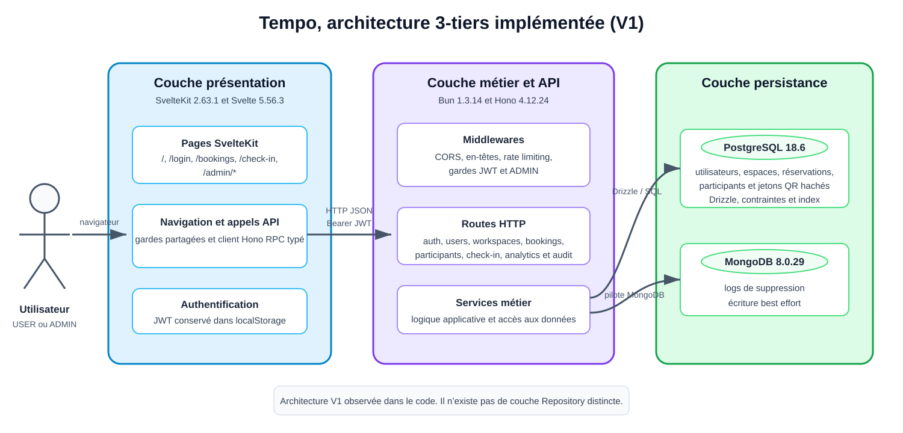
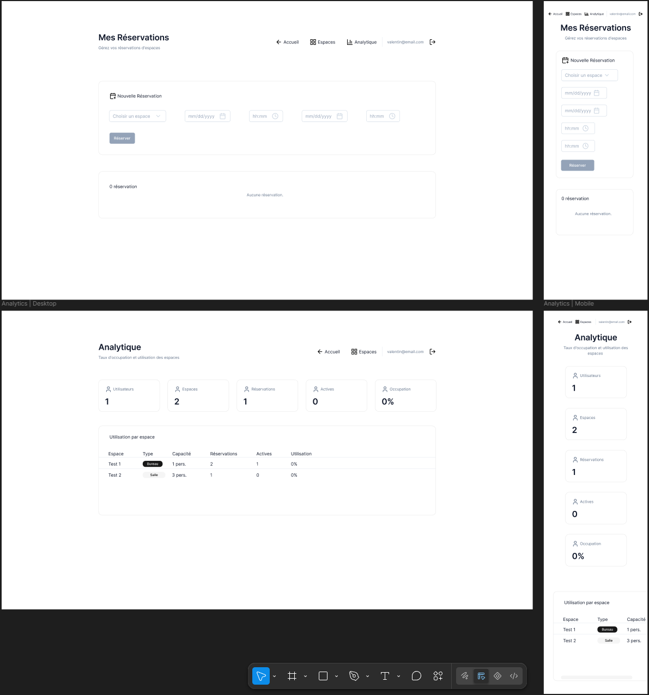

Certification professionnelle

Titre professionnel: **Concepteur développeur d'applications**

RNCP**:** **37873**

DOSSIER PROJET

PROJET :

**Tempo**

Rédacteur :

Valentin Musset

Date : _7 Octobre 2026_

**SOMMAIRE**

[**1\. LISTE DES COMPÉTENCES DU RÉFÉRENTIEL COUVERTES PAR LE PROJET 5**](#_heading=h.q0csxcn7m3b6)

[1.1 Développer une application sécurisée 5](#_heading=h.zgknclrva8dg)

[1.1.1. Installer et configurer son environnement de travail en fonction du projet 5](#_heading=h.iv9l2oxmryuq)

[1.1.2. Développer des interfaces utilisateur 5](#_heading=h.hvmu9o7mnhn)

[1.1.3. Développer des composants métier 6](#_heading=h.rd66saot106b)

[1.1.4. Contribuer à la gestion d’un projet informatique 6](#_heading=h.dmc92bv3pf0y)

[1.2. Concevoir et développer une application sécurisée organisée en couches 7](#_heading=h.55z3s9enzo44)

[1.2.1. Analyser les besoins et maquetter une application 7](#_heading=h.bwc1y7afymco)

[1.2.2. Définir l’architecture logicielle d’une application 7](#_heading=h.ee3p06xiek5u)

[1.2.3. Concevoir et mettre en place une base de données relationnelle 8](#_heading=h.p57fqm153z0m)

[1.2.4. Développer des composants d’accès aux données SQL et NoSQL 8](#_heading=h.j5c7j03jfu7e)

[1.3. Préparer le déploiement d’une application sécurisée 9](#_heading=h.e1q9txizy794)

[1.3.1. Préparer et exécuter les plans de tests d’une application 9](#_heading=h.ml885hoekyv)

[1.3.2. Préparer et documenter le déploiement d’une application 9](#_heading=h.a2wy8s9oh637)

[1.3.3. Contribuer à la mise en production dans une démarche DevOps 10](#_heading=h.c3fzifay2rt2)

[**2\. CAHIER DES CHARGES 10**](#_heading=h.717sjx161azr)

[2.1. Description de l’existant 11](#_heading=h.roobauohrn6j)

[2.2. Reprise de l’existant 11](#_heading=h.a1a6b59gqa4z)

[2.3. Principes de référencement 11](#_heading=h.nzo2zub5cjoe)

[2.4. Exigences de performances et de volumétrie 11](#_heading=h.vewcadtmz9hx)

[2.5. Multilinguisme & adaptations pour un public spécifique 11](#_heading=h.pvoesii9jn4y)

[2.6. Description graphique et ergonomique 11](#_heading=h.h3yf8vbzkh65)

[2.6.1. Composants de la charte graphique 11](#_heading=h.sle2t5coid52)

[2.6.2. Design, Responsive design et autres exigences liées au design 12](#_heading=h.m45s1yg0kr66)

[2.7. Besoins fonctionnels « métier » 12](#_heading=h.bwkwq0e7cu48)

[2.7.1. Utilisateurs du projet 12](#_heading=h.f3gf204bglfa)

[2.7.2. Informations relatives aux contenus 12](#_heading=h.qkkogx47ksyd)

[2.7.3. Inventaire des besoins fonctionnels 12](#_heading=h.dqt5ooe4opsg)

[2.8. Budget 13](#_heading=h.xtntveccwyfw)

[**3\. PRESENTATION DE L’ENTREPRISE ET DU SERVICE 13**](#_heading=h.v4vymgp7mzaw)

[3.1. Présentation de l’entreprise et du service 13](#_heading=h.q1cbo285b4k4)

[3.2. Objectifs du projet 13](#_heading=h.cje3jfeqgukc)

[3.3. Cible adressée par le projet 13](#_heading=h.2oqm6rqyrn9v)

[3.4. Processus utilisateur impacté 13](#_heading=h.fjftw0brin51)

[**4\. GESTION DE PROJET 13**](#_heading=h.z2twetev8qvz)

[4.1. Intervenants sur le projet 13](#_heading=h.h5hqv82srs6t)

[4.2. Méthodologie 14](#_heading=h.7vv6o6uovqor)

[4.3. Outils, planning et suivi 14](#_heading=h.9iyyf1hgaxjg)

[4.4. Objectifs de qualité 14](#_heading=h.91a0fe802vdv)

[**5\. SPECIFICATIONS FONCTIONNELLES 14**](#_heading=h.r55u82i5749q)

[5.1. Contraintes du projet et livrables attendus 14](#_heading=h.588sbic6a0x7)

[5.1.1. Criticité de l’application 14](#_heading=h.ujikzl5eisrt)

[5.1.2. Applications connexes 14](#_heading=h.wd4hy4sjnafp)

[5.1.3. Services tiers 14](#_heading=h.ebaq7fpx8jji)

[5.1.4. Livrables attendus 15](#_heading=h.j0kblgidqrt1)

[5.2. Architecture logicielle du projet 15](#_heading=h.oas5q9xrngzt)

[5.3. Maquettes et enchainement des maquettes 15](#_heading=h.grhgg1cclqy7)

[5.3.1. Cartographie 15](#_heading=h.ugldkiqvv5d4)

[5.3.2. Maquettes 15](#_heading=h.khrm0nsx8zcf)

[5.4. Diagramme du comportement des fonctionnalités de type cas d’utilisations 16](#_heading=h.1vc4p7fudiru)

[5.4.1. MCD (MERISE) 16](#_heading=h.95pb8dmdjuhw)

[5.4.2. MLD (MERISE) 16](#_heading=h.dswgdfpwb0ev)

[5.4.3. MPD (MERISE) 16](#_heading=h.5li51dpo76v2)

[5.4.4. Diagramme de classes (UML) 16](#_heading=h.1e5qp7ks08z7)

[5.5. Script de création et/ou de modification de la base de données 16](#_heading=h.89g3wdqx8vqc)

[5.5.1. Script de création 16](#_heading=h.vtfauvdbaafq)

[5.5.2. Argumentation 16](#_heading=h.c29av2da32er)

[5.5.3. Script de modification 16](#_heading=h.70fefffytdps)

[5.5.4. Argumentation 16](#_heading=h.ft2g1su1j6ut)

[5.6. Diagramme du comportement des fonctionnalités de type cas d’utilisations 16](#_heading=h.tyzy94mfdory)

[5.6.1. Diagramme de cas d’utilisation global (UML) 16](#_heading=h.seh7oycsy8qk)

[5.7. Fonctionnalités détaillées les plus significatives 16](#_heading=h.d7ay29cwkfr1)

[5.7.1. Fonctionnalité 1 16](#_heading=h.9vtaqgveaphf)

[5.7.2. Fonctionnalité 2 17](#_heading=h.ldddwin3ak98)

[5.7.3. Fonctionnalité 3 17](#_heading=h.34fyzeufhr9r)

[5.7.4. Fonctionnalité 4 17](#_heading=h.koujl4q2vsf)

[5.7.5. Fonctionnalité 5 17](#_heading=h.pz4hcr6x4623)

[**6\. SPECIFICATIONS TECHNIQUES 17**](#_heading=h.4ol9l8qf9nye)

[6.1. Référencement 17](#_heading=h.4ar0eyllmooc)

[6.2. Environnement technique 17](#_heading=h.tqfkinf5x5p3)

[6.3. Navigation et accessibilité 18](#_heading=h.yz8m5on7qevc)

[6.4. Services tiers 18](#_heading=h.8nld3ppwzuog)

[6.5. Sécurité 18](#_heading=h.70pdhxshncr)

[**7\. REALISATIONS 18**](#_heading=h.hfrh9es5ht4c)

[7.1. Exemple 1 : xxx (Composants Métier) 19](#_heading=h.yofz38owczco)

[7.1.1. Affichage 19](#_heading=h.aj5blhloa4sg)

[7.1.2. Extrait(s) de code 19](#_heading=h.ewgr4ckt8vey)

[7.1.3. Argumentation 19](#_heading=h.pke3sloambje)

[7.2. Exemple 1 : xxx (Composants Métier) 19](#_heading=h.t2pzl7v6zorv)

[7.2.1. Affichage 19](#_heading=h.73wgyca75igp)

[7.2.2. Extrait(s) de code 19](#_heading=h.nxjh2epkwy0h)

[7.2.3. Argumentation 19](#_heading=h.jxjpt7whoyi9)

[7.3. Exemple 1 : xxx (Composants d’accès aux données) 19](#_heading=h.ixp7iht4cqhf)

[7.3.1. Affichage 19](#_heading=h.83v0drffglar)

[7.3.2. Extrait(s) de code 19](#_heading=h.ouuuxia9nu9m)

[7.3.3. Argumentation 19](#_heading=h.szs89lvz11xt)

[7.4. Exemple 1 : xxx (Composants d’accès aux données) 19](#_heading=h.o6oumfxhgwj)

[7.4.1. Affichage 19](#_heading=h.u8o10fp4pzhj)

[7.4.2. Extrait(s) de code 19](#_heading=h.dxmdp3hei969)

[7.4.3. Argumentation 19](#_heading=h.5u327oh5pe)

[7.5. Exemple 1 : xxx (Autres) 19](#_heading=h.2bvzxoro6kk6)

[7.5.1. Affichage 19](#_heading=h.w9ujtev4pznk)

[7.5.2. Extrait(s) de code 19](#_heading=h.3p2dpewe1o6c)

[7.5.3. Argumentation 19](#_heading=h.8db133daok71)

[**8\. ELEMENTS DE SECURITE DE L’APPLICATION 19**](#_heading=h.6cr22bg5aggb)

[**9\. PLAN DE TESTS 19**](#_heading=h.gd985yt6u2c)

[**10\. JEU D’ESSAI DE LA FONCTIONNALITE LA PLUS REPRESENTATIVE 20**](#_heading=h.v073hqrdsavw)

[10.1. Fonctionnalité testée 20](#_heading=h.ooom1yk8i7an)

[10.2. Description des scenarios 20](#_heading=h.5oooznhgdxox)

[10.3. Résultats des tests 20](#_heading=h.u7t470fetadg)

[10.4. Conclusion 20](#_heading=h.te6o45arycqm)

[**11\. VEILLE SUR LES VULNÉRABILITÉS DE SÉCURITÉ 20**](#_heading=h.r2ma1mm4epee)

# 1\. LISTE DES COMPÉTENCES DU RÉFÉRENTIEL COUVERTES PAR LE PROJET

Exprimer à la première du singulier vos compétences mises en œuvre dans votre projet. Adapter la description des activités à votre projet et à vos activités

## 1.1 Développer une application sécurisée

### 1.1.1. Installer et configurer son environnement de travail en fonction du projet

_Description des activités à mettre en avant_

Le concepteur développeur d’applications prépare son environnement de travail en fonction du projet qui lui est confié. Il installe et configure sur son poste de travail tous les outils nécessaires à son environnement de travail afin de reconstituer un environnement de développement conforme à l’environnement de production.

_Ma contribution sur le projet Tempo_

J'ai installé et configuré mon environnement de travail à partir des besoins spécifiques du projet : le runtime **Bun** (exécution TypeScript, gestionnaire de paquets et de workspaces), **Docker** et **Docker Compose** pour lancer localement les services PostgreSQL et MongoDB dans des conteneurs identiques à ceux utilisés en production, ainsi que **Git/GitHub** pour le versioning. J'ai mis en place les outils de qualité de code (Oxlint, Oxfmt) et de test (Bun Test, Vitest) directement intégrés à l'environnement de développement, avec des scripts `bun run dev`, `bun run lint`, `bun run test` centralisés à la racine du monorepo.

Pour info, éléments de preuve des compétences (vérifier que ces éléments sont présents dans votre projet, dans votre dossier et dans votre présentation) :

- Les outils de développement nécessaires sont installés
- Les outils de gestion des versions et de collaboration sont installés
- Les conteneurs implémentent les services requis
- La documentation technique de l’environnement de travail est comprise, en langue française ou anglaise (niveau B1 CECRL pour l’anglais)

### 1.1.2. Développer des interfaces utilisateur

_Description des activités à mettre en avant_

A partir du dossier de conception, il développe la partie dynamique de l’application avec des composants métier sécurisés, dans un style défensif, éventuellement en asynchrone, en respectant les bonnes pratiques de la programmation.

_Ma contribution sur le projet Tempo_

J'ai développé les interfaces utilisateur du frontend avec **Svelte 5** (Runes : `$state`, `$derived`, `$effect`) et la librairie de composants **shadcn-svelte**, stylées avec **Tailwind CSS** pour garantir un rendu responsive sur desktop, tablette et mobile. Les appels à l'API backend sont effectués de façon asynchrone via le client RPC typé (`hc<AppType>`), avec gestion des erreurs et des états de chargement côté interface (ex : message d'erreur en cas de créneau déjà réservé).

Pour info, éléments de preuve des compétences (vérifier que ces éléments sont présents dans votre projet, dans votre dossier et dans votre présentation) :

- L’interface est conforme au dossier de conception
- L’interface s’adapte au type d’utilisation de l‘application et notamment à la taille, au type et à la disposition du support
- La charte graphique est respectée
- La réglementation en vigueur est respectée
- Le code est documenté
- Les tests unitaires ont été réalisés pour les composants concernés
- Le jeu d’essai fonctionnel est complet
- Les tests de sécurité sont réalisés
- La documentation technique des interfaces utilisateur est comprise, en langue française ou anglaise (niveau B1 CECRL pour l’anglais)
- La démarche structurée de résolution de problème est adaptée en cas de dysfonctionnement
- Le système de veille permet de suivre les évolutions technologiques et les problématiques de sécurité en lien avec les interfaces utilisateur

### 1.1.3. Développer des composants métier

_Description des activités à mettre en avant_

A partir du dossier de conception, il développe la partie dynamique de l’application avec des composants métier sécurisés, dans un style défensif, éventuellement en asynchrone, en respectant les bonnes pratiques de la programmation.

Il documente le code. Il conçoit un jeu d’essai fonctionnel et réalise les tests unitaires de chaque composant. Il détermine une démarche structurée de résolution de problème en cas de découverte d’un dysfonctionnement lors de l’analyse des résultats des tests unitaires ou en cas d’incident survenant en production. Il réalise les tests de sécurité. Il effectue une veille technologique sur les évolutions techniques et de sécurité liées aux technologies qu’il utilise.

_Ma contribution sur le projet Tempo_

J'ai développé les composants métier du backend en TypeScript, organisés en modules (`auth`, `users`, `workspaces`, `bookings`, `audit`), chacun suivant le même découpage Route/Service/Accès aux données. Le composant le plus représentatif est l'algorithme de détection de chevauchement de réservations (`bookingService.checkOverlap`), que j'ai conçu, documenté et couvert par des tests unitaires (Bun Test) traitant tous les cas limites (chevauchement partiel, total, réservations consécutives). J'ai sécurisé les composants avec une validation stricte des entrées (Zod) et un contrôle des rôles utilisateur. J'effectue une veille technique régulière (changelogs Bun/Hono/Drizzle, avis de sécurité npm) pour suivre les évolutions des technologies utilisées.

Pour info, éléments de preuve des compétences (vérifier que ces éléments sont présents dans votre projet, dans votre dossier et dans votre présentation) :

- Les bonnes pratiques de la programmation orientée objet (POO) sont respectées
- Les composants métier sont sécurisés
- Les règles de nommage sont conformes aux normes de qualité de l’entreprise
- Le code source est documenté
- Les traitements répondent aux fonctionnalités décrites dans le dossier de conception
- Les tests unitaires sont réalisés
- Les tests de sécurité sont réalisés
- La démarche structurée de résolution de problème est adaptée en cas de dysfonctionnement
- Le système de veille permet de suivre les évolutions technologiques et les problématiques de sécurité en lien avec les composants métier d’une application

### 1.1.4. Contribuer à la gestion d’un projet informatique

_Description des activités à mettre en avant_

Le concepteur développeur d’applications contribue à la gestion du projet informatique en planifiant et en faisant le suivi de ses tâches de conception et de développement. Il définit les environnements de développement en adéquation avec l’architecture du projet. Il définit les outils collaboratifs en fonction de la méthode de développement et rédige les comptes rendus de réunion.

_Ma contribution sur le projet Tempo_

Ayant mené ce projet seul, j'ai assuré moi-même la gestion de projet : planification des tâches sur un tableau **Trello** en colonnes Kanban (À faire / En cours / Terminé), suivi de l'avancement au fil des itérations, et priorisation des fonctionnalités critiques (authentification, réservation) avant les fonctionnalités secondaires (audit, administration). J'ai également tenu un fichier `todo.md` pour le suivi des tâches restantes à court terme, en remplacement des comptes rendus de réunion habituels à une équipe.

Pour info, éléments de preuve des compétences (vérifier que ces éléments sont présents dans votre projet, dans votre dossier et dans votre présentation) :

- Les tâches de conception et de développement sont planifiées en fonction du délai défini
- Le suivi des tâches est mis en rapprochement avec la planification, les éventuels retards sont identifiés et les acteurs concernés sont alertés
- Les procédures qualité sont mises en œuvre
- L’environnement de développement défini est en adéquation avec l’architecture du projet
- Les outils collaboratifs sont choisis en fonction de la méthode de développement
- Les comptes rendus de réunion sont structurés, rédigés dans un style adapté, dans le respect des règles orthographiques et grammaticales, et contiennent les informations nécessaires

## 1.2. Concevoir et développer une application sécurisée organisée en couches

### 1.2.1. Analyser les besoins et maquetter une application

_Description des activités à mettre en avant_

Le concepteur développeur d’applications analyse les besoins utilisateurs de l’application. Il réalise les maquettes de l’application, ainsi que leur enchaînement. Il rédige le dossier de conception.

Le concepteur développeur d’applications analyse le cahier des charges en identifiant les limites du système, les acteurs et les messages. Il formalise les besoins utilisateurs. Il construit les maquettes de l’application et l’enchaînement des écrans, éventuellement à l’aide d’un outil de maquettage.

_Ma contribution sur le projet Tempo_

J'ai rédigé le cahier des charges technique du projet (`SPECS.md`) en identifiant les acteurs, les limites du système et les besoins fonctionnels. J'ai préparé une première maquette dans Figma, puis je l'ai fait évoluer pendant l'implémentation avec les composants shadcn-svelte. Le diagramme de cas d'utilisation, la cartographie des écrans et la maquette sont présentés en section 5.

Pour info, éléments de preuve des compétences (vérifier que ces éléments sont présents dans votre projet, dans votre dossier et dans votre présentation) :

- Les besoins recensés couvrent l’ensemble des exigences utilisateur exprimées dans le cahier des charges
- Les maquettes sont réalisées conformément au cahier des charges en langue française ou anglaise (niveau B1 du CECRL pour l’anglais)
- L’enchaînement des maquettes est formalisé par un schéma
- Le dossier de conception est structuré, en conformité avec la démarche de conception

### 1.2.2. Définir l’architecture logicielle d’une application

_Description des activités à mettre en avant_

Il conçoit l’architecture logicielle multicouche répartie en vue du développement d’une application sécurisée. Il définit le rôle de chaque couche en tenant compte de la stratégie de sécurité. Il identifie les besoins d’éco-conception de l’application. Il conçoit le schéma conceptuel des données en respectant les règles des bases de données relationnelles, les règles de nommage en vigueur dans l’entreprise, et en assurant l’intégrité des données.

_Ma contribution sur le projet Tempo_

J'ai conçu une architecture 3-tiers (présentation / métier / persistance) répartie en un monorepo Bun composé de deux workspaces indépendants (frontend Svelte, backend Hono), communiquant via une API RPC typée. J'ai défini le rôle de chaque couche en intégrant la sécurité dès la conception (validation systématique des entrées, authentification JWT centralisée dans un middleware). Pour l'éco-conception, j'ai privilégié un runtime performant et léger (Bun) ainsi que des images Docker multi-stage optimisées, réduisant la consommation de ressources par rapport à une stack Node.js classique. J'ai conçu le schéma conceptuel des données (MCD) en respectant les règles du modèle relationnel et en garantissant l'intégrité référentielle (clés étrangères, contraintes de suppression en cascade).

Pour info, éléments de preuve des compétences (vérifier que ces éléments sont présents dans votre projet, dans votre dossier et dans votre présentation) :

- L’architecture logicielle est conforme aux bonnes pratiques d’une architecture multicouche répartie sécurisée
- Le rôle de chaque couche est bien défini en tenant compte de la stratégie de sécurité
- Les besoins d’éco-conception de l’application sont identifiés

### 1.2.3. Concevoir et mettre en place une base de données relationnelle

_Description des activités à mettre en avant_

A partir du schéma physique, Il met en place la base de données. Il définit les utilisateurs et leurs droits d’accès en respectant les règles de sécurité et de confidentialité du cahier des charges. Il crée un jeu d’essai complet dans une base de données de test et la sauvegarde afin de pouvoir la restaurer.

_Ma contribution sur le projet Tempo_

À partir du schéma physique (MPD), j'ai mis en place la base de données **PostgreSQL** en générant les scripts de création via **Drizzle Kit** (`bunx drizzle-kit generate` / `migrate`) à partir du schéma TypeScript déclaratif (`schema.ts`). Un utilisateur applicatif dédié (`admin`) est défini avec ses droits d'accès via les variables d'environnement (`DATABASE_URL`), séparé de tout accès direct en production. J'ai créé un jeu d'essai (mocks) utilisé dans les tests unitaires pour valider les traitements sans dépendre d'une base réelle, et la persistance des données de test/développement est assurée par un volume Docker (`postgres_data`) restaurable.

Pour info, éléments de preuve des compétences (vérifier que ces éléments sont présents dans votre projet, dans votre dossier et dans votre présentation) :

- Le schéma conceptuel respecte les règles du relationnel
- Le schéma physique est conforme aux besoins exprimés dans le cahier des charges
- Les règles de nommage ont été respectées
- L’intégrité, la sécurité et la confidentialité des données est assurée
- La base de données de test est créée avec un jeu d’essai complet et peut être restaurée en cas d’incident
- La documentation technique des bases de données est comprise, en langue française ou anglaise (niveau B1 du CECRL pour l’anglais)

### 1.2.4. Développer des composants d’accès aux données SQL et NoSQL

_Description des activités à mettre en avant_

Il code les traitements relatifs aux accès aux données en consultation, modification, création et suppression. Il s’assure que les traitements gèrent l’intégrité et les conflits d’accès aux données, et qu’ils permettent de respecter la confidentialité. Il prend en compte les cas d’exception. Il valide et contrôle les entrées dans les composants serveurs sécurisés avant la mise à jour de la base de données.

Il réalise les tests unitaires et de sécurité. Il détermine une démarche structurée de résolution de problème en cas de découverte d’un dysfonctionnement lors de l’analyse des résultats des tests unitaires ou lors d’un incident de production.

_Ma contribution sur le projet Tempo_

J'ai développé les composants d'accès aux données SQL avec **Drizzle ORM** (requêtes typées, jointures déclaratives via `db.query.*.findMany`) pour les entités relationnelles (utilisateurs, espaces, réservations), et NoSQL avec le driver **MongoDB natif** pour les logs d'audit (`auditService`). Chaque composant gère les cas d'exception métier (espace introuvable, chevauchement de créneau, accès non autorisé) en levant des erreurs typées interceptées au niveau de la route. Les entrées sont validées par des schémas Zod avant toute écriture en base. J'ai réalisé les tests unitaires associés (mocks des accès base de données) pour valider ces traitements indépendamment de l'infrastructure.

Pour info, éléments de preuve des compétences (vérifier que ces éléments sont présents dans votre projet, dans votre dossier et dans votre présentation) :

- Les traitements relatifs aux manipulations des données répondent aux fonctionnalités décrites dans le dossier de conception
- Les cas d’exception sont pris en compte
- L’intégrité et la confidentialité des données sont maintenues
- Les conflits d’accès aux données sont gérés
- Toutes les entrées sont contrôlées et validées dans les composants serveurs sécurisés
- Les tests unitaires et de sécurité sont associés à chaque composant
- La démarche structurée de résolution de problème est adaptée en cas de dysfonctionnement
- Le système de veille permet de suivre les évolutions technologiques et les problématiques de sécurité liées aux bases de données SQL et NoSQL

## 1.3. Préparer le déploiement d’une application sécurisée

### 1.3.1. Préparer et exécuter les plans de tests d’une application

_Description des activités à mettre en avant_

Le concepteur développeur d’applications prépare et exécute les plans de tests d’une application. Il vérifie que les résultats sont ceux qui sont attendus.

Le concepteur développeur d’applications prépare un plan de tests, crée ou fait créer un environnement de test. Il exécute ou fait exécuter les tests sur cet environnement manuellement ou automatiquement. Il vérifie que les résultats sont conformes aux résultats attendus.

_Ma contribution sur le projet Tempo_

J'ai préparé un plan de tests couvrant les règles métier critiques du projet (authentification, détection de chevauchement de réservations, autorisations par rôle, collaboration et journalisation d'audit), détaillé en section 9. J'ai créé un environnement de test isolé permettant d'exécuter 99 tests backend unitaires/HTTP, 3 tests d'intégration PostgreSQL, 2 tests d'intégration MongoDB avec Bun Test, 18 tests frontend avec Vitest et 2 parcours E2E avec Playwright. Ils vérifient notamment les statuts HTTP 200/201/400/401/403/404/409, le refus d'un utilisateur `USER`, l'autorisation d'un `ADMIN`, la persistance d'une réservation, le rejet atomique d'une double réservation concurrente, les invitations et le check-in par QR code, ainsi que l'écriture, l'auteur, l'horodatage, l'ordre et le filtrage des logs d'audit réels. Les tests navigateur pilotent réellement l'interface pour vérifier le parcours de réservation et d'annulation, puis le parcours d'invitation, d'acceptation et de check-in. Les suites couvrent aussi les bornes temporelles des statistiques, la modification des espaces, les protections HTTP, la configuration du seed de démonstration et les redirections sur réponses 401/403. Je vérifie systématiquement que les résultats obtenus correspondent aux résultats attendus avant de considérer une fonctionnalité comme terminée.

Pour info, éléments de preuve des compétences (vérifier que ces éléments sont présents dans votre projet, dans votre dossier et dans votre présentation) :

- Le plan de tests couvre l’ensemble des fonctionnalités retenues pour l’application
- Un environnement de tests est créé
- L’intégralité des tests exécutés sont conformes au plan de tests défini
- Les résultats obtenus sont cohérents avec les résultats attendus
- Le plan de tests tient compte des évolutions technologiques et des problèmes de sécurité liés aux tests logiciels

### 1.3.2. Préparer et documenter le déploiement d’une application

_Description des activités à mettre en avant_

Il écrit et documente les scripts et la procédure de déploiement d’une application. Il définit les environnements de tests et les procédures pour exécuter les tests.

_Ma contribution sur le projet Tempo_

J'ai écrit et documenté les scripts de déploiement de l'application : deux `Dockerfile` multi-stage (un par workspace) et un fichier `docker-compose.yml` orchestrant PostgreSQL, MongoDB, le backend et le frontend. Les versions de Bun et des bases sont épinglées. Compose attend les health checks des bases, le backend applique automatiquement les migrations Drizzle avant de démarrer, puis le frontend attend que l'API soit saine. Un profil optionnel charge un jeu de démonstration idempotent. La procédure locale, les sauvegardes, la restauration et la stratégie de rollback sont documentées dans le `README.md`. L'exécution complète a été validée sur un runner GitHub disposant de Docker par le pipeline d'intégration continue.

Pour info, éléments de preuve des compétences (vérifier que ces éléments sont présents dans votre projet, dans votre dossier et dans votre présentation) :

- La procédure de déploiement est rédigée
- Les scripts de déploiement sont écrits et documentés
- Les environnements de tests sont définis et la procédure d’exécution des tests d’intégration, système et d’acceptation client est rédigée
- Le système de veille permet de suivre les évolutions technologiques et les problématiques de sécurité liées au déploiement d’une application

### 1.3.3. Contribuer à la mise en production dans une démarche DevOps

_Description des activités à mettre en avant_

Cette compétence s’exerce seul ou au sein d’une équipe, en adéquation avec la méthode de gestion de projet choisie.

Dans le cadre d’une démarche Devops, le concepteur développeur d’applications réalise l’intégration en continu du projet (CI Continuous Integration) en collaboration avec les équipes systèmes (operations OPS) qui contrôlent ou effectuent le déploiement en continu (CD Continuous Delivery).

Selon les projets, la communication écrite et orale peut s’effectuer en anglais avec les acteurs concernés.

_Ma contribution sur le projet Tempo_

Ayant travaillé seul sur ce projet, j'ai cumulé les rôles de développeur et d'« exploitant » en mettant en place moi-même le pipeline d'intégration continue avec **GitHub Actions** (`.github/workflows/ci.yml`). Ce pipeline exécute automatiquement, à chaque `push` et `pull request` : formatage, lint, contrôles TypeScript/Svelte, tests et build applicatif. Un second job construit puis démarre la stack Docker Compose, attend les health checks, charge le jeu de démonstration, exécute les tests d'intégration PostgreSQL et MongoDB puis le parcours E2E Playwright dans Chromium, et vérifie les endpoints publics ainsi que la connexion administrateur. En cas d'échec du parcours navigateur, ses traces, captures et vidéos sont conservées sept jours comme artefact. L'[exécution réussie du 1er septembre 2026](https://github.com/Vaalley/tempo/actions/runs/33485477310) prouve l'exécution complète du pipeline : le job « Quality & Tests » et le job « Docker Build Check » sont verts, y compris l'étape E2E Playwright.


Pour info, éléments de preuve des compétences (vérifier que ces éléments sont présents dans votre projet, dans votre dossier et dans votre présentation) :

- Les outils de qualité de code sont utilisés
- Les outils d’automatisation de tests sont utilisés
- Les scripts d’intégration continue s’exécutent sans erreur
- Le serveur d’automatisation est paramétré pour les livrables et les tests
- Les rapports de l’Intégration Continue sont interprétés
- La documentation technique des différents outils est comprise, en langue française ou anglaise (niveau B1du CECRL pour l’anglais)
- La démarche structurée de résolution de problème est adaptée en cas de dysfonctionnement
- Le système de veille permet de suivre les évolutions technologiques et les problématiques de sécurité liées à la démarche DevOps

# 2\. CAHIER DES CHARGES

S’exprimer au présent et d’une façon totalement impersonnelle. Éviter les termes techniques dans le CDC.

## 2.1. Description de l’existant

Tempo est un projet réalisé en dehors de tout contexte professionnel (projet personnel de certification, sans lien avec la structure qui accueille mon alternance). Il n’existe donc pas d’application antérieure à reprendre : il s’agit d’une création complète (« greenfield »).

Le constat de départ est le suivant : de nombreuses entreprises ont adopté le flex-office (postes de travail non attitrés) sans toujours disposer d’un outil simple pour réserver un bureau ou une salle et pour permettre aux équipes de piloter le taux d’occupation des locaux. Les solutions actuelles (tableur partagé, plan papier, outils de réservation de salles génériques) ne couvrent ni la gestion des chevauchements de créneaux, ni le suivi de présence, ni la vision d’ensemble pour un administrateur. Tempo répond à ce besoin avec une application web dédiée.

## 2.2. Reprise de l’existant

Aucune version précédente n’existe. Aucun élément (nom de domaine, hébergement, documentation) n’est donc à reprendre. Le patrimoine documentaire du projet (cahier des charges `SPECS.md`, diagrammes MERISE/UML, README) a été rédigé intégralement dans le cadre de ce projet.

## 2.3. Principes de référencement

Tempo est une application métier interne (SaaS B2B) destinée à être utilisée par les collaborateurs et administrateurs d’une entreprise après authentification. Elle n’a donc pas vocation à être référencée sur les moteurs de recherche publics : aucune stratégie SEO n’est requise pour les pages applicatives situées derrière l’authentification.

## 2.4. Exigences de performances et de volumétrie

Le projet vise une PME type de 50 à 300 collaborateurs répartis sur un ou plusieurs sites en flex-office. Ordres de grandeur retenus pour dimensionner l’architecture :

- Nombre d’utilisateurs actifs simultanés : quelques dizaines (usage concentré aux heures d’arrivée/de départ de bureau) ;
- Nombre de réservations créées par jour : quelques centaines pour une entreprise de cette taille ;
- Disponibilité attendue : disponibilité aux heures ouvrées (l’indisponibilité en dehors de ces plages a un impact limité) ;
- Temps de réponse attendu : inférieur à 300 ms sur les endpoints de consultation/réservation.

Ce niveau de volumétrie reste modéré, ce qui justifie une architecture monolithique modulaire (backend Hono + PostgreSQL) plutôt qu’une architecture micro-services, tout en gardant une séparation claire par couches et par modules pour permettre une montée en charge ultérieure.

## 2.5. Multilinguisme & adaptations pour un public spécifique

L’application est développée uniquement en français dans sa version actuelle. Aucune traduction n’est prévue à ce stade du projet.

Aucune adaptation spécifique n’a été mise en place à ce jour ; l’accessibilité (RGAA — sémantique HTML, labels ARIA) est identifiée comme un axe d’amélioration pour une évolution future de l’application.

## 2.6. Description graphique et ergonomique

### 2.6.1. Composants de la charte graphique

Identité visuelle :

- Logo : logotype simple « Tempo », sans identité graphique poussée (le projet n’a pas de charte graphique de marque, il s’agit d’une application interne) ;
- Police et taille de caractères : police système par défaut (sans-serif) via Tailwind CSS, tailles harmonisées par les composants shadcn-svelte ;
- Palette de couleurs : palette neutre (« zinc/slate ») générée via variables CSS OKLCH (`--primary`, `--secondary`, `--accent`, `--destructive`, …), avec un thème clair et un thème sombre (`.dark`) ;
- Déclinaison de l’identité visuelle : cohérence assurée par la librairie de composants shadcn-svelte (boutons, cartes, tableaux, badges, alertes) réutilisés sur l’ensemble des écrans (connexion, réservations, administration des espaces).

### 2.6.2. Design, Responsive design et autres exigences liées au design

L’application est conçue en responsive design grâce à Tailwind CSS (approche « utility-first », classes adaptatives). Elle doit rester utilisable aussi bien sur poste de travail (consultation du planning, administration) que sur mobile (réservation rapide, scan du QR code de check-in).

Aucune exigence de design particulière (flat design, parallaxe, …) n’a été formulée : le parti pris est un design sobre et fonctionnel, cohérent avec les standards des outils métier (shadcn-svelte).

## 2.7. Besoins fonctionnels « métier »

### 2.7.1. Utilisateurs du projet

Deux profils d’utilisateurs sont identifiés (voir diagramme de cas d’utilisation `use case diagram.png`) :

- **Collaborateur (`USER`)** : s’inscrit, se connecte, consulte les espaces disponibles, crée/consulte/annule ses réservations, confirme sa présence (check-in) ;
- **Administrateur (`ADMIN`)** : hérite des droits du collaborateur, consulte, crée, modifie et supprime les espaces de travail, gère les comptes utilisateurs, supervise toutes les réservations, peut les annuler et consulte les statistiques ainsi que les logs d'audit.

Le processus métier impacté est la **gestion des ressources immobilières / facilities management** (occupation des locaux), en lien avec les fonctions RH et Office Management de l’entreprise.

### 2.7.2. Informations relatives aux contenus

L’application ne diffuse pas de contenu éditorial (articles, images, vidéos). Les données manipulées sont exclusivement des données métier :

- Données d’identité et de compte (email, mot de passe haché, rôle) ;
- Données de réservation (espace réservé, créneau horaire, statut) ;
- Données d’audit (traçabilité des actions sensibles : suppression d’un espace, d’une réservation, d’un utilisateur).

Ces données étant à caractère personnel (compte utilisateur, historique de présence), le projet applique une logique de protection des données dès la conception (mot de passe haché avec `Bun.password`, validation stricte des entrées via Zod, journalisation des actions de suppression dans MongoDB à des fins de traçabilité RGPD).

### 2.7.3. Inventaire des besoins fonctionnels

| Thème            | Qui            | Quoi                                       | Pourquoi                                                                 |
| ---------------- | -------------- | ------------------------------------------ | ------------------------------------------------------------------------ |
| Authentification | Collaborateur  | S'inscrire                                 | Créer un compte pour accéder à l'application                             |
| Authentification | Collaborateur  | Se connecter                               | Accéder à l'application de manière sécurisée                             |
| Authentification | Collaborateur  | Se déconnecter                             | Quitter l'application en sécurité                                        |
| Espaces          | Collaborateur  | Consulter les espaces disponibles          | Trouver un bureau ou une salle libre                                     |
| Espaces          | Collaborateur  | Filtrer les espaces par type/capacité      | Trouver rapidement l'espace adapté au besoin                             |
| Espaces          | Administrateur | Consulter / créer / supprimer un espace    | Tenir à jour l'inventaire des espaces disponibles                        |
| Réservations     | Collaborateur  | Créer une réservation (publique ou privée) | Réserver un espace pour un créneau donné                                 |
| Réservations     | Collaborateur  | Consulter ses réservations                 | Suivre ses réservations passées et à venir                               |
| Réservations     | Collaborateur  | Annuler sa réservation                     | Libérer un espace qui ne sera plus utilisé                               |
| Réservations     | Collaborateur  | Confirmer sa présence (check-in QR code)   | Valider l'occupation réelle de l'espace réservé                          |
| Réservations     | Système        | Détecter les chevauchements de créneaux    | Garantir qu'un espace n'est jamais réservé deux fois sur le même créneau |
| Supervision      | Administrateur | Consulter toutes les réservations          | Piloter le taux d'occupation des locaux                                  |
| Supervision      | Administrateur | Consulter les logs d'audit                 | Assurer la traçabilité des actions sensibles (RGPD)                      |

Le détail exhaustif des cas d'utilisation et de leurs relations (inclusions/extensions) est disponible dans le diagramme de cas d'utilisation (`use case diagram.png`, section 5.6).

Aucun besoin non formulé de type e-commerce, boutique en ligne ou moteur de recherche n'a été identifié : Tempo est un outil métier interne, sans catalogue ni paiement. Les règles de gestion métier identifiées sont détaillées en section 5 (contrôle des chevauchements, quotas d'espaces, statuts de réservation).

## 2.8. Budget

S'agissant d'un projet personnel réalisé en parallèle de mon alternance, aucun budget financier n'a été alloué. L'investissement se mesure en temps de travail personnel, réparti approximativement comme suit :

| Phase                                        | Charge estimée     |
| -------------------------------------------- | ------------------ |
| Cadrage & cahier des charges (`SPECS.md`)    | quelques jours     |
| Conception (MERISE, UML, maquettage)         | quelques jours     |
| Développement backend (API, base de données) | plusieurs semaines |
| Développement frontend (interfaces Svelte)   | plusieurs semaines |
| Tests, CI et containerisation                | quelques jours     |
| Rédaction de la documentation / dossier      | quelques jours     |

_(à ajuster avec mes propres estimations de temps réel passé)_

# 3\. PRESENTATION DE L’ENTREPRISE ET DU SERVICE

## 3.1. Présentation de l’entreprise et du service

Tempo n'est pas développé pour le compte d'une entreprise existante : il s'agit d'un projet personnel, mené en autonomie en dehors du cadre de mon alternance, dans l'objectif de démontrer l'ensemble des compétences du référentiel CDA sur un cas d'usage réaliste.

Le projet est pensé comme un produit SaaS destiné à être commercialisé auprès de PME ayant adopté le flex-office : je me positionne à la fois comme porteur du besoin (maîtrise d'ouvrage fictive), concepteur et développeur (maîtrise d'œuvre) de l'application, ce qui m'a permis de mettre en œuvre l'ensemble de la démarche projet (cadrage, conception, développement, tests, déploiement).

## 3.2. Objectifs du projet

Le projet répond à un besoin métier réel et répandu : la gestion des espaces en flex-office. Les objectifs poursuivis sont :

- Permettre à un collaborateur de consulter en temps réel les espaces disponibles (bureaux, salles de réunion) et de réserver un créneau sans conflit ;
- Permettre à un administrateur de gérer le parc d'espaces avec un CRUD complet et de superviser le taux d'occupation ;
- Fiabiliser la présence réelle grâce à un mécanisme de check-in par QR code ;
- Assurer la traçabilité des actions sensibles (audit) dans une logique de conformité RGPD.

Il ne s'agit pas d'un site e-commerce, mais d'une application métier interne (SaaS B2B) de gestion de ressources.

## 3.3. Cible adressée par le projet

La cible est exclusivement BtoB : des entreprises (PME à ETI, 50 à 300 collaborateurs) ayant mis en place le flex-office sur un ou plusieurs sites. Deux segments d'utilisateurs internes à ces entreprises sont adressés : les collaborateurs (utilisateurs finaux, priorité à la simplicité d'usage) et les administrateurs/office managers (priorité au pilotage et à la supervision).

## 3.4. Processus utilisateur impacté

Le projet impacte principalement les fonctions **RH / Office Management** (gestion des espaces de travail et suivi de l'occupation des locaux) et, de manière indirecte, la **Gestion** (optimisation de la surface immobilière utilisée).

# 4\. GESTION DE PROJET

S’exprimer à la première du singulier. Vous parlez de vos compétences projet mises en œuvre dans le cadre de votre projet.

## 4.1. Intervenants sur le projet

Le projet a été mené en solo. J'ai assuré l'ensemble des rôles :

- **Maîtrise d'ouvrage (MOA)** : expression du besoin, rédaction du cahier des charges (`SPECS.md`) ;
- **Maîtrise d'œuvre (MOE)** : conception (MERISE, UML, architecture logicielle) et développement (backend, frontend, base de données) ;
- **Recette** : rédaction et exécution des tests unitaires (Bun Test / Vitest) ;
- **Exploitation** : mise en place de la conteneurisation Docker et du pipeline CI (GitHub Actions).

Aucun autre intervenant (webdesigner, chef de projet, client) n'est intervenu sur ce projet personnel.

## 4.2. Méthodologie

La méthode Agile repose sur un découpage du travail en itérations courtes, une adaptation continue au fur et à mesure de l'avancement, et une priorisation permanente de la valeur livrée plutôt qu'une planification figée en amont (par opposition au cycle en V).

Dans le cadre de ce projet solo, j'ai adopté une approche inspirée de la méthode **Kanban** : un tableau de tâches (Trello) organisé en colonnes (À faire / En cours / Terminé), avec des tickets représentant des fonctionnalités ou des tâches techniques (ex : « Implémenter la détection de chevauchement de réservations », « Ajouter le middleware JWT »). Cette approche m'a permis de garder une visibilité constante sur l'avancement, de prioriser les fonctionnalités critiques (authentification, réservation) avant les fonctionnalités secondaires, et de livrer par petites itérations testées (chaque fonctionnalité étant accompagnée de ses tests unitaires avant d'être considérée comme terminée).

## 4.3. Outils, planning et suivi

Les phases de gestion de projet suivies sont : cadrage (rédaction du cahier des charges `SPECS.md`), conception (diagrammes MERISE/UML, maquettage des écrans), développement (backend puis frontend, en parallèle des tests), intégration continue (vérification automatique à chaque `push`/`pull request`), puis rédaction de la documentation.

Outils utilisés pour le suivi :

- **Trello** (tableau Kanban) pour le suivi des tâches ;
- **Git / GitHub** pour le versioning et l'historique des commits ;
- **GitHub Actions** pour l'intégration continue (lint, tests, build Docker) ;
- Un fichier `todo.md` à la racine du dépôt pour le suivi des tâches restantes à court terme.

_(Insérer ici une ou deux captures d'écran du tableau Trello et de l'historique Git.)_

## 4.4. Objectifs de qualité

Les objectifs de qualité fixés pour le projet sont :

- **Fiabilité fonctionnelle** : couverture des règles métier critiques et des principaux comportements frontend (authentification, réservation, invitations, check-in, autorisations, espaces, routes administrateur, statistiques et sécurité HTTP) — 99 tests backend unitaires/HTTP, 3 tests d'intégration PostgreSQL, 2 tests d'intégration MongoDB et 18 tests frontend ;
- **Qualité de code** : linting automatisé avec Oxlint et formatage homogène avec Oxfmt, regroupés dans un script `precommit` manuel et exécutés en CI ;
- **Sécurité** : validation stricte des entrées avec Zod, hachage des mots de passe, protection des routes par JWT et contrôle des rôles ;
- **Maintenabilité** : architecture modulaire en couches (route / service / accès aux données) répliquée à l'identique sur chaque module métier (auth, users, workspaces, bookings, audit) ;
- **Non-régression** : intégration continue (GitHub Actions) détectant les échecs de format, lint, types, tests ou déploiement Docker. La protection de `main` reste volontairement désactivée pendant le développement : la CI informe donc le développeur sans bloquer techniquement ses envois directs.

# 5\. SPECIFICATIONS FONCTIONNELLES

S’exprimer au présent et d’une façon totalement impersonnelle. Les spécifications fonctionnelles détaillées sont rédigées par la maîtrise d’œuvre après réception et analyse du cahier des charges. C’est la traduction du cahier des charges en termes plus techniques (données en entrée, données en sortie, description des écrans de l’IHM, règles de calcul, de transformation des données, …) dont le but est de décrire de façon détaillée comment les exigences fonctionnelles vont être implémentées dans le SI, et donc permettre le développement du logiciel. Les SFD doivent être validées par la maîtrise d’ouvrage, elles constituent donc le point d’articulation entre la demande et la solution qui y répond et doivent être compréhensibles par les 2 parties.

Les SFD vont préciser le découpage en traitements, pour chacun d’entre eux la description des écrans si traitement transactionnel, les données en entrée (saisies par un utilisateur ou contenues dans un fichier), leur description et format, les règles de contrôle à appliquer avant traitement, les règles de traitement, les données en sortie, etc…

## 5.1. Contraintes du projet et livrables attendus

### 5.1.1. Criticité de l’application

L'application est un outil métier interne utilisé pendant les heures ouvrées. Sa criticité est modérée : une indisponibilité en journée empêcherait la consultation et la création des réservations, les réponses aux invitations et le check-in.

Cible de disponibilité (KPI) : disponibilité aux heures ouvrées (8h-19h en semaine), support en 5/7. Nombre d'utilisateurs visé pour une PME type : quelques dizaines à quelques centaines de comptes actifs.

### 5.1.2. Applications connexes

Tempo est une application autonome, sans dépendance fonctionnelle vis-à-vis d'une autre application existante. Elle pourrait à terme s'interfacer avec un annuaire d'entreprise (SSO/LDAP) ou un calendrier professionnel (synchronisation des réservations), mais aucune intégration de ce type n'est implémentée à ce jour.

### 5.1.3. Services tiers

Aucun service tiers externe (Google Analytics, réseaux sociaux, emailing, CRM) n'est intégré à ce jour. Le projet reste volontairement autonome (auto-hébergé, sans dépendance à des API externes payantes) afin de rester démontrable en local via Docker.

### 5.1.4. Livrables attendus

- Cahier des charges technique (`SPECS.md`) ;
- Diagrammes de conception : MERISE (MCD/MLD/MPD), UML (cas d'utilisation, classes, séquence, activité) ;
- Code source (backend + frontend) versionné sur GitHub ;
- Scripts de création de base de données (migrations Drizzle) ;
- Tests unitaires (backend) ;
- Conteneurisation Docker (Dockerfiles + `docker-compose.yml`) ;
- Pipeline d'intégration continue (GitHub Actions) ;
- Documentation (README, présent dossier projet).

## 5.2. Architecture logicielle du projet

Tempo utilise une architecture 3-tiers dans un monorepo Bun :

- la présentation est assurée par SvelteKit et Svelte 5. Les pages appellent l'API avec le client Hono RPC typé par `AppType` ;
- le backend Hono regroupe les middlewares HTTP, les routes et les services des modules `auth`, `users`, `workspaces`, `bookings`, `analytics` et `audit` ;
- PostgreSQL conserve les utilisateurs, les espaces, les réservations, les participants et les jetons QR hachés. MongoDB reçoit les journaux de suppression.

Dans le backend, le chemin d'un traitement est `Route → Service → Drizzle/Mongo`. Il n'existe pas de couche Repository distincte. Le frontend et le backend occupent deux workspaces (`apps/frontend` et `apps/backend`) et disposent chacun de leur Dockerfile multi-stage. Docker Compose orchestre ces deux applications avec PostgreSQL et MongoDB.

Le schéma suivant décrit l'architecture observée dans le code de la V1.



## 5.3. Maquettes et enchainement des maquettes

### 5.3.1. Cartographie

Cartographie des écrans de l'application (routing SvelteKit) :

```
/                      Page d'accueil
/login                 Connexion / inscription
/bookings              Réservations personnelles ou vue globale pour un administrateur
/check-in              Validation de présence depuis un QR code
/admin/workspaces      Administration CRUD des espaces (rôle ADMIN)
/admin/analytics       Statistiques d'occupation (réservé au rôle ADMIN)
/admin/audit           Consultation des suppressions auditées (réservé au rôle ADMIN)
```

Enchaînement : un visiteur non authentifié est redirigé vers `/login`. Après la connexion ou l'inscription suivie d'une connexion, l'application ouvre `/`. Cet accueil propose l'accès aux réservations pour un collaborateur. Pour un administrateur, il affiche aussi la gestion des utilisateurs et les liens vers `/admin/workspaces`, `/admin/analytics` et `/admin/audit`. La page `/bookings` montre les réservations de l'utilisateur standard ou l'ensemble des réservations avec leur propriétaire pour un administrateur.

### 5.3.2. Maquettes

Une première maquette a été réalisée dans [Figma](https://www.figma.com/design/cvMJhj3qr2kSouD2GR3fE8/Tempo?node-id=0-1&t=08qaUd48S0dcjfgZ-1). Elle a servi à poser la navigation et les principaux écrans. L'interface a ensuite évolué pendant le développement avec les composants shadcn-svelte. La capture ci-dessous conserve l'état de cette maquette initiale ; les captures de l'application livrée servent de référence pour le MVP.



## 5.4. Modélisation des données

### 5.4.1. MCD (MERISE)


### 5.4.2. MLD (MERISE)


### 5.4.3. MPD (MERISE)


### 5.4.4. Diagramme de classes (UML)


Ces quatre diagrammes décrivent le modèle cible. Les invitations, les participants et les QR codes de check-in font maintenant partie de la V1. Les sociétés multi-sites, les notifications et le statut d'annulation logique restent prévus pour une version ultérieure.

Le modèle implémenté dans `apps/backend/src/db/schema.ts` contient cinq tables PostgreSQL : `users`, `workspaces`, `bookings`, `booking_participants` et `booking_qr_tokens`. MongoDB conserve séparément les logs de suppression. Les migrations `0000` à `0004` constituent la preuve du modèle réellement déployé.

## 5.5. Script de création et/ou de modification de la base de données

### 5.5.1. Script de création

Drizzle Kit génère les migrations SQL à partir de `apps/backend/src/db/schema.ts`. La migration `0000_gorgeous_vapor.sql` crée les enums, les utilisateurs et les espaces :

```sql
CREATE TYPE "public"."role" AS ENUM('ADMIN', 'USER');
CREATE TYPE "public"."workspace_type" AS ENUM('DESK', 'MEETING_ROOM');

CREATE TABLE "users" (
    "id" uuid PRIMARY KEY DEFAULT gen_random_uuid() NOT NULL,
    "email" text NOT NULL UNIQUE,
    "password" text NOT NULL,
    "role" "role" DEFAULT 'USER',
    "created_at" timestamp DEFAULT now()
);

CREATE TABLE "workspaces" (
    "id" serial PRIMARY KEY NOT NULL,
    "name" text NOT NULL,
    "type" "workspace_type" NOT NULL,
    "capacity" integer DEFAULT 1 NOT NULL,
    "created_at" timestamp DEFAULT now()
);
```

La migration `0001_optimal_black_tarantula.sql` ajoute ensuite les réservations et leurs clés étrangères :

```sql
CREATE TABLE "bookings" (
    "id" uuid PRIMARY KEY DEFAULT gen_random_uuid() NOT NULL,
    "user_id" uuid NOT NULL,
    "workspace_id" integer NOT NULL,
    "start_at" timestamp NOT NULL,
    "end_at" timestamp NOT NULL,
    "created_at" timestamp DEFAULT now(),
    FOREIGN KEY ("user_id") REFERENCES "users"("id") ON DELETE CASCADE,
    FOREIGN KEY ("workspace_id") REFERENCES "workspaces"("id") ON DELETE CASCADE
);
```

### 5.5.2. Argumentation

Drizzle fournit les types TypeScript utilisés par les services et génère la base des migrations SQL. Les contraintes PostgreSQL qui ne sont pas décrites par le schéma Drizzle restent dans des migrations SQL versionnées. Les clés étrangères avec `ON DELETE CASCADE` évitent les réservations orphelines après la suppression d'un utilisateur ou d'un espace.

Lorsqu'une réservation ou un espace est supprimé par l'API, le service tente aussi d'écrire un log dans MongoDB. Cet audit fonctionne en mode best effort : une panne MongoDB est journalisée, mais elle n'annule pas la suppression déjà effectuée dans PostgreSQL.

### 5.5.3. Script de modification

La migration `0001_optimal_black_tarantula.sql` est le premier script de modification de la base initiale. Elle crée la table `bookings`, comme présenté en 5.5.1. La migration personnalisée `0002_booking_overlap_constraint.sql` ajoute les règles temporelles :

```sql
CREATE EXTENSION IF NOT EXISTS "btree_gist";

ALTER TABLE "bookings"
ADD CONSTRAINT "bookings_valid_time_range"
CHECK ("end_at" > "start_at");

ALTER TABLE "bookings"
ADD CONSTRAINT "bookings_workspace_time_exclusion"
EXCLUDE USING gist (
    "workspace_id" WITH =,
    tsrange("start_at", "end_at", '[)') WITH &&
);
```

La migration `0003_data_integrity_indexes.sql` complète l'intégrité et les index :

```sql
UPDATE "users" SET "role" = 'USER' WHERE "role" IS NULL;
UPDATE "workspaces" SET "capacity" = 1 WHERE "capacity" < 1;

ALTER TABLE "users" ALTER COLUMN "role" SET NOT NULL;
ALTER TABLE "workspaces"
ADD CONSTRAINT "workspaces_capacity_check" CHECK ("capacity" >= 1);

CREATE INDEX "bookings_user_id_idx" ON "bookings" ("user_id");
CREATE INDEX "bookings_workspace_time_idx"
ON "bookings" ("workspace_id", "start_at", "end_at");
```

### 5.5.4. Argumentation

Une vérification applicative qui lit les réservations avant l'insertion laisse une fenêtre de concurrence entre deux requêtes. La migration `0002_booking_overlap_constraint.sql` confie donc la décision finale à PostgreSQL. La contrainte d'exclusion GiST interdit atomiquement deux créneaux qui se chevauchent pour le même espace. L'intervalle `[)` exclut l'heure de fin et autorise deux réservations consécutives. La contrainte `CHECK` rejette les créneaux vides ou inversés.

La migration `0003_data_integrity_indexes.sql` rend le rôle obligatoire, impose une capacité minimale de 1 et indexe les recherches par utilisateur et par espace/créneau. Elle corrige d'abord les anciennes valeurs incompatibles avec ces contraintes.

La migration `0004_booking-collaboration-checkin.sql` ajoute la visibilité publique ou privée, les participants, les statuts d'invitation et les jetons QR. Elle rattache automatiquement le propriétaire de chaque réservation existante comme participant accepté. Les index empêchent qu'un même utilisateur soit ajouté deux fois à une réservation et accélèrent les recherches par utilisateur, réservation et statut.

## 5.6. Diagramme du comportement des fonctionnalités de type cas d’utilisations

### 5.6.1. Diagramme de cas d’utilisation global (UML)


Ce diagramme correspond au périmètre cible. La V1 reprend l'inscription, la connexion, la consultation des espaces, la création et l'annulation d'une réservation, la visibilité publique ou privée, les invitations, les participants, le check-in par QR code, la gestion des espaces et utilisateurs, les statistiques et la consultation des audits. Le filtrage des espaces et les fonctions multi-sites restent prévus pour une version ultérieure.

Dans le code actuel, le rôle `ADMIN` reprend les droits du collaborateur et dispose des routes de gestion et de supervision. L'écriture d'un log intervient après la suppression d'une réservation ou d'un espace. Elle n'est pas déclenchée par un service planifié.

## 5.7. Fonctionnalités détaillées les plus significatives

### 5.7.1. Fonctionnalité 1 - Réservation d'un espace

Le collaborateur choisit un espace, saisit les dates de début et de fin et définit une visibilité publique ou privée. La V1 ne propose pas encore le filtrage des espaces par type et capacité.

| Élément               | Spécification                                                                                                                                                                                   |
| --------------------- | ----------------------------------------------------------------------------------------------------------------------------------------------------------------------------------------------- |
| Statut                | Réalisé dans le MVP                                                                                                                                                                             |
| Préconditions         | Utilisateur connecté ; espace existant                                                                                                                                                          |
| Interface             | Formulaire de la page `/bookings`                                                                                                                                                               |
| Endpoint et droits    | `POST /bookings`, rôles `USER` et `ADMIN`                                                                                                                                                       |
| Données               | `workspaceId`, `startAt`, `endAt`, `visibility`                                                                                                                                                 |
| Scénario nominal      | Validation Zod, contrôle de l'espace et du créneau, insertion PostgreSQL, retour HTTP 201                                                                                                       |
| Erreurs               | HTTP 400 si les données sont invalides, 401 sans jeton, 404 si l'espace n'existe pas, 409 si le créneau chevauche une réservation                                                               |
| Critère d'acceptation | Une réservation valide apparaît dans la liste de l'utilisateur. Deux requêtes concurrentes sur le même espace et le même créneau ne peuvent pas créer deux réservations.                        |
| Preuves               | `bookings.service.spec.ts`, `http.routes.spec.ts`, `postgres-bookings.integration.spec.ts`, `e2e/booking-flow.spec.ts` et contrainte `bookings_workspace_time_exclusion` de la migration `0002` |

_Diagramme d'activité_


_Diagramme de séquence_


Les deux diagrammes montrent le déroulement général. La visibilité et les participants sont implémentés. Le statut d'annulation logique reste limité au modèle cible, car une annulation supprime encore physiquement la réservation.

### 5.7.2. Fonctionnalité 2 - Annulation d'une réservation

Un utilisateur standard peut supprimer l'une de ses réservations. Un administrateur peut supprimer n'importe quelle réservation depuis la vue globale.

| Élément               | Spécification                                                                                                      |
| --------------------- | ------------------------------------------------------------------------------------------------------------------ |
| Statut                | Réalisé dans le MVP                                                                                                |
| Préconditions         | Utilisateur connecté ; réservation existante                                                                       |
| Interface             | Action "Annuler" dans `/bookings` ; le propriétaire est affiché dans la vue administrateur                         |
| Endpoint et droits    | `DELETE /bookings/:id`, propriétaire ou rôle `ADMIN`                                                               |
| Donnée                | `bookingId`                                                                                                        |
| Scénario nominal      | Contrôle du propriétaire, suppression PostgreSQL, tentative d'écriture dans MongoDB, retour HTTP 200               |
| Erreurs               | HTTP 401 sans jeton, 403 si un utilisateur vise la réservation d'un tiers, 404 si la réservation n'existe pas      |
| Critère d'acceptation | La réservation disparaît de la liste. Une tentative d'audit contient l'entité supprimée et l'auteur de l'action.   |
| Preuves               | `bookings.service.spec.ts`, `http.routes.spec.ts`, `mongo-audit.integration.spec.ts` et `e2e/booking-flow.spec.ts` |

_Diagramme d’activité_


_Diagramme de séquence_


### 5.7.3. Fonctionnalité 3 - Gestion des espaces

L'administrateur consulte, crée, modifie ou supprime un bureau ou une salle de réunion.

| Élément               | Spécification                                                                                                                           |
| --------------------- | --------------------------------------------------------------------------------------------------------------------------------------- |
| Statut                | Réalisé dans le MVP                                                                                                                     |
| Précondition          | Compte `ADMIN` connecté                                                                                                                 |
| Interface             | Tableau et formulaire partagé de `/admin/workspaces`                                                                                    |
| Endpoints et droits   | `GET /workspaces` pour tout utilisateur connecté ; `POST /workspaces`, `PATCH /workspaces/:id` et `DELETE /workspaces/:id` pour `ADMIN` |
| Données               | `name`, `type` parmi `DESK` et `MEETING_ROOM`, `capacity` entière supérieure ou égale à 1                                               |
| Scénario nominal      | Validation Zod, écriture PostgreSQL, réponse HTTP 200 ou 201. Une suppression déclenche ensuite une tentative d'audit.                  |
| Erreurs               | HTTP 400 si les données sont invalides, 401 sans jeton, 403 pour un utilisateur standard, 404 si l'espace demandé n'existe pas          |
| Critère d'acceptation | La liste reflète la création, la modification ou la suppression. Un `USER` ne peut effectuer aucune écriture.                           |
| Preuves               | `workspaces.dto.spec.ts`, `workspaces.service.spec.ts`, `admin.routes.spec.ts`, `http.routes.spec.ts` et `authorized-api.spec.ts`       |

_Diagramme d’activité_


_Diagramme de séquence_


### 5.7.4. Fonctionnalité 4 - Check-in par QR code

Le propriétaire ou un administrateur génère un QR code renouvelable. Le code contient une URL dont le jeton reste dans le fragment, ce qui évite son envoi automatique au serveur lors du chargement de la page. PostgreSQL ne conserve que son hash. Un participant accepté peut confirmer sa présence pendant le créneau.

| Élément               | Spécification                                                                                                                                                                 |
| --------------------- | ----------------------------------------------------------------------------------------------------------------------------------------------------------------------------- |
| Statut                | Réalisé dans la V1                                                                                                                                                            |
| Préconditions         | Participant accepté ; réservation en cours ; QR code valide                                                                                                                   |
| Interface             | QR affiché dans `/bookings`, validation dans `/check-in`                                                                                                                      |
| Endpoints et droits   | `POST /bookings/:id/qr` pour le propriétaire ou `ADMIN` ; `POST /bookings/:id/check-in` pour un participant accepté                                                           |
| Données               | `bookingId`, jeton QR, `checkedInAt`                                                                                                                                          |
| Scénario nominal      | Génération et hachage du jeton, scan de l'URL, contrôle du participant et du créneau, enregistrement de l'heure de présence                                                   |
| Erreurs               | HTTP 403 pour un jeton invalide ou un non-participant ; 409 pour une invitation non acceptée, un check-in anticipé ou une réservation terminée                                |
| Critère d'acceptation | Le QR ne permet un check-in que sur la réservation concernée et pendant son créneau. La date de présence apparaît ensuite dans la liste des participants.                     |
| Preuves               | `booking-collaboration.routes.spec.ts`, `postgres-bookings.integration.spec.ts`, `authorized-api.spec.ts`, `route-guard.spec.ts` et le second parcours `booking-flow.spec.ts` |

_Diagramme d’activité_


_Diagramme de séquence_


### 5.7.5. Fonctionnalité 5 - Authentification

Le même écran permet de créer un compte puis de se connecter. Après une authentification réussie, l'application redirige vers `/`, qui affiche un accueil adapté au rôle.

| Élément               | Spécification                                                                                                                                                |
| --------------------- | ------------------------------------------------------------------------------------------------------------------------------------------------------------ |
| Statut                | Réalisé dans le MVP                                                                                                                                          |
| Précondition          | Aucune pour l'inscription ; compte existant pour la connexion                                                                                                |
| Interface             | Formulaire `/login`                                                                                                                                          |
| Endpoints             | `POST /auth/register` et `POST /auth/login`                                                                                                                  |
| Données               | `email`, `password`                                                                                                                                          |
| Scénario nominal      | Validation Zod, hachage avec `Bun.password.hash`, vérification avec `Bun.password.verify`, émission d'un JWT valable 24 heures, stockage dans `localStorage` |
| Erreurs               | HTTP 400 si les données sont invalides, 401 si les identifiants sont faux, 409 si l'email existe déjà, 429 lorsque la limite de requêtes est atteinte        |
| Critère d'acceptation | Aucun hash n'est renvoyé au client. Le JWT permet l'accès aux routes protégées et les liens d'administration ne sont affichés qu'au rôle `ADMIN`.            |
| Preuves               | `auth.service.spec.ts`, `app.security.spec.ts`, `rate-limit.spec.ts`, `auth.svelte.spec.ts`, `route-guard.spec.ts` et `e2e/booking-flow.spec.ts`             |

### 5.7.6. Fonctionnalité 6 - Statistiques d'occupation

La page `/admin/analytics` présente les totaux et l'utilisation actuelle de chaque espace.

| Élément               | Spécification                                                                                                                            |
| --------------------- | ---------------------------------------------------------------------------------------------------------------------------------------- |
| Statut                | Réalisé dans le MVP                                                                                                                      |
| Précondition          | Compte `ADMIN` connecté                                                                                                                  |
| Interface             | Cartes de synthèse et tableau de `/admin/analytics`                                                                                      |
| Endpoints et droits   | `GET /analytics/overview` et `GET /analytics/workspaces`, rôle `ADMIN`                                                                   |
| Données               | Utilisateurs, espaces, réservations et heure courante                                                                                    |
| Scénario nominal      | Une réservation est active si `startAt <= maintenant < endAt`. Le service compte les espaces distincts occupés.                          |
| Erreurs               | HTTP 401 sans jeton, 403 pour un utilisateur standard, 500 si le calcul échoue                                                           |
| Critère d'acceptation | Le taux global vaut `espaces distincts occupés / espaces totaux × 100`, reste entre 0 et 100 %, et vaut 0 % quand aucun espace n'existe. |
| Preuves               | `analytics.service.spec.ts`, `admin.routes.spec.ts`, `http.routes.spec.ts` et `authorized-api.spec.ts`                                   |

La capacité limite maintenant le nombre de participants actifs ou invités. Le calcul analytique reste fondé sur l'occupation de l'espace entier : un espace avec une réservation active est utilisé à 100 %, sinon à 0 %.

### 5.7.7. Fonctionnalité 7 - Consultation des logs d'audit

| Élément               | Spécification                                                                                                                             |
| --------------------- | ----------------------------------------------------------------------------------------------------------------------------------------- |
| Statut                | Réalisé dans le MVP                                                                                                                       |
| Précondition          | Compte `ADMIN` connecté                                                                                                                   |
| Interface             | Tableau `/admin/audit`                                                                                                                    |
| Endpoint et droits    | `GET /audit?limit=100`, rôle `ADMIN`; la limite acceptée va de 1 à 200                                                                    |
| Données               | Type et identifiant de l'entité, données supprimées, date, identifiant, email et rôle de l'auteur                                         |
| Scénario nominal      | Lecture MongoDB du plus récent au plus ancien, puis affichage dans le tableau                                                             |
| Erreurs               | HTTP 400 si la limite est invalide, 401 sans jeton, 403 pour un utilisateur standard, 500 si MongoDB ne répond pas                        |
| Critère d'acceptation | L'administrateur voit les suppressions dans l'ordre décroissant. Un utilisateur standard ne peut ni ouvrir l'écran ni appeler l'endpoint. |
| Preuves               | `audit.service.spec.ts`, `mongo-audit.integration.spec.ts`, `admin.routes.spec.ts`, `route-guard.spec.ts` et `authorized-api.spec.ts`     |

### 5.7.8. Fonctionnalité 8 - Invitations et participants

| Élément               | Spécification                                                                                                                                                                    |
| --------------------- | -------------------------------------------------------------------------------------------------------------------------------------------------------------------------------- |
| Statut                | Réalisé dans la V1                                                                                                                                                               |
| Préconditions         | Réservation non terminée ; utilisateur invité déjà inscrit ; capacité disponible                                                                                                 |
| Interface             | Actions "Gérer", "Inviter", "Accepter", "Refuser" et "Rejoindre" dans `/bookings`                                                                                                |
| Endpoints et droits   | Invitation par le propriétaire ou `ADMIN`, réponse par l'invité, participation libre pour une réservation publique                                                               |
| Données               | `bookingId`, `userId`, rôle `OWNER` ou `GUEST`, statut `PENDING`, `ACCEPTED` ou `DECLINED`, dates de réponse et de check-in                                                      |
| Scénario nominal      | Le service verrouille la réservation pendant le contrôle de capacité, crée l'invitation, puis l'utilisateur accepte ou refuse. Le propriétaire est toujours participant accepté. |
| Erreurs               | HTTP 403 pour une réservation privée rejointe sans invitation ; 404 si l'utilisateur n'existe pas ; 409 en cas de doublon, de capacité atteinte ou de réservation terminée       |
| Critère d'acceptation | Une réservation privée reste limitée à ses membres. Une réservation publique peut être rejointe sans dépasser la capacité de l'espace.                                           |
| Preuves               | `booking-collaboration.routes.spec.ts`, `postgres-bookings.integration.spec.ts`, `authorized-api.spec.ts` et `booking-flow.spec.ts`                                              |

# 6\. SPECIFICATIONS TECHNIQUES

## 6.1. Référencement

Tempo est une application interne protégée par authentification. Le document HTML déclare `lang="fr"` et la balise `<meta name="robots" content="noindex, nofollow">` demande aux moteurs de ne pas indexer l'application. Cette directive n'est pas un contrôle d'accès ; les gardes frontend et backend restent nécessaires.

## 6.2. Environnement technique

| Domaine        | Version utilisée                            | Usage dans Tempo                                            |
| -------------- | ------------------------------------------- | ----------------------------------------------------------- |
| Runtime        | Bun 1.3.14                                  | Exécution TypeScript, scripts et workspaces                 |
| Backend        | Hono 4.12.24                                | Routes HTTP, middlewares et client RPC typé                 |
| Validation     | Zod 4.4.3                                   | Validation des corps, paramètres et requêtes                |
| Frontend       | Svelte 5.56.3 et SvelteKit 2.63.1           | Pages, composants et navigation                             |
| Build frontend | Vite 7.3.5                                  | Serveur de développement et build                           |
| Style          | Tailwind CSS 4.3.0 et shadcn-svelte         | Mise en page responsive et composants                       |
| Accès SQL      | Drizzle ORM 0.45.2 et Drizzle Kit 0.31.10   | Schéma typé et migrations                                   |
| Base SQL       | PostgreSQL 18.6, image Alpine 3.24          | Utilisateurs, espaces et réservations                       |
| Base NoSQL     | MongoDB 8.0.29, image Noble                 | Logs de suppression                                         |
| Qualité        | Oxlint 1.68.0 et Oxfmt 0.21.0               | Lint et formatage                                           |
| Tests          | Bun Test, Vitest 4.1.8 et Playwright 1.57.0 | Tests unitaires, HTTP, intégration et parcours E2E Chromium |
| CI             | GitHub Actions                              | Vérifications qualité et recette de la stack Docker Compose |

Le poste utilisé pour la finalisation fonctionne sous Windows 10 Pro avec PowerShell et Codex Desktop. Le dépôt ne dépend d'aucun réglage propre à cet outil. La CI s'exécute sur un runner Ubuntu fourni par GitHub Actions.

| Environnement | Composition                                                                                                                         |
| ------------- | ----------------------------------------------------------------------------------------------------------------------------------- |
| Développement | Backend et frontend lancés par Bun ; PostgreSQL et MongoDB joignables en local                                                      |
| Test          | Tests isolés par mocks, bases d'intégration PostgreSQL/MongoDB et navigateur Chromium piloté par Playwright                         |
| Démonstration | Stack Docker Compose composée de PostgreSQL, MongoDB, backend et frontend ; profil `demo` pour charger un jeu de données idempotent |

### 6.2.1. Ports et configuration

| Service            | Port hôte | Port conteneur |
| ------------------ | --------- | -------------- |
| PostgreSQL         | 5432      | 5432           |
| MongoDB            | 27017     | 27017          |
| API Hono           | 3000      | 3000           |
| Frontend SvelteKit | 5173      | 3000           |

Les exemples de configuration sont regroupés dans `.env.example` et `apps/backend/.env.example`. Les valeurs sensibles restent dans des fichiers `.env` ignorés par Git.

| Groupe                   | Variables                                                                                          |
| ------------------------ | -------------------------------------------------------------------------------------------------- |
| PostgreSQL               | `POSTGRES_USER`, `POSTGRES_PASSWORD`, `POSTGRES_DB`, `DATABASE_URL`                                |
| MongoDB                  | `MONGO_INITDB_ROOT_USERNAME`, `MONGO_INITDB_ROOT_PASSWORD`, `MONGO_URL`, `MONGO_DB_NAME`           |
| Authentification et HTTP | `JWT_SECRET`, `FRONTEND_ORIGIN`, `AUTH_RATE_LIMIT_MAX`, `AUTH_RATE_LIMIT_WINDOW_MS`, `TRUST_PROXY` |
| Frontend                 | `PUBLIC_API_URL`                                                                                   |
| Jeu de démonstration     | `DEMO_ADMIN_EMAIL`, `DEMO_ADMIN_PASSWORD`, `DEMO_USER_EMAIL`, `DEMO_USER_PASSWORD`                 |

## 6.3. Navigation et accessibilité

L'application se lance localement avec Docker Compose (`docker compose up --build --detach --wait`). Le frontend répond sur `http://localhost:5173` et l'API sur `http://localhost:3000`. Aucun nom de domaine ni hébergement public n'est configuré. Le poste Windows utilisé pour la finalisation ne dispose pas de Docker ; GitHub Actions construit et démarre donc la stack complète sur un runner neuf.

Les pages sont accessibles via des routes définies par SvelteKit (`/`, `/login`, `/bookings`, `/admin/workspaces`, `/admin/analytics`, `/admin/audit`). L'accès à `/bookings` est conditionné à la présence d'un jeton JWT, tandis que les routes `/admin/*` vérifient également le rôle `ADMIN`. Les mêmes autorisations sont appliquées côté API afin que la sécurité ne repose pas uniquement sur l'interface.

Les formulaires utilisent des libellés associés aux champs et des boutons nommés. Le document est déclaré en français et les contrôles Svelte ne signalent ni erreur ni avertissement. Les parcours Playwright valident la réservation, l'annulation, l'invitation et le check-in par QR code dans Chromium. Aucun audit WCAG complet n'a encore été mené. Firefox, Edge et Safari n'ont pas été vérifiés ; la compatibilité navigateur prouvée se limite donc à Chromium.

### 6.3.1. Routes de l'API

| Méthode  | Route                                      | Autorisation                  | Fonction                                                       |
| -------- | ------------------------------------------ | ----------------------------- | -------------------------------------------------------------- |
| `GET`    | `/health`                                  | Publique                      | Vérifie que l'API répond                                       |
| `POST`   | `/auth/register`                           | Publique, limitée par adresse | Crée un compte `USER`                                          |
| `POST`   | `/auth/login`                              | Publique, limitée par adresse | Renvoie le JWT et l'utilisateur                                |
| `GET`    | `/users`                                   | `ADMIN`                       | Liste les utilisateurs                                         |
| `POST`   | `/users`                                   | `ADMIN`                       | Crée un utilisateur sans renvoyer son hash                     |
| `GET`    | `/workspaces`                              | Utilisateur connecté          | Liste les espaces                                              |
| `GET`    | `/workspaces/:id`                          | Utilisateur connecté          | Consulte un espace                                             |
| `POST`   | `/workspaces`                              | `ADMIN`                       | Crée un espace                                                 |
| `PATCH`  | `/workspaces/:id`                          | `ADMIN`                       | Modifie un espace                                              |
| `DELETE` | `/workspaces/:id`                          | `ADMIN`                       | Supprime un espace et tente de l'auditer                       |
| `GET`    | `/bookings`                                | Utilisateur connecté          | Liste ses réservations, invitations et réservations publiques  |
| `POST`   | `/bookings`                                | Utilisateur connecté          | Crée une réservation publique ou privée                        |
| `POST`   | `/bookings/:id/invitations`                | Propriétaire ou `ADMIN`       | Invite un utilisateur existant                                 |
| `PATCH`  | `/bookings/:id/invitations/:participantId` | Utilisateur invité            | Accepte ou refuse une invitation                               |
| `POST`   | `/bookings/:id/join`                       | Utilisateur connecté          | Rejoint une réservation publique si une place reste disponible |
| `POST`   | `/bookings/:id/qr`                         | Propriétaire ou `ADMIN`       | Génère ou renouvelle le QR code                                |
| `POST`   | `/bookings/:id/check-in`                   | Participant accepté           | Enregistre la présence pendant le créneau                      |
| `DELETE` | `/bookings/:id`                            | Propriétaire ou `ADMIN`       | Supprime une réservation et tente de l'auditer                 |
| `GET`    | `/analytics/overview`                      | `ADMIN`                       | Renvoie les totaux et le taux d'occupation actuel              |
| `GET`    | `/analytics/workspaces`                    | `ADMIN`                       | Renvoie l'utilisation actuelle de chaque espace                |
| `GET`    | `/audit?limit=100`                         | `ADMIN`                       | Liste les suppressions auditées                                |

## 6.4. Services tiers

Aucun service tiers métier n'est intégré. L'application n'appelle ni service d'analytics, ni réseau social, ni service d'emailing ou CRM. GitHub Actions intervient seulement pour l'intégration continue.

## 6.5. Sécurité

Deux rôles existent : `ADMIN` et `USER`. Ils sont définis par un enum PostgreSQL et inclus dans le JWT. Les gardes backend contrôlent toutes les routes protégées. Les gardes frontend masquent ou bloquent les écrans interdits, mais ne remplacent pas les contrôles de l'API.

Les jetons JWT sont signés en HS256 avec `hono/jwt` et expirent après 24 heures. `JWT_SECRET` est obligatoire ; le backend refuse de démarrer si la valeur manque ou reste vide. Les mots de passe sont hachés avec `Bun.password.hash` puis vérifiés avec `Bun.password.verify`. Aucun endpoint ne renvoie leur hash.

Le CORS n'accepte que l'origine fournie par `FRONTEND_ORIGIN`. Le backend refuse une origine absente ou invalide. `secureHeaders` ajoute aux réponses de l'API une CSP restrictive, `X-Content-Type-Options`, `Referrer-Policy`, `X-Frame-Options`, HSTS et `Permissions-Policy`. Les routes d'inscription et de connexion partagent, par défaut, une limite de 10 requêtes par adresse sur 15 minutes. Une requête supplémentaire reçoit HTTP 429 et `Retry-After`.

Zod valide les corps, paramètres et chaînes de requête avant le traitement. PostgreSQL complète ces contrôles par les clés étrangères, les contraintes `CHECK` et la contrainte d'exclusion des réservations concurrentes.

Le QR code contient une URL de check-in avec un jeton aléatoire de 256 bits dans le fragment. Le fragment n'est pas transmis lors du chargement initial de la page et il est retiré de l'historique avant l'appel API. PostgreSQL conserve uniquement le hash SHA-256 du jeton. Chaque nouvelle génération invalide le code précédent, et le backend refuse le check-in avant le début ou après la fin de la réservation.

### 6.5.1. Limites connues

- Le JWT reste dans `localStorage`. Un script injecté par une faille XSS pourrait le lire. Une exposition publique demanderait un cookie `HttpOnly`, `Secure` et `SameSite`, avec une protection CSRF adaptée.
- Aucun mécanisme de révocation individuelle des jetons ou de rotation automatique du secret n'est implémenté. Un jeton volé reste valable jusqu'à son expiration ou jusqu'au changement global du secret.
- Le limiteur de requêtes réside dans la mémoire du processus. Plusieurs instances backend nécessiteraient un stockage partagé.
- Le projet local utilise HTTP. TLS doit être terminé par un reverse proxy ou la plateforme d'hébergement avant une mise en ligne.
- Les volumes Docker conservent les données, et le README fournit les commandes `pg_dump`, `pg_restore`, `mongodump` et `mongorestore`. Les sauvegardes ne sont ni planifiées ni externalisées automatiquement.
- L'audit MongoDB fonctionne en mode best effort. Une panne MongoDB n'annule pas une suppression PostgreSQL déjà validée.
- Le QR code est partagé entre les participants d'une réservation. Une personne qui en obtient une copie doit encore être connectée avec un compte participant accepté, mais elle peut effectuer son check-in à distance pendant le créneau.

GitHub Actions vérifie le format, le lint, les types, les tests, les builds et le démarrage Docker Compose. La branche `main` reste volontairement non protégée pendant le développement. La CI signale donc un échec sans empêcher techniquement un envoi direct.

# 7\. REALISATIONS

S’exprimer à la première du singulier. Vous parlez de vos réalisations mises en œuvre dans le cadre de votre projet.

## 7.1. Détection de chevauchement de réservations (Composants Métier)

### 7.1.1. Affichage

_(Insérer une capture d'écran du message d'erreur affiché à l'utilisateur lorsqu'un créneau est déjà réservé : « Ce créneau est déjà réservé pour cet espace ».)_

### 7.1.2. Extrait(s) de code

```typescript
// apps/backend/src/modules/bookings/bookings.service.ts
async checkOverlap(
    workspaceId: number,
    startAt: Date,
    endAt: Date,
    excludeBookingId?: string,
): Promise<boolean> {
    const conditions = [
        eq(bookings.workspaceId, workspaceId),
        // Chevauchement : (startAt < existing.endAt) ET (endAt > existing.startAt)
        lt(bookings.startAt, endAt),
        gt(bookings.endAt, startAt),
    ];

    if (excludeBookingId) {
        const overlapping = await db.query.bookings.findFirst({
            where: and(...conditions, ne(bookings.id, excludeBookingId)),
        });
        return !!overlapping;
    }

    const overlapping = await db.query.bookings.findFirst({
        where: and(...conditions),
    });

    return !!overlapping;
},
```

### 7.1.3. Argumentation

Ce composant métier illustre une logique algorithmique au-delà du simple CRUD : la détection de chevauchement repose sur l'intersection de deux intervalles de temps (`startAt`/`endAt`). La condition retenue (`nouveauDébut < finExistante` ET `nouvelleFin > débutExistante`) couvre tous les cas de chevauchement (partiel, total, inclusion). Ce traitement est appelé avant toute création de réservation (`bookingService.create`) afin de fournir une erreur rapide. La migration `0002_booking_overlap_constraint.sql` ajoute en complément une contrainte d'exclusion PostgreSQL GiST sur l'espace et l'intervalle semi-ouvert `[startAt, endAt[`. PostgreSQL garantit ainsi atomiquement que deux requêtes concurrentes ne peuvent pas réserver le même espace sur des créneaux qui se chevauchent ; le conflit SQL est traduit en erreur métier `BOOKING_OVERLAP` (HTTP 409). Les réservations consécutives restent autorisées. La logique et la traduction de la contrainte sont couvertes par des tests unitaires.

## 7.2. Middleware d'authentification et de contrôle des rôles (Composants Métier)

### 7.2.1. Affichage

_(Insérer une capture d'écran de la réponse HTTP 401/403 retournée par l'API lorsqu'un utilisateur non authentifié ou non autorisé tente d'accéder à une route protégée.)_

### 7.2.2. Extrait(s) de code

```typescript
// apps/backend/src/middlewares/auth.guard.ts
import { jwt } from 'hono/jwt';
import { authService } from '../modules/auth/auth.service';

export const authGuard = jwt({
    secret: authService.getSecret(),
    alg: 'HS256',
});

export interface JWTPayload {
    sub: string; // ID utilisateur
    email: string;
    role: 'ADMIN' | 'USER';
    exp: number;
}
```

```typescript
// apps/backend/src/modules/bookings/bookings.route.ts (extrait)
app.get('/', async (c) => {
    const payload = c.get('jwtPayload');

    if (payload.role === 'ADMIN') {
        return c.json(await bookingService.getAll());
    }

    return c.json(await bookingService.getByUser(payload.sub));
});
```

### 7.2.3. Argumentation

Le middleware `authGuard` est appliqué à l'ensemble des routes sensibles (`app.use('*', authGuard)`), ce qui centralise la vérification du jeton JWT et évite toute duplication de logique de sécurité dans les contrôleurs. Le payload décodé (`jwtPayload`) est ensuite exploité dans chaque route pour adapter le comportement au rôle de l'utilisateur (un `USER` ne voit que ses propres réservations, un `ADMIN` voit l'ensemble), démontrant une gestion fine des autorisations (RBAC) au-delà de la simple authentification.

## 7.3. Accès aux données relationnelles avec Drizzle ORM (Composants d’accès aux données)

### 7.3.1. Affichage

_(Insérer une capture d'écran de la liste des réservations affichées côté frontend, alimentée par cette requête.)_

### 7.3.2. Extrait(s) de code

```typescript
// apps/backend/src/modules/bookings/bookings.service.ts
async getByUser(userId: string): Promise<Booking[]> {
    return await db.query.bookings.findMany({
        where: eq(bookings.userId, userId),
        with: {
            workspace: true,
        },
        orderBy: (bookingTable, { desc }) => [desc(bookingTable.startAt)],
    });
},
```

### 7.3.3. Argumentation

Ce composant illustre l'utilisation de l'ORM Drizzle en mode « relational query » : la jointure avec la table `workspaces` (`with: { workspace: true }`) est exprimée de façon déclarative et typée, sans écrire de SQL manuel, tout en conservant les avantages du typage strict. Le tri par date décroissante (`orderBy`) répond au besoin métier d'afficher les réservations les plus récentes en premier.

## 7.4. Accès aux données NoSQL — Logs d'audit MongoDB (Composants d’accès aux données)

### 7.4.1. Affichage

L'écran `/admin/audit` liste les 100 suppressions les plus récentes avec la date, l'action, l'entité concernée, l'auteur et son rôle. Une capture de cet écran alimenté par des données de démonstration reste à insérer dans la version PDF.

### 7.4.2. Extrait(s) de code

```typescript
// apps/backend/src/modules/audit/audit.service.ts
async logDeletion(
    entityType: AuditLog['entityType'],
    entityId: string | number,
    entityData: Record<string, unknown>,
    performedBy: AuditLog['performedBy'],
): Promise<void> {
    const actionMap: Record<AuditLog['entityType'], AuditAction> = {
        workspace: 'DELETE_WORKSPACE',
        booking: 'DELETE_BOOKING',
        user: 'DELETE_USER',
    };

    await this.log({
        action: actionMap[entityType],
        entityType,
        entityId,
        entityData,
        performedBy,
    });
},
```

### 7.4.3. Argumentation

Ce composant démontre l'utilisation conjointe de deux systèmes de persistance selon la nature des données : PostgreSQL pour les données métier structurées (contraintes fortes, relations), MongoDB pour les logs d'audit dont le schéma peut évoluer sans migration SQL. Le service tente d'enregistrer chaque suppression sensible avec l'identité de son auteur. Dans le MVP, une panne MongoDB est journalisée côté serveur sans annuler la suppression PostgreSQL ; cette limite de traçabilité est explicitement conservée comme axe d'amélioration.

## 7.5. Client RPC typé de bout en bout (Autres)

### 7.5.1. Affichage

_(Insérer une capture d'écran de l'auto-complétion TypeScript dans l'éditeur, montrant l'inférence des routes/typages côté frontend.)_

### 7.5.2. Extrait(s) de code

```typescript
// apps/frontend/src/lib/client.ts
import { env } from '$env/dynamic/public';
import { hc } from 'hono/client';
import type { AppType } from '@tempo/backend/src/index';

export function createApiClient(apiUrl: string | undefined, options: ApiClientOptions = {}) {
    return hc<AppType>(normalizeApiUrl(apiUrl), {
        headers: options.token ? { Authorization: `Bearer ${options.token}` } : {},
    });
}

export function getAuthClient() {
    const token = typeof window !== 'undefined' ? localStorage.getItem('token') : null;
    return createApiClient(env.PUBLIC_API_URL, { token });
}
```

### 7.5.3. Argumentation

Cette approche (Hono RPC) permet au frontend Svelte d'importer directement le type `AppType` exporté par le backend, sans génération de code ni client SDK séparé. Toute évolution d'une route côté backend est immédiatement répercutée côté frontend par une erreur de compilation TypeScript, ce qui sécurise fortement l'intégration entre les deux couches de l'application dans un contexte de monorepo.

# 8\. ELEMENTS DE SECURITE DE L’APPLICATION

Plusieurs mesures de sécurité ont été mises en place à chaque couche de l'application :

- **Authentification** : JWT signé (HS256), durée de vie limitée (24h), middleware `authGuard` appliqué systématiquement aux routes sensibles ;
- **Autorisation (RBAC)** : contrôle du rôle (`ADMIN`/`USER`) dans les routes, restreignant les actions d'administration (gestion des espaces, vue globale des réservations) ;
- **Mots de passe** : hachage via `Bun.password` (Argon2id), aucun mot de passe en clair en base ni dans les logs ;
- **Validation des entrées** : schémas Zod appliqués à chaque route (`@hono/zod-validator`), limitant les risques d'injection ou de données malformées ;
- **Intégrité référentielle** : contraintes de clés étrangères avec suppression en cascade contrôlée (`ON DELETE CASCADE`) ;
- **Traçabilité (audit)** : journalisation des suppressions sensibles dans MongoDB avec l'identité de l'auteur de l'action, à des fins de conformité RGPD ;
- **Sécurité HTTP** : CORS limité à l'origine frontend configurée, en-têtes défensifs et limitation des requêtes de connexion/inscription avec réponse HTTP 429 ;
- **Qualité et non-régression** : intégration continue (GitHub Actions) exécutant systématiquement lint, formatage, types, tests, build et recette Docker à chaque envoi ou proposition de fusion ;
- **Secrets** : secret JWT et identifiants de connexion aux bases de données chargés via des variables d'environnement. Seuls des modèles `.env.example` avec valeurs factices sont versionnés ; les fichiers `.env` réels sont ignorés par Git.

Dans le MVP, le jeton est stocké dans `localStorage`. Ce choix simplifie le client RPC mais rend le jeton accessible à tout script exécuté dans la page en cas de faille XSS. La CSP ajoutée aux réponses de l'API ne protège pas à elle seule le document frontend : ce risque demeure. Avant une exposition publique, l'amélioration recommandée est une session portée par un cookie `HttpOnly`, `Secure` et `SameSite`, accompagnée d'une protection CSRF adaptée. Le limiteur actuel est local à chaque processus ; plusieurs instances backend nécessiteraient un stockage partagé, par exemple Redis.

Axes d'amélioration identifiés : migration du JWT vers un cookie sécurisé, limiteur distribué en cas de déploiement horizontal, rotation du secret JWT et chiffrement TLS lors d'un déploiement en production.

# 9\. PLAN DE TESTS

Le plan de tests repose principalement sur des **tests unitaires backend** (Bun Test), couvrant les services métier de chaque module :

| Module            | Fichier de test                                                                          | Ce qui est testé                                                                     |
| ----------------- | ---------------------------------------------------------------------------------------- | ------------------------------------------------------------------------------------ |
| `auth`            | `auth.service.spec.ts`                                                                   | Inscription, connexion, hachage/vérification de mot de passe, génération du JWT      |
| `bookings`        | `bookings.service.spec.ts`                                                               | Chevauchement, conflit PostgreSQL, création, visibilité, consultation et suppression |
| Collaboration     | `booking-collaboration.routes.spec.ts`                                                   | Invitations, participation publique, autorisations et fenêtre de check-in            |
| `workspaces`      | `workspaces.service.spec.ts` et `workspaces.dto.spec.ts`                                 | Création, consultation, modification, suppression et validation PATCH                |
| `users`           | `users.service.spec.ts`                                                                  | Gestion des comptes utilisateurs                                                     |
| `audit`           | `audit.service.spec.ts`                                                                  | Écriture et lecture des logs d'audit MongoDB                                         |
| `analytics`       | `analytics.service.spec.ts`                                                              | Indicateurs globaux et agrégation par espace                                         |
| `authGuard`       | `auth.guard.spec.ts`                                                                     | Refus du rôle `USER` et autorisation du rôle `ADMIN`                                 |
| Routes admin      | `admin.routes.spec.ts`                                                                   | Réponses 401/403 et validation PATCH sur les routes d'audit et d'espaces             |
| Routes HTTP       | `http.routes.spec.ts`                                                                    | Statuts 200/201/400/401/403/404/409, validation, gardes JWT et erreurs métier        |
| Intégration PG    | `postgres-bookings.integration.spec.ts`                                                  | Persistance, concurrence, invitation, acceptation et QR sur PostgreSQL réel          |
| Intégration Mongo | `mongo-audit.integration.spec.ts`                                                        | Écriture, auteur, horodatage, ordre et filtrage des logs d'audit réels               |
| E2E navigateur    | `booking-flow.spec.ts`                                                                   | Réservation/annulation puis invitation/acceptation/check-in dans Chromium            |
| Sécurité HTTP     | `app.security.spec.ts`, `security.config.spec.ts`, `rate-limit.spec.ts`                  | CORS, en-têtes, configuration, quotas, isolation et réinitialisation des fenêtres    |
| Seed démo         | `demo-seed.config.spec.ts`                                                               | Validation des comptes de démonstration et refus des mots de passe trop courts       |
| Frontend          | `auth.svelte.spec.ts`, `authorized-api.spec.ts`, `client.spec.ts`, `route-guard.spec.ts` | Connexion, configuration du client RPC, réservation, erreurs 401/403 et gardes admin |

Au total, **99 tests backend unitaires/HTTP et 18 tests frontend** sont exécutés par `bun run test`. Trois tests d'intégration PostgreSQL, deux tests d'intégration MongoDB et deux parcours E2E Playwright complètent cette validation. Ils couvrent une réservation complète, deux créations concurrentes dont une seule doit réussir, les invitations et le check-in par QR code, l'écriture et la lecture des audits, puis les deux parcours navigateur. Ces sept scénarios d'intégration/E2E passent localement. L'[exécution GitHub Actions réussie du 1er septembre 2026](https://github.com/Vaalley/tempo/actions/runs/33485477310) confirme par ailleurs le fonctionnement du pipeline sur un runner neuf avec la stack Docker complète ; une nouvelle exécution validera cette évolution dans la CI.

Ce plan de tests sera enrichi au fil des évolutions technologiques (autres parcours E2E, tests de charge sur l'algorithme de détection de chevauchement) et des retours de veille sécurité (voir section 11).

# 10\. JEU D’ESSAI DE LA FONCTIONNALITE LA PLUS REPRESENTATIVE

## 10.1. Fonctionnalité testée

La fonctionnalité retenue comme la plus représentative est la **création d'une réservation avec détection de chevauchement** (module `bookings`), car elle concentre à la fois une règle métier non triviale (intersection d'intervalles de temps), une logique d'autorisation, et une gestion d'erreurs métier explicite (espace introuvable, créneau déjà réservé).

## 10.2. Description des scenarios

| Jeu d'essai | Description                                                                                                     | Résultat attendu                                    |
| ----------- | --------------------------------------------------------------------------------------------------------------- | --------------------------------------------------- |
| JE1         | Création d'une réservation sur un espace existant, créneau libre (10h-11h)                                      | Réservation créée (HTTP 201)                        |
| JE2         | Création d'une réservation sur un espace inexistant                                                             | Erreur `WORKSPACE_NOT_FOUND` (HTTP 404)             |
| JE3         | Création d'une réservation sur un créneau totalement identique à une réservation existante (10h-11h vs 10h-11h) | Erreur `BOOKING_OVERLAP` (HTTP 409)                 |
| JE4         | Création d'une réservation chevauchant partiellement le début d'une réservation existante (9h-11h vs 10h-12h)   | Erreur `BOOKING_OVERLAP` (HTTP 409)                 |
| JE5         | Création d'une réservation chevauchant partiellement la fin d'une réservation existante (11h-13h vs 10h-12h)    | Erreur `BOOKING_OVERLAP` (HTTP 409)                 |
| JE6         | Création d'une réservation totalement incluse dans une réservation existante (11h-12h vs 10h-14h)               | Erreur `BOOKING_OVERLAP` (HTTP 409)                 |
| JE7         | Création d'une réservation immédiatement consécutive à une réservation existante (12h-13h juste après 10h-12h)  | Réservation créée (HTTP 201), pas de chevauchement  |
| JE8         | Suppression d'une réservation par son propriétaire                                                              | Réservation supprimée, log d'audit créé             |
| JE9         | Suppression d'une réservation par un autre utilisateur que le propriétaire                                      | Erreur `UNAUTHORIZED` (HTTP 403)                    |
| JE10        | Suppression de la réservation d'un utilisateur par un administrateur                                            | Réservation supprimée, auteur administrateur audité |

## 10.3. Résultats des tests

| Jeu d'essai | Résultat attendu            | Résultat obtenu |
| ----------- | --------------------------- | --------------- |
| JE1         | Réservation créée (201)     | Conforme ✅     |
| JE2         | `WORKSPACE_NOT_FOUND` (404) | Conforme ✅     |
| JE3         | `BOOKING_OVERLAP` (409)     | Conforme ✅     |
| JE4         | `BOOKING_OVERLAP` (409)     | Conforme ✅     |
| JE5         | `BOOKING_OVERLAP` (409)     | Conforme ✅     |
| JE6         | `BOOKING_OVERLAP` (409)     | Conforme ✅     |
| JE7         | Réservation créée (201)     | Conforme ✅     |
| JE8         | Suppression + log d'audit   | Conforme ✅     |
| JE9         | `UNAUTHORIZED` (403)        | Conforme ✅     |

_(Les résultats ci-dessus correspondent à l'exécution des tests unitaires `bookings.service.spec.ts`, tous passants via `bun test`. Insérer ici une capture d'écran de l'exécution `bun test` en local ou du job CI GitHub Actions.)_

## 10.4. Conclusion

L'ensemble des jeux d'essai sur la fonctionnalité de réservation sont concluants : la logique de détection de chevauchement couvre correctement tous les cas d'intersection d'intervalles (chevauchement partiel, total, réservations consécutives). Aucune réserve n'a été identifiée sur cette fonctionnalité à ce stade.

Action à accomplir : compléter ces tests unitaires par un test d'intégration bout-en-bout (appel HTTP réel sur une base de données de test) pour valider l'ensemble de la chaîne route → service → base de données.

# 11\. VEILLE SUR LES VULNÉRABILITÉS DE SÉCURITÉ

_(Section à rédiger personnellement : décrire ma pratique réelle de veille sécurité — sources suivies (ex : newsletters CERT-FR, blogs sécurité, OWASP, changelogs de sécurité des dépendances npm/Bun), fréquence, et actions concrètes menées sur ce projet, par exemple :_

- _Vérification régulière des vulnérabilités connues dans les dépendances (`bun audit` / Dependabot / GitHub Security Advisories) ;_
- _Application du principe du moindre privilège pour les rôles applicatifs ;_
- _Choix de fonctions de hachage de mot de passe recommandées (Argon2id via `Bun.password`) plutôt que des algorithmes obsolètes ;_
- _Suivi des bonnes pratiques OWASP (validation des entrées, gestion des erreurs sans fuite d'information, expiration des jetons JWT).)_

23 Dossier Projet MUSSET \- VALENTIN 
