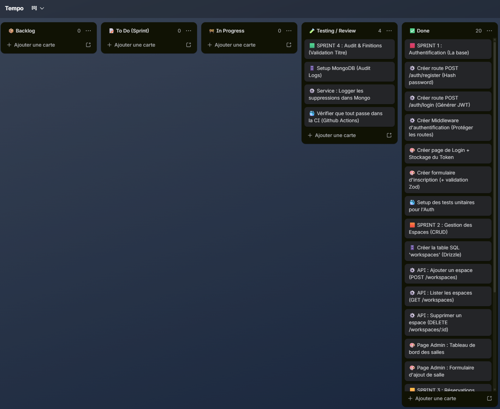
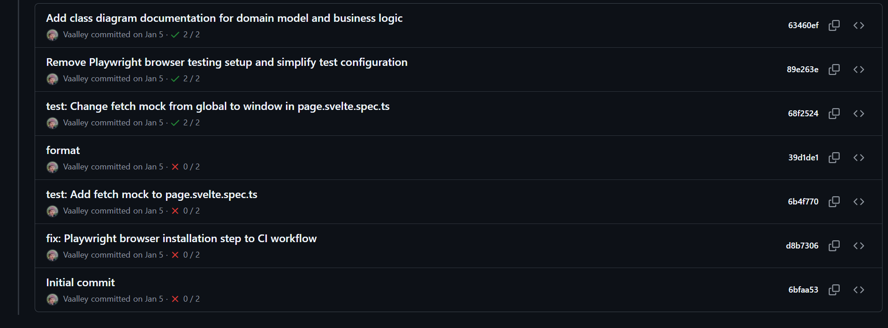
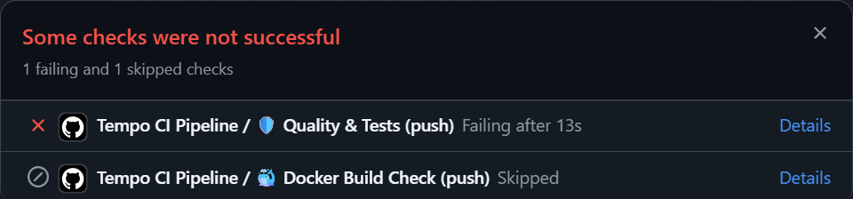
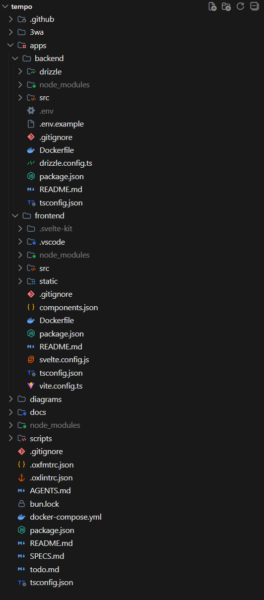

1. GESTION DE PROJET
   S’exprimer à la première du singulier. Vous parlez de vos compétences projet mises en
   œuvre dans le cadre de votre projet.

1.1. Intervenants sur le projet

Le projet Tempo est un projet personnel que j'ai mené seul, en dehors du cadre de mon alternance. J'ai donc cumulé l'ensemble des rôles habituellement répartis entre plusieurs intervenants :

- **Maîtrise d'ouvrage (MOA)** : j'ai exprimé le besoin métier (gestion des espaces en flex-office) et rédigé le cahier des charges (`SPECS.md`) ;
- **Maîtrise d'œuvre (MOE)** : j'ai assuré la conception (diagrammes MERISE/UML, architecture logicielle) et le développement (backend, frontend, base de données) ;
- **Recette** : j'ai rédigé et exécuté les tests unitaires (Bun Test / Vitest) et fait des tests manuels ;
- **Exploitation** : j'ai mis en place la conteneurisation Docker et le pipeline CI/CD (GitHub Actions).

Aucun autre intervenant (webdesigner, chef de projet, client) n'est intervenu sur ce projet.

1.2. Méthodologie

La méthode Agile repose sur un découpage du travail en itérations courtes, une adaptation continue au fur et à mesure de l'avancement, et une priorisation permanente de la valeur livrée plutôt qu'une planification figée en amont (par opposition au cycle en V).

Dans le cadre de ce projet solo, j'ai adopté une approche inspirée de la méthode **Kanban** : un tableau de tâches (Trello) organisé en colonnes (À faire / En cours / Terminé), avec des tickets représentant des fonctionnalités ou des tâches techniques (ex : « Mettre en place l'authentification JWT », « Implémenter la détection de chevauchement de réservations »). Cette approche m'a permis de garder une visibilité constante sur l'avancement, de prioriser les fonctionnalités critiques (authentification, réservation) avant les fonctionnalités secondaires (audit, administration), et de livrer par petites itérations testées.

1.3. Outils, planning et suivi

Les phases de gestion de projet suivies sont : cadrage (rédaction du cahier des charges `SPECS.md`), conception (diagrammes MERISE/UML), mise en place des environnements, développement (backend puis frontend, en parallèle des tests), intégration continue, puis rédaction de la documentation.

Outils utilisés pour le suivi :

- **Trello** (tableau Kanban) pour le suivi des tâches ; 
- **Git / GitHub** pour le versioning et l'historique des commits ; 
- **GitHub Actions** pour l'intégration continue (lint, tests, build Docker) ; 

    1.4. Objectifs de qualité

Les objectifs de qualité fixés pour le projet sont :

- **Fiabilité fonctionnelle** : couverture par tests unitaires des règles métier critiques (détection de chevauchement de réservations, authentification, autorisations) ;
- **Qualité de code** : linting automatisé avec Oxlint et formatage homogène avec Oxfmt, exécutés en pré-commit et en CI ;
- **Sécurité** : validation stricte des entrées avec Zod, hachage des mots de passe, protection des routes par JWT et contrôle des rôles ;
- **Maintenabilité** : architecture modulaire en couches (route / service / accès aux données) répliquée à l'identique sur chaque module métier ;
- **Non-régression** : intégration continue (GitHub Actions) bloquant la fusion du code si le format, le lint, les tests ou le build Docker échouent.

2. Maquettes et enchainement des maquettes

2.1. Cartographie



Cartographie des écrans de l'application (routing SvelteKit) :

```
/                      Page d'accueil
/login                 Connexion / inscription
/bookings              Mes réservations (créer, consulter, annuler, check-in)
/admin/workspaces      Administration des espaces (CRUD, réservé au rôle ADMIN)
```

Enchaînement : un visiteur non authentifié est redirigé vers `/login`. Après connexion, le collaborateur accède à `/bookings` pour gérer ses réservations. Un administrateur dispose en plus d'un accès à `/admin/workspaces` pour gérer le parc d'espaces. L'application est responsive (Tailwind CSS) et s'adapte aux versions desktop, tablette et mobile.

2.2. Maquettes

L'outil de maquettage Figma a été utilisé : les écrans ont été conçus directement avec la librairie de composants shadcn(shadcn-svelte), ce qui a permis d'itérer rapidement entre conception et implémentation.

_(Insérer ici 3 à 4 captures d'écran des pages principales : connexion, liste des réservations, formulaire de création de réservation, administration des espaces — en version desktop et mobile.)_

3. Réalisation

3.1. Mise en place des environnements

J'ai mis en place un environnement de développement reproductible à l'aide de **Docker** et **Docker Compose** : deux conteneurs de bases de données (**PostgreSQL** pour les données relationnelles, **MongoDB** pour les logs d'audit), démarrables localement via `docker compose up -d postgres mongo`, avec des volumes persistants (`postgres_data`, `mongo_data`). Le runtime **Bun** est utilisé en local pour exécuter le backend (Hono) et le frontend (Svelte/Vite) en mode développement (`bun run dev`). Les variables sensibles (chaînes de connexion, secret JWT) sont injectées via des variables d'environnement, jamais commitées dans le dépôt Git. Un environnement de production équivalent (mêmes images Docker) est décrit dans `docker-compose.yml` pour garantir la parité dev/prod.

3.2. Initialisation du projet

J'ai initialisé le projet sous forme de **monorepo Bun Workspaces**, avec deux applications distinctes : `apps/backend` (API Hono + Drizzle ORM) et `apps/frontend` (Svelte 5 + Vite). J'ai mis en place dès le départ les outils de qualité (Oxlint, Oxfmt) et la configuration TypeScript stricte partagée. Le dépôt a été versionné sur **GitHub**, avec un pipeline d'intégration continue (GitHub Actions) configuré très tôt afin de fiabiliser chaque évolution ultérieure. La structure des modules backend (`auth`, `users`, `workspaces`, `bookings`, `audit`) a été définie dès l'initialisation, chaque module suivant le même découpage route/service/accès aux données.

3.3. Implémentation des développements
(identification, rôles, première feature)

**Identification / rôles** : le projet définit deux rôles utilisateurs, portés par un enum PostgreSQL (`role`) et embarqués dans le payload du jeton JWT à la connexion : `USER` (collaborateur) et `ADMIN` (administrateur, qui hérite des droits du collaborateur et dispose en plus des droits de gestion des espaces et de supervision).

**Première fonctionnalité développée : l'authentification.** J'ai commencé par l'inscription et la connexion, car c'est la fonctionnalité socle dont dépendent toutes les autres (aucune réservation ni gestion d'espace n'est possible sans utilisateur authentifié) :

- Inscription (`POST /auth/register`) : validation de l'email et du mot de passe (Zod), hachage du mot de passe avec `Bun.password.hash`, création du compte avec le rôle `USER` par défaut ;
- Connexion (`POST /auth/login`) : vérification des identifiants (`Bun.password.verify`), génération d'un jeton JWT signé (HS256, durée de vie 24h) contenant l'identifiant, l'email et le rôle de l'utilisateur ;
- Mise en place d'un middleware (`authGuard`) appliqué à toutes les routes sensibles, chargé de vérifier la validité du jeton avant d'autoriser l'accès.

Cette première fonctionnalité a été accompagnée dès le départ de ses tests unitaires (`auth.service.spec.ts`), afin de valider le comportement attendu (rejet d'un email déjà utilisé, rejet d'un mot de passe incorrect, génération correcte du jeton) avant de construire les fonctionnalités suivantes (gestion des espaces, réservations) au-dessus de ce socle sécurisé.
