<!-- _class: cover -->
<!-- _paginate: false -->

# Tempo

## Réserver un bureau ou une salle

Titre professionnel **Concepteur développeur d’applications**
RNCP 37873

<div class="meta">

**Valentin Musset** · 3W Academy
Soutenance du 7 octobre 2026

</div>

---

# Sommaire

<div class="cols">
<div>

1. Mon parcours et le projet
2. La conception
3. L’organisation du travail
4. L’architecture
5. Une réservation, du formulaire à la base

</div><div>

6. La sécurité
7. Les tests et la qualité
8. La CI et le déploiement
9. Le bilan et les suites
10. Conclusion

</div></div>

<!-- Annoncer le fil conducteur : expliquer le besoin, les choix, puis suivre une réservation dans le code. -->

---

# 1. Introduction

## Valentin Musset

- Diplôme **Développeur web full stack**, 3W Academy, obtenu en 2025
- Préparation du titre CDA en alternance chez **Collectif Energie**
- Tempo : mon projet personnel de certification, réalisé en dehors de l’entreprise

<!-- Ajouter à l'oral ce qui a motivé le passage du FSD au CDA, avec ses propres mots. Ne pas présenter Tempo comme une commande de Collectif Energie. Source : DP, présentation des activités et rubrique diplômes. -->

---

# 1.1. Contexte

## Des espaces partagés, des réservations à coordonner

- Un bureau ou une salle peut recevoir plusieurs demandes pour le même créneau
- Un planning partagé gère mal les invitations et le suivi de présence
- Tempo s’adresse aux entreprises, écoles et centres de formation qui partagent leurs espaces

<!-- Présenter un besoin imaginé pour le projet, pas une étude terrain ni un problème mesuré dans l'entreprise. La cible initiale comprend notamment des entreprises de plus de 50 collaborateurs. -->

---

# 1.2. Objectif du projet

<div class="cols">
<div>

### Collaborateur

- Réserver un espace
- Inviter ou rejoindre des participants
- Confirmer sa présence par QR code

</div><div>

### Administrateur

- Gérer les espaces et les comptes
- Consulter toutes les réservations
- Suivre l’occupation et les suppressions

</div></div>

<!-- La réservation peut être publique ou privée. Le check-in confirme une action pendant le créneau, pas une géolocalisation dans la salle. -->

---

# 1.3. Contraintes

| Métier                                           | Technique et organisation               |
| ------------------------------------------------ | --------------------------------------- |
| Aucun chevauchement pour un espace               | Contrôles dans l’API et PostgreSQL      |
| Une invitation en attente occupe une place       | Gérer les demandes simultanées          |
| Des droits différents selon le compte            | Vérifier les droits côté serveur        |
| Un projet personnel en parallèle de l’alternance | Avancer par fonctionnalités dans Trello |

<!-- Expliquer pourquoi un simple contrôle dans le formulaire ne suffit pas si deux requêtes arrivent en même temps. -->

---

<!-- _class: chapter -->

# 2. Conception

Du besoin aux modèles de données

<!-- Transition : les diagrammes présentés sont ceux du dossier. La séquence de réservation suit la V1 ; les autres modèles conservent des éléments de la conception initiale. Les écarts sont signalés sur les slides. -->

---

# 2.1. Démarche de conception

1. Décrire les rôles et les règles dans `SPECS.md`
2. Préparer les écrans avec Figma
3. Modéliser les parcours en UML et les données avec MERISE
4. Traduire ces choix en routes, services et migrations SQL

**Périmètre V1 :** comptes, espaces, réservations, participants et check-in

<!-- Le multi-site, les quotas avancés et les notifications sont restés hors de la V1. Les modèles ont un périmètre plus large que le code livré. -->

---

<!-- _class: diagram-slide -->

# 2.2. Diagramme de cas d’utilisation

<div class="cols">
<div class="diagram">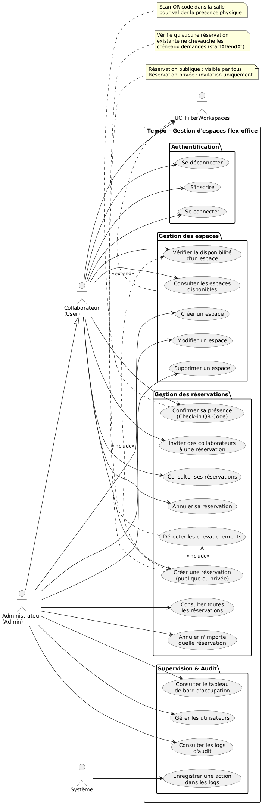</div>
<div>

**Deux rôles à distinguer**

- Le collaborateur gère ses réservations
- L’administrateur dispose aussi des fonctions de gestion

<p class="small">Les droits sont contrôlés côté serveur. Le check-in confirme une action pendant le créneau, sans prouver la présence physique.</p>


</div></div>

<p class="diagram-link"><a href="assets/uml-cas.png" target="_blank" rel="noopener noreferrer">Ouvrir le diagramme complet dans un nouvel onglet</a></p>

<!-- Source : diagrams/use case diagram.png, reproduit sans modification. Le lien ouvre le diagramme actuel dans un nouvel onglet pour le zoom. La référence UC_FilterWorkspaces reste à corriger dans le fichier source. -->

---

<!-- _class: diagram-slide -->

# 2.3. Diagramme d’activité

<div class="cols">
<div class="diagram">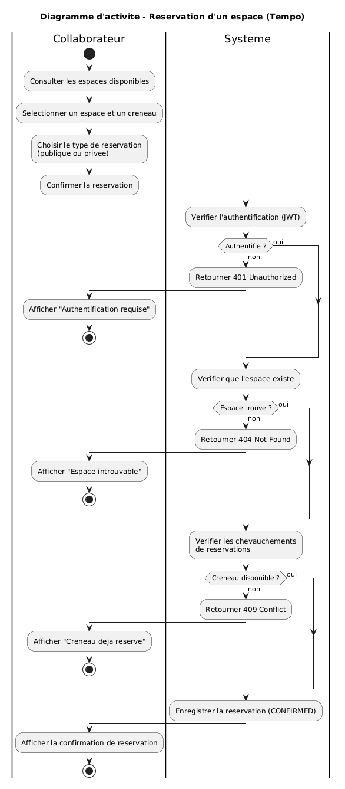</div>
<div>

**Parcours retenu : réserver un espace**

Choisir un espace et un créneau, vérifier la disponibilité, puis enregistrer la réservation.

<p class="small">Dans la V1, les dates sont des instants complets et la contrainte PostgreSQL protège aussi les demandes simultanées.</p>


</div></div>

<p class="diagram-link"><a href="assets/uml-activite.png" target="_blank" rel="noopener noreferrer">Ouvrir le diagramme complet dans un nouvel onglet</a></p>

<!-- Source : diagrams/activity diagram - reservation.png. Faire suivre le chemin nominal puis le refus de disponibilité. Ne pas attribuer au diagramme les corrections de concurrence ajoutées dans le code. -->

---

<!-- _class: diagram-slide -->

# 2.4. Diagramme de séquence

<div class="cols wide">
<div class="diagram">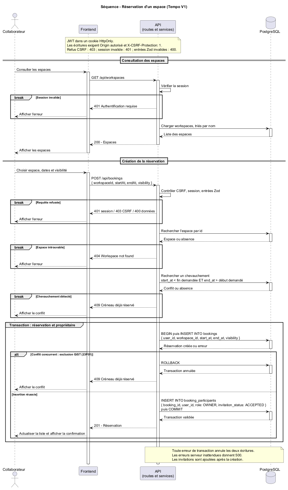</div>
<div>

**Du navigateur à la base**

La requête traverse la route et le service avant l’écriture en base.

<p class="small">Dans la V1, le champ de visibilité est <code>visibility</code>. Une transaction crée la réservation et la participation de son propriétaire ; PostgreSQL protège les créneaux concurrents.</p>


</div></div>

<p class="diagram-link"><a href="assets/uml-sequence.png" target="_blank" rel="noopener noreferrer">Ouvrir le diagramme complet dans un nouvel onglet</a></p>

<!-- Source : diagrams/sequence diagram - reservation.png. Décrire les échanges plutôt que lire chaque message. La séquence représente la V1 : transaction, participation du propriétaire et refus des conflits concurrents par PostgreSQL. Les fragments break arrêtent le parcours en cas de refus. -->

---

<!-- _class: diagram-slide -->

# 2.5. Diagramme de classes

<div class="diagram">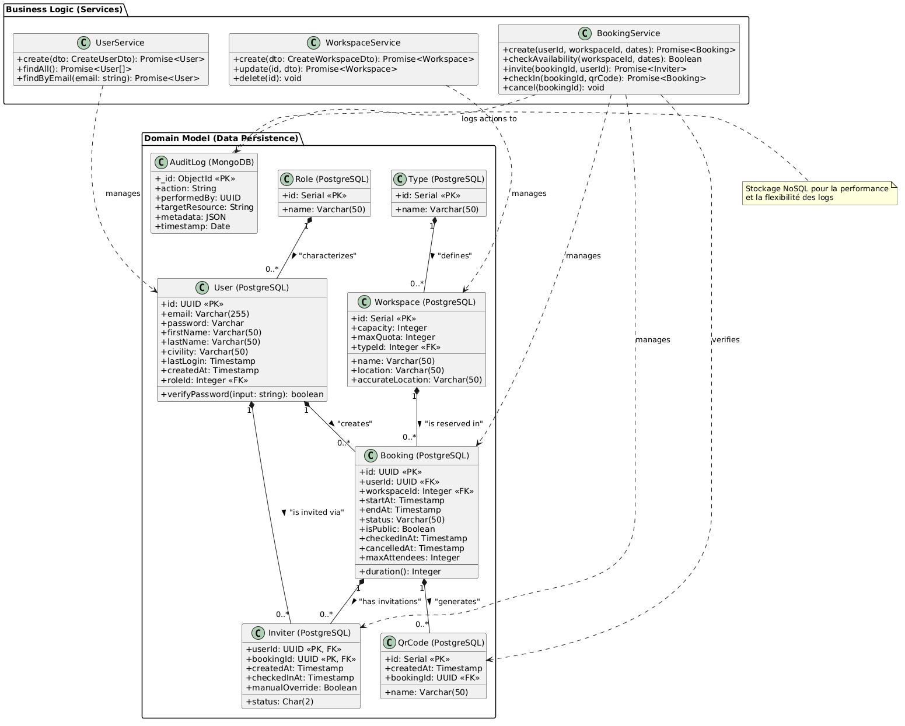</div>

<p class="caption">Le modèle décrit la conception. Le code utilise surtout des services sous forme d’objets et de fonctions. Les quotas et plusieurs attributs du modèle ne font pas partie de la V1.</p>

<p class="diagram-link"><a href="assets/uml-classes.png" target="_blank" rel="noopener noreferrer">Ouvrir le diagramme complet dans un nouvel onglet</a></p>

<!-- Source : diagrams/class diagram.png. Les enums et les participants dans le code diffèrent de ce modèle. Ouvrir assets/uml-classes.png si nécessaire. Ne pas présenter les classes du diagramme comme les classes TypeScript exécutées. -->

---

<!-- _class: diagram-slide -->

# 2.6. MERISE : le MCD

<div class="diagram">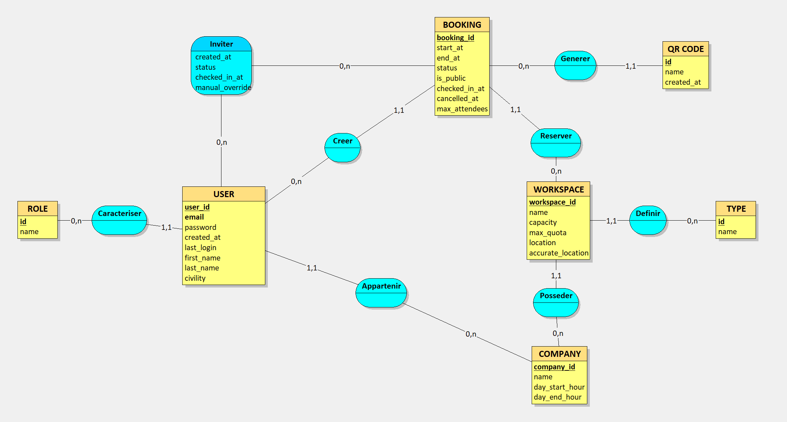</div>

<p class="caption">Le MCD décrit les entités et leurs liens métier. Le modèle initial inclut un périmètre plus large que la V1.</p>

<p class="diagram-link"><a href="assets/mcd.png" target="_blank" rel="noopener noreferrer">Ouvrir le diagramme complet dans un nouvel onglet</a></p>

<!-- Source : diagrams/merise/MCD.png. Expliquer le lien entre un utilisateur, une réservation et un espace. Signaler les entreprises, localisations ou notifications du modèle qui ne sont pas implémentées. -->

---

<!-- _class: diagram-slide -->

# 2.7. MERISE : le MLD

<div class="diagram">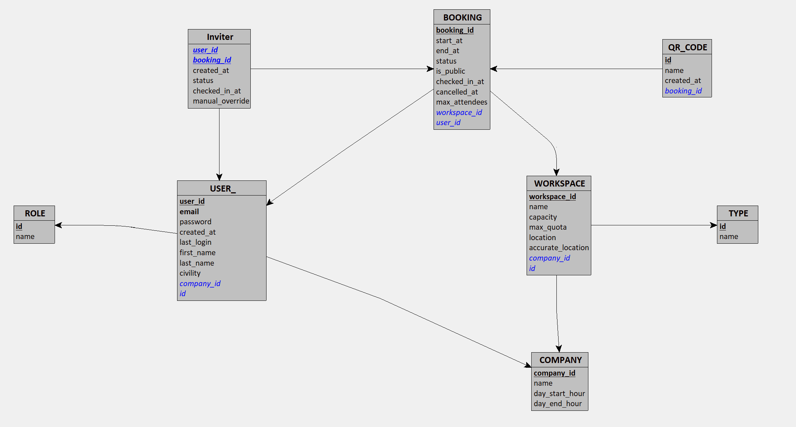</div>

<p class="caption">Dans le MLD, la table `Inviter` relie les utilisateurs aux réservations. Dans le code, cette relation est implémentée par `booking_participants`, qui conserve le rôle du participant, sa réponse à l’invitation et l’heure de son check-in.</p>

<p class="diagram-link"><a href="assets/mld.png" target="_blank" rel="noopener noreferrer">Ouvrir le diagramme complet dans un nouvel onglet</a></p>

<!-- Source : diagrams/merise/MLD.png. Expliquer les clés primaires et étrangères sans lire toutes les colonnes. Le code actuel conserve un seul hash QR actif par réservation. -->

---

<!-- _class: diagram-slide -->

# 2.8. MERISE : le MPD

<div class="diagram">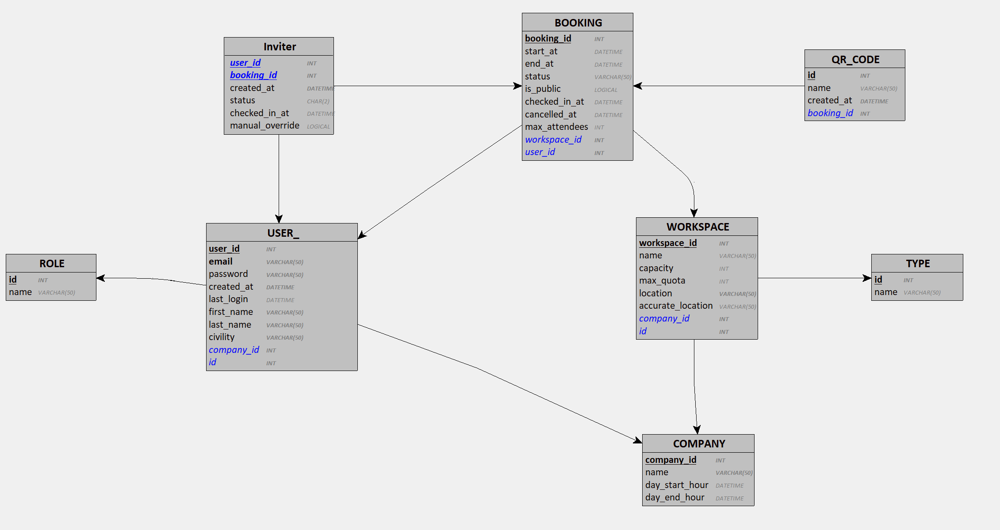</div>

<p class="caption">Le schéma Drizzle et les migrations décrivent la base mise en place : cinq tables PostgreSQL, des UUID pour les comptes et réservations, et des enums pour les rôles.</p>

<p class="diagram-link"><a href="assets/mpd.png" target="_blank" rel="noopener noreferrer">Ouvrir le diagramme complet dans un nouvel onglet</a></p>

<!-- Source : diagrams/merise/MPD.png. Le MPD original utilise notamment des identifiants entiers. Ne pas le confondre avec apps/backend/src/db/schema.ts. MongoDB conserve les audits séparément. -->

---

# 3. Méthodologie et organisation

<div class="cols wide">
<div>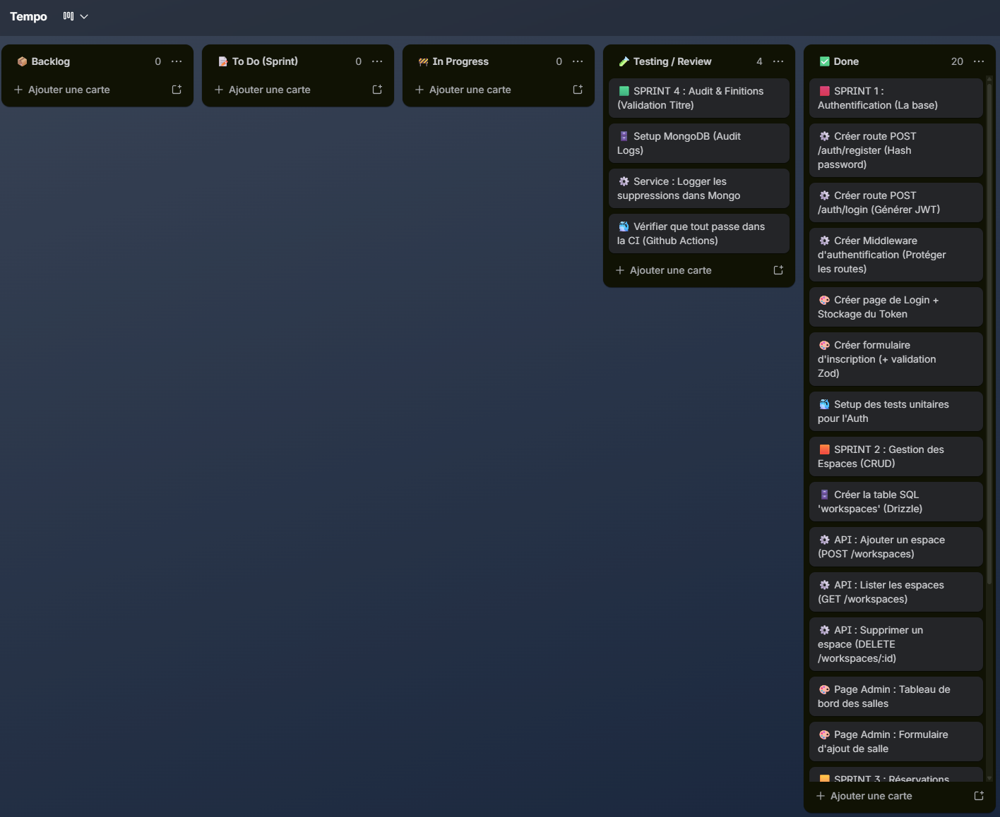</div>
<div>

- Un projet réalisé seul
- Des cartes dans « À faire », « En cours » et « Terminé »
- Des tests au fil du développement
- Git pour conserver l’historique

</div></div>

<!-- Capture issue de 3wa/trello.png. Raconter l'ordre réel : authentification, espaces et réservation, puis collaboration et check-in. Pas de faux calendrier ni de dates inventées. -->

---

<!-- _class: chapter -->

# 4. Architecture

Une application organisée en trois couches

<!-- Transition vers les choix techniques. Le schéma d'architecture ancien montre localStorage : il n'est pas repris comme description de la session actuelle. -->

---

# 4.1. Choix techniques

| Outil                                          | Utilisation dans Tempo                      |
| ---------------------------------------------- | ------------------------------------------- |
| Svelte 5, SvelteKit, Tailwind et shadcn-svelte | Écrans et formulaires                       |
| Bun et Hono                                    | API TypeScript et exécution des services    |
| Drizzle et PostgreSQL                          | Données métier, transactions et contraintes |
| MongoDB                                        | Journal des suppressions                    |
| Docker Compose                                 | Environnement de démonstration              |

<!-- Justifier les choix par leur usage concret. Le monorepo permet de partager le type AppType entre Hono et le frontend. -->

---

# 4.2. Architecture générale

| Couche                          | Responsabilité                              |
| ------------------------------- | ------------------------------------------- |
| Présentation : SvelteKit        | Afficher les pages et envoyer les demandes  |
| API et services : Hono          | Vérifier les droits et appliquer les règles |
| Données : PostgreSQL et MongoDB | Conserver les données métier et les audits  |

<!-- Description du code actuel, sans modifier les diagrammes existants. Le frontend et l'API partagent la même origine sur la démonstration publique. -->

---

# 4.3. Architecture backend

- Modules `auth`, `users`, `workspaces`, `bookings`, `analytics` et `audit`
- Les routes reçoivent les requêtes et renvoient les statuts HTTP
- Les services appliquent les règles métier
- Drizzle et le pilote MongoDB exécutent les accès aux données
- Zod valide les entrées avant l'appel du service

<!-- Pas de couche Repository distincte. Montrer au besoin le dossier modules/bookings avec route, service et DTO. -->

---

# 4.4. Architecture frontend

<div class="cols wide">
<div>

- Pages SvelteKit et états locaux avec les runes Svelte
- Client Hono RPC typé avec `AppType`
- Redirections selon la session et le rôle
- Réponses 401 et 403 traitées dans le client

<p class="small">Sur mobile, les champs passent en colonne et les tableaux défilent dans leur propre zone.</p>

</div><div class="diagram">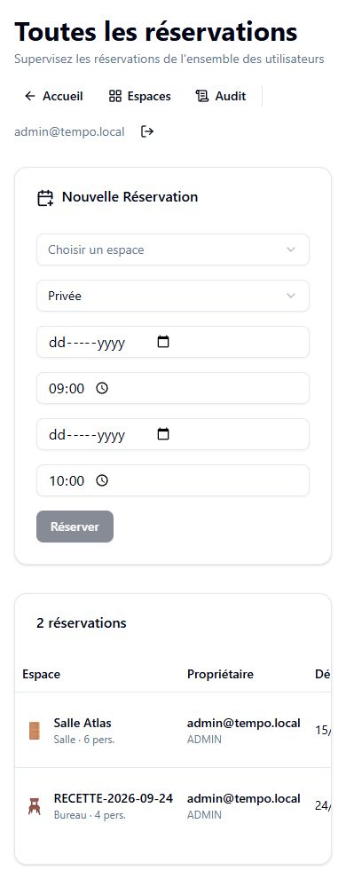</div>
</div>

<!-- Capture du 24 septembre 2026, largeur 390 pixels. Les gardes de navigation ne remplacent pas les contrôles de l'API. -->

---

# 5. Développement : créer une réservation

<div class="cols wide">
<div>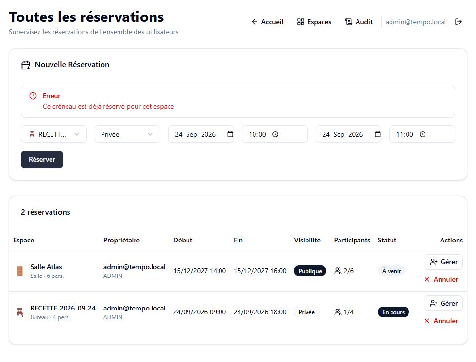</div>
<div>

1. Le formulaire envoie l’espace, les dates et la visibilité
2. L’API contrôle les données et la session
3. Le service tente la création
4. Le frontend affiche le résultat

</div></div>

<!-- Capture réelle du 24 septembre. Fil conducteur des trois slides suivantes : suivre une seule demande, puis expliquer le cas de deux demandes simultanées. -->

---

# 5.1. La route reçoit la demande

```ts
.post('/', zValidator('json', createBookingSchema), async (c) => {
  try {
    const payload = c.get('jwtPayload');
    const data = c.req.valid('json');

    const booking = await bookingService.create(payload.sub, data);
    return c.json(booking, 201);
```

La route utilise l’identité de la session, puis transmet les données validées au service.

<p class="source">Extrait : apps/backend/src/modules/bookings/bookings.route.ts</p>

<!-- Extrait partiel du début de la route, sans le catch. authGuard protège déjà le module. Les extraits restent du texte sélectionnable dans Marp, plutôt que des captures difficiles à modifier. -->

---

# 5.2. Le service et la transaction

```ts
const hasOverlap = await this.checkOverlap(data.workspaceId, startAt, endAt);

if (hasOverlap) {
  throw new Error('BOOKING_OVERLAP');
}
```

Le service vérifie d’abord l’existence de l’espace et la disponibilité.

La transaction crée ensuite **la réservation et son propriétaire comme participant accepté**.

<p class="source">Extrait : apps/backend/src/modules/bookings/bookings.service.ts</p>

<!-- Si une étape de la transaction échoue, l'ensemble n'est pas validé. Le contrôle préalable ne suffit pas contre deux demandes simultanées : transition vers PostgreSQL. -->

---

# 5.3. PostgreSQL empêche le doublon

```sql
ALTER TABLE "bookings"
ADD CONSTRAINT "bookings_workspace_time_exclusion"
EXCLUDE USING gist (
  "workspace_id" WITH =,
  tsrange("start_at", "end_at", '[)') WITH &&
);
```

- Deux requêtes concurrentes ne peuvent pas réserver le même espace au même moment
- L’intervalle `[)` permet deux créneaux consécutifs
- Le conflit devient une réponse **HTTP 409**

<p class="source">Migration : apps/backend/drizzle/0002_booking_overlap_constraint.sql</p>

<!-- Donner l'exemple 10 h à 11 h puis 11 h à 12 h. Le service reconnaît le code SQL 23P01 et la contrainte, puis produit BOOKING_OVERLAP. -->

---

# 5.4. Invitation et check-in

<div class="cols">
<div>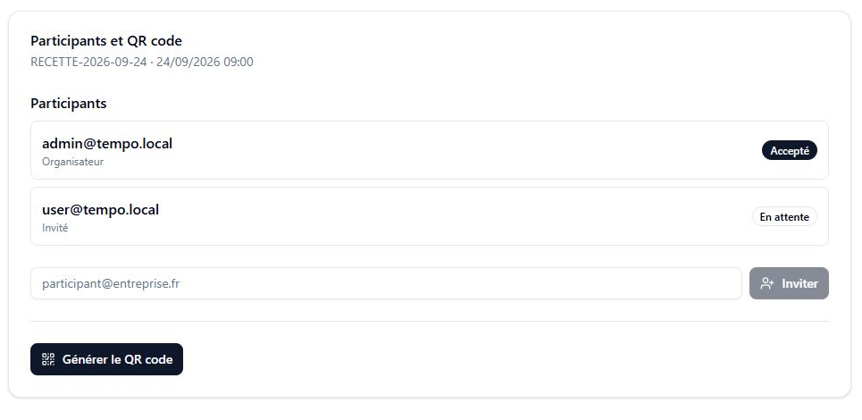<p class="caption">Une invitation en attente occupe déjà une place.</p></div>
<div>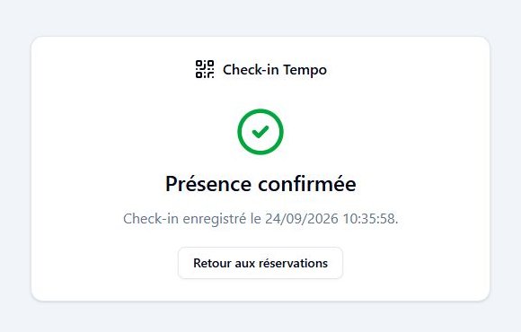<p class="caption">Le participant accepté confirme sa présence pendant le créneau.</p></div>
</div>

<!-- Captures du 24 septembre 2026. La réservation de recette a été supprimée après le contrôle. Le service verrouille l'espace puis la réservation avant d'ajouter un participant. Une démonstration live reste facultative, sans utiliser le QR supprimé. -->

---

# 6. Sécurité : session et autorisations

```ts
const payload = await readSession(c);
if (!payload) return c.json({ error: 'Authentification requise' }, 401);
c.set('jwtPayload', payload);
await next();
```

- JWT dans un cookie **HttpOnly**, `SameSite=Strict`, `Secure` en HTTPS
- Contrôle du rôle ADMIN et des droits sur chaque réservation
- Origine autorisée et en-tête CSRF pour les modifications

<p class="source">Extrait : apps/backend/src/middlewares/auth.guard.ts</p>

<!-- readSession lit le cookie et vérifie le JWT. 401 signifie absence de session valide, 403 droits insuffisants. Le cookie ne rend pas les failles XSS inoffensives. -->

---

# 6.1. Protection des données et du QR

- Mots de passe hachés avec `Bun.password`
- Validation Zod et contraintes PostgreSQL
- Limitation des tentatives d’inscription et de connexion
- Jeton QR aléatoire de 256 bits, seul son hash SHA-256 reste en base

<!-- Le serveur vérifie le participant, son statut et le créneau. Générer un nouveau QR invalide le précédent. Ne pas annoncer une preuve de présence physique. -->

---

<!-- _class: chapter -->

# 7. Tests et qualité logicielle

Vérifier les règles, puis les parcours complets

<!-- Présenter les niveaux de test plutôt que donner seulement un nombre de tests. Les résultats cités sont datés dans le dossier. -->

---

# 7.1. Stratégie de test

| Niveau                 | Ce que je vérifie                           |
| ---------------------- | ------------------------------------------- |
| Unitaires et HTTP      | Services, routes, rôles et erreurs          |
| Frontend               | Session, client RPC et gardes de navigation |
| Intégration PostgreSQL | Transactions, capacité et concurrence       |
| Intégration MongoDB    | Écriture et lecture des audits              |
| Playwright             | Réservation, invitation et check-in         |

<!-- Inventaire du dossier : 106 tests backend unitaires et HTTP, 22 frontend, 15 PostgreSQL, 2 MongoDB et 2 parcours E2E. Ces chiffres ne signifient pas que toutes les suites ont été rejouées lors de chaque déploiement. -->

---

# 7.2. Exemple de test unitaire

```ts
await expect(
  bookingService.create('user-1', {
    workspaceId: 1,
    startAt: '2024-01-01T10:30:00Z',
    endAt: '2024-01-01T11:30:00Z',
    visibility: 'PRIVATE',
  }),
).rejects.toThrow('BOOKING_OVERLAP');
```

Le test simule une réservation existante de **10 h à 12 h** et attend le refus du nouveau créneau.

<p class="source">Extrait : apps/backend/src/modules/bookings/bookings.service.spec.ts</p>

<!-- Les mocks préparent un espace existant puis une réservation en conflit. La date 2024 appartient au test et ne correspond pas à une recette réelle. Ce test ne prouve pas à lui seul la concurrence PostgreSQL. -->

---

# 7.3. Qualité

- Oxlint et Oxfmt contrôlent le code et son formatage
- TypeScript et Svelte Check détectent les erreurs de types
- Le build vérifie la compilation de production

<!-- Écrans : accueil, réservations, espaces, check-in et audit. Cela ne constitue pas un audit complet d'accessibilité ni une validation Firefox/WebKit. -->

---

# 8. CI/CD : pipeline de vérification

<div class="cols wide">
<div>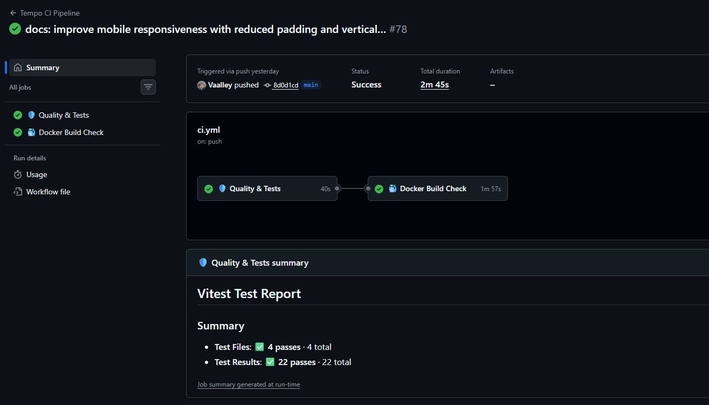</div>
<div>

**Quality & Tests**
Format, lint, types, tests et build

**Docker Build Check**
Stack Docker, seed, intégrations et E2E

<p class="small">Preuve datée du 23 septembre 2026, commit <code>8d0d1cd</code>.</p>

</div></div>

<!-- Source : https://github.com/Vaalley/tempo/actions/runs/35839428413. Preuve historique, ne pas l'annoncer comme le statut de la dernière version. Vérifier la CI du commit remis avant la soutenance. -->

---

# 8.1. Déploiement de la démonstration

- Serveur Ubuntu partagé, fichiers Tempo dans `/opt/tempo/`
- Docker Compose pour les applications et les bases
- Caddy et DuckDNS pour l’accès HTTPS
- Mots de passe et clé JWT fournis au démarrage, sans les inclure dans les images Docker
- Bases sans exposition directe à Internet

**CI automatisée, déploiement manuel**

<!-- Site : https://tempo-val.duckdns.org. Aucun identifiant à projeter. MongoDB 7.0.43 remplace la version 8 incompatible avec le noyau de ce serveur. Le raccordement Caddy se trouve dans /srv/tempo/caddy.conf. -->

---

# 9. Bilan et perspectives

<div class="cols">
<div>

### Ce que j’ai mis en place

- Le parcours de réservation jusqu’au check-in
- Des règles protégées jusque dans la base
- Une démonstration accessible en HTTPS

</div><div>

### Ce qui reste à travailler

- Charge, accessibilité et autres navigateurs
- Intégration de fonctionnalités pour une V2
- Amélioration de l'expérience utilisateur

</div></div>

<!-- Ajouter à l'oral le principal apprentissage personnel avec un exemple vécu. L'audit MongoDB est best effort : une panne peut laisser une suppression sans trace. L'annulation par le bouton reste à revérifier après le blocage de confirmation pendant la recette. -->

---

<!-- _class: chapter -->

# 10. Conclusion et remerciements

Tempo m’a permis de travailler un projet complet, depuis le besoin jusqu’à sa mise en ligne.

Merci aux formateurs de la 3W Academy, à mon tuteur et à l’ami qui héberge la démonstration.

**Merci pour votre attention.**

<!-- Terminer avec son propre bilan et laisser la place aux questions. Adapter les remerciements aux personnes réellement concernées. -->
